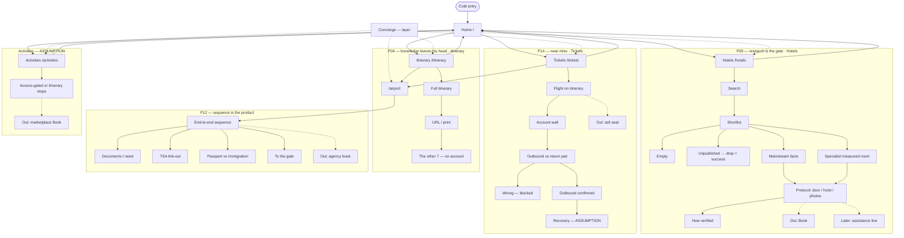

# Prototype agentic 1

**Date:** 2026-09-18  
**Git:** `Coforge_skin`  
**Figma:** `mnPFHuLUzXItWQimrWQEvV`  
**Surfaces:** React HashRouter (`packages/themes/examples/coforge-skin/app`) +
Storybook `CoForge/Luma prototype` · Figma reactions follow the same
proto-spec  
**Status:** Slice 0–1 in code. Gate A unsigned. Synthetic. ADR-024.

Canonical close-out this executes:
[`coforge-luma-final.md`](coforge-luma-final.md).  
Flow spec:
`packages/themes/examples/coforge-skin/product/flows/prototype-agentic-1.json`.

---

## Joined flowchart (locked)

---

## Design system only (CoForge overlay on Carbon)

Query `packages/themes/src/dtcg/coforge/component-token-map.json`. No `cf-*`, no
shadcn, no Figma Make.

| Region                    | Carbon id                                       | React                                                              |
| ------------------------- | ----------------------------------------------- | ------------------------------------------------------------------ |
| Shell                     | `cds-header`                                    | `Header` + `HeaderName` + `HeaderNavigation` + `HeaderMenuItem`    |
| Concierge / account       | `cds-header-global-action` + `cds-header-panel` | `HeaderGlobalAction` + `HeaderPanel` + `Switcher` / `SwitcherItem` |
| Page                      | UI Shell `Content`                              | `Content` (`main`)                                                 |
| Layout                    | Carbon 2x grid                                  | `Grid` / `Column` / `Stack`                                        |
| Home / job cards          | `cds-tile`                                      | `ClickableTile`                                                    |
| Hotels search             | `cds-search`                                    | `Search` (labelled, in-job)                                        |
| Status                    | `cds-tag-readonly`                              | `Tag` gray / outline                                               |
| Links                     | `cds-link`                                      | `Link` (`--cds-link-primary` coral-text)                           |
| Primary lg                | `cds-button`                                    | `Button` kind primary **lg** (coral fill)                          |
| Small / drop              | `cds-button`                                    | `Button` ghost or primary **sm** (not coral)                       |
| Protocol list             | `cds-ordered-list`                              | `OrderedList` / `ListItem`                                         |
| Empty / blocked / success | `cds-inline-notification`                       | `InlineNotification`                                               |
| Document pair             | `cds-radio-button-group`                        | `RadioButtonGroup` / `RadioButton`                                 |
| Airport sequence          | `cds-progress-indicator`                        | `ProgressIndicator` / `ProgressStep`                               |
| Account wall              | `cds-form` + `cds-button`                       | `Form` + Sign in **lg**                                            |

**Responsive:** `HeaderMenuButton` + `SideNav` duplicate the **same four jobs**
at narrow width. This is Carbon UI Shell collapse, not a product rail and not
`cf-nav-rail`. Airport stays out of that list. Book, checkout, hold, sell seat,
marketplace Book, agency book, sitewide search, airport as a Header menu item,
`cf-nav-rail`, coral on small text, page `#ffffff`.

Skin: `data-coforge-skin=on` on light only. Bone / ink / coral per
`coforge-skin-contract`.

---

## Slice this file owns

| Slice | In this pass                                                                                      |
| ----- | ------------------------------------------------------------------------------------------------- |
| 0     | Header 4 jobs + concierge layer + account; Home tiles; HashRouter stubs                           |
| 1     | Hotels search, shortlist, empty, unpublished drop, mainstream + specialist protocol, how-verified |
| 2–4   | Tickets pair, itinerary share, airport sequence — wired so the flowchart is clickable             |
| 5     | Activities list only (ASSUMPTION, no Book)                                                        |
| Figma | Same proto-spec; reactions after React bench                                                      |

---

## How to run

Storybook `@carbon/react`, toolbar **CoForge → CoForge skin**:

`CoForge / Luma prototype / App`

Hash routes: `#/`, `#/tickets`, `#/hotels`, `#/activities`, `#/itinerary`,
`#/airport`.
