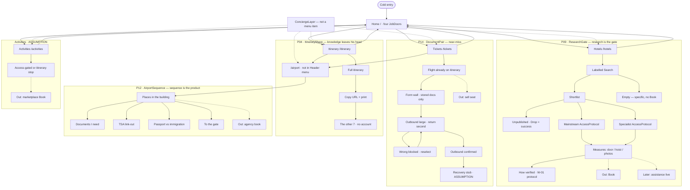

# Prototype agentic 2

**Date:** 2026-09-18  
**Git:** `Coforge_skin`  
**Figma:** `mnPFHuLUzXItWQimrWQEvV`  
**Status:** Plan. Do not start pixels until accepted. Gate A unsigned. ADR-024.

P1 made the joined graph **clickable**. P2 makes each stage **usable and
desirable** (Nielsen + anti-HMW) by wrapping Carbon in `new/` only where the map
cannot express the job.

**Audit:**
`packages/themes/examples/coforge-skin/product/PROTOTYPE-2-AUDIT.md`  
**Skills:** `coforge-heuristics`, `coforge-new-component` (plus existing
ux/ui/frontend/prototype)  
**P1 remains:** Storybook `CoForge / Luma prototype / App`

---

## Polished flowchart (depth)

Solid = P2 in. Dotted later. Dashed = out.

---

## `new/` inventory (P2 only)

Path: `packages/themes/examples/coforge-skin/new/<Name>/`

| Folder            | Stage | Nielsen drive | Carbon it wraps                   |
| ----------------- | ----- | ------------- | --------------------------------- |
| `JobDoor`         | Shell | N2, N8        | ClickableTile                     |
| `ConciergeLayer`  | Layer | N2, N7        | HeaderGlobalAction, HeaderPanel   |
| `ResearchGate`    | P09   | N5, N9        | Search, Tile, Tag, ghost Button   |
| `AccessProtocol`  | P09   | N6, N10       | Tile, Tag, OrderedList, Link      |
| `DocumentPair`    | P14   | N2, N5, N4    | Form, Tile-as-choice, Button lg   |
| `ItineraryShare`  | P04   | N2, N7        | Button, read-only TextInput       |
| `AirportSequence` | P12   | N2, N1        | Tiles/list, Link, ghost next/back |

No `new/` for: Sign-in **fields** (use Carbon `TextInput` + `Form`), Tags,
Header menu items.

Do **not** put these in `packages/react/src/components/`. Do **not** `cf-*`.

---

## Heuristic bar (must pass to ship a slice)

| Slice | Must pass                                                                                                   |
| ----- | ----------------------------------------------------------------------------------------------------------- |
| Shell | Four doors state a **non-OTA** job; airport not in menu; concierge has no Book                              |
| P09   | No Book control at all; drop unpublished succeeds; empty is not a dead page; both inventories open protocol |
| P14   | Pair distinguishable without colour; wrong blocked; one confirm lg; no checkout                             |
| P04   | Copyable URL; recipient view with no account wall                                                           |
| P12   | Not ProgressIndicator-as-checkout; TSA is external; next/back                                               |
| All   | Coral lg only; labelled Search; one h1; keyboard Header + primary actions                                   |

---

## Build sequence (after this plan is accepted)

| Slice      | Do                                                                                |
| ---------- | --------------------------------------------------------------------------------- |
| **2.0**    | `JobDoor` + `ConciergeLayer` on existing HashRouter                               |
| **2.1**    | `ResearchGate` + `AccessProtocol` (replace magic Krakow; persist drop in session) |
| **2.2**    | Carbon Form sign-in + `DocumentPair`                                              |
| **2.3**    | `ItineraryShare` (clipboard URL `#/itinerary/share`)                              |
| **2.4**    | Replace ProgressIndicator with `AirportSequence`                                  |
| **2.5**    | Activities stop uses JobDoor/Access tag only — still no Book                      |
| **Figma**  | Same proto-spec; instances + reactions after 2.0–2.1 React bench                  |
| **Gate A** | Human                                                                             |

Surfaces stay Figma + React. Ban Figma Make, shadcn, Book.

---

## Definition of done (P2)

- Every node in the mermaid above is a screen or a labelled Out/Later
- Every `new/` spec `forbidden` list is empty in the UI
- Heuristic table in `product/VERIFY.md` has Evidence, not Skip, for N2/N5 on
  P09 and P14
- Human Gate A
