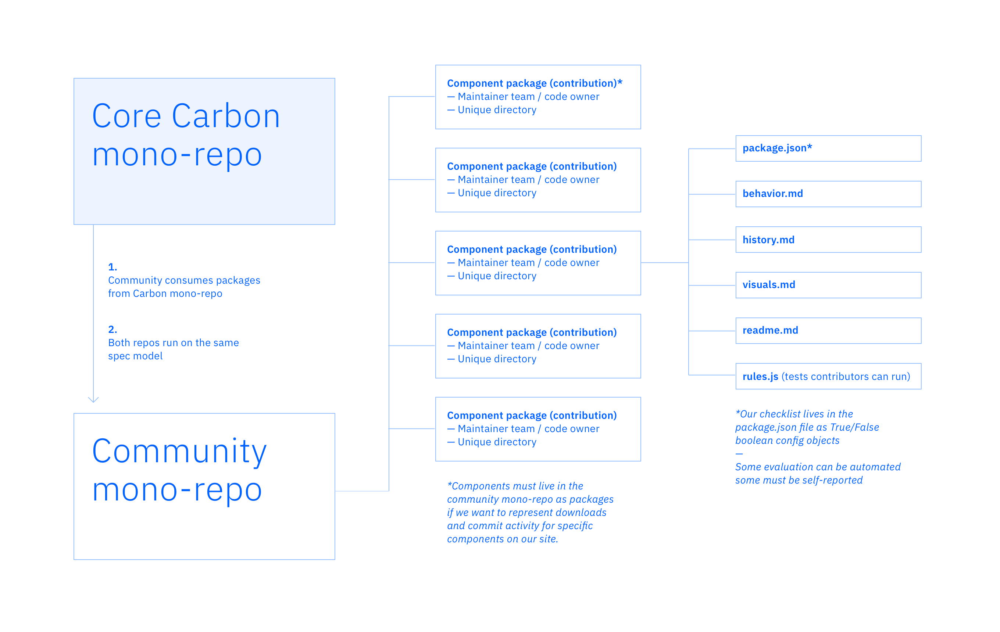

# Community components

### What are community components?

Community Components is our new library of custom components contributed by you.
It is based off of our new contribution model.

- **Development environment:** Unlike our old "add-on" model, community
  components will no longer live in individual, per-team repos. Instead, they
  will all live in the same `carbon-community-components` monorepo. This allows
  us to provide a consistent API and a single workspace that is the source of
  truth for community components, not just for development purposes but also for
  consuming purposes. By having community components live in the same package,
  we will be able to better surface your contributions.

- **Website documentation:** Unlike before, when "add-ons" weren't really
  surfaced in any of our documentation, community components will have a
  gallery, coupled with component specific documentation, on our website. This
  will allow the rest of the community to find and consume custom components
  easier and thus reduce design and development effort. We also want to
  encourage community members to contribute back, not just to Carbon, but to the
  community components they're using as well. Just because core Carbon won't be
  maintaining these, doesn't mean you can't contribute to them!

- **Quality control:** We want to make contributing easy, but want to encourage
  improvement, maintenance and contribution. We've created a recommended
  checklist of comprehensive design and development guidelines. While there is
  no requirement to meet any or all of these guidelines, component quality will
  be displayed based off of how many guidelines you meet. Evaluation of level of
  completeness is based on your assessment.

  _If we're not required to meet any of the guidelines, why would we want to
  create more work for ourselves by trying to meet most of them?_

  Good question. Carbon will be endorsing components that meet 80% or more of
  the guidelines as being on the same design and development level as core
  Carbon components. This means that we will prioritize them when we surface
  these components on our website. It is our goal that by endorsing these and
  surfacing them more notably, more users will use and contribute to your
  component and make it easier for you to maintain it.

- **Maintainers:** The core Carbon team will not be responsible for maintaining
  community components. The responsibility to maintain them will fall on the
  team who contributed the component.

The diagram above illustrates one way we could implement this vision for
community contribution. In this model we would need both a Core Carbon and a
Community monorepo. The Community repo would consume packages from Core Carbon
repo and both monorepos would need to run on the same spec model (this has not
been implemented yet). In order to accurately represent downloads and activity
for a specific component on the Carbon website, components would need to live in
the Community monorepo as packages.

### Component checklist

This check-list consists of a series of agreed upon acceptance criteria (put
forth by Carbon designers and developers) that lives in the `package.json` file
as a set of boolean config objects. Each spec will need some meta data (i.e.
first major release when it was introduced) before we can badge it.
Contributions can then be evaluated according to the completion of the spec.
Some of the criteria can be tested through automation, some will be
self-reported.

In order to contribute a community component, the only _truly_ required items
are the basic guidelines. This allows us to give you a unique package directory
in the monorepo. Reaching 100% completeness means meeting all of the design and
development guidelines on this list.

**Basic (always required)**

- [ ] Unique design or feature
- [ ] Unique component name

**Design artifacts (added in [community box folder](link here))**

- [ ] Component drawing (in Sketch / XD / Sigma) template link
- [ ] States: default, hover, active, disabled, etc
- [ ] Component in-situ product screens
- [ ] Component in-situ flows detailing the job-to-be-done
- [ ] Responsive design on all breakpoints
- [ ] Component redline / spec (template link)
- [ ] Component Usage guidance (writing)
- [ ] Design explorations, audit, and research

**Visual**

- [ ] Using IBM type styles
- [ ] Using IBM colors
- [ ] Using IBM icons
- [ ] Using IBM grid & layout guidance
- [ ] Design in all 4 color themes
- [ ] Satisfy basic accessibility contrast requirements (text readability 4.5:1,
      info graphics 3:1)

**Code**

- [ ] Built with Carbon v10+
- [ ] SASS
- [ ] Using Carbon design tokens (color, type, motion, spacing)
- [ ] `#{$prefix}` class naming
- [ ] Semantic HTML
- [ ] Code documentation (props, class/selectors)
- [ ] Include different states (hover, focus, disabled)
- [ ] Unit testing
- [ ] Should have motion (CSS transition)
- [ ] Theming functionality

**Responsiveness**

- [ ] Mobile (`sm`, `md`)
- [ ] Desktop (`lg`, `xlg`)
- [ ] Large format (`max`)

**Accessibility**

- [ ] Pass AVT 1 test
- [ ] Pass AVT 2 test
- [ ] Pass AVT 3 test

**Frameworks**

- [ ] Vanilla JS
- [ ] React
- [ ] Angular
- [ ] Vue

**Browser support**

- [ ] Chrome
- [ ] Safari
- [ ] Firefox
- [ ] IE11
- [ ] Edge

### Process

1. **Contributor License Agreement:** Before you can contribute any code, we
   need you to sign a Contributor License Agreement (CLA).
2. **Development environment:** If you haven't already, fork and clone the
   community components monorepo. Checkout our
   [Developer Handbook](../developer-handbook.md) to read up on our best coding
   practices and proper commit messages.
3. **Issue:** Check repo for an _existing_ issue related to your contribution
   first. If none exist, open a new issue.
4. **Package directory:** Once you open an issue, we will review that you have a
   unique name and create a directory for your package. We will then make you a
   maintainer of the monorepo and codeowner of your package.
5. **Website draft status:** Once we've added your package directory, it is your
   job to add a card to our website gallery with a placeholder image and draft
   status.
6. **Pull request:** Create a new branch and add your component assets. Submit a
   PR and merge when you're ready.
7. **Website final status:** Once you've completed and merged your component,
   update your website card to the final status.

### FAQ

**Why should I contribute a community component?**

The purpose of community components is to reduce the design and development
effort for Carbon users. By creating a path for contributing and surfacing
custom components, users can then collaborate on work with teams who are using
similar components, as well as focus on developing other assets that haven't
been contributed.

The short and sweet is:

- You'll save time creating new assets since you can use and contribute to
  existing community components
- If you're building a community component, you'll have a way to surface it and
  thus get more users and contributors to help maintain it

**What happens if I don't have a designer or developer to meet all of the
guidelines?**

Our hope with community components is that we create a path that allows anyone
to contribute regardless of the completion. By creating a single environment for
this we hope to connect contributors who need a designer or developer to help
out. Part of our effort in helping contributors who don't have the means to
complete the checklist includes displaying these contribution on our website
gallery as `code only` or `design only` assets.

**Can I contribute to `code only` or `design only` assets?**

YES! We encourage you to combine efforts on these components. Our main goal is
to have a community lead library. If you're a designer interested in
contributing to `code only` assets, reach out to the codeowner to work with
them. If you're a developer interested in contributing to `design only` assets,
reach out to the designer to let them know you're interested in building their
component; you should find that all of the design assets needed for development
already live in the package directory and all they're missing is code.

**If my contribution is `code only`/`design only`, do I leave my initial
contribution issue open when I merge my PR?**

No. Please close the issue so that Carbon knows that you already have a package
directory assigned. Instead, open a `need help` issue, and add a label depending
on if you need a dev or design contributor to help (`need dev`/ `need design`).
You can reference your original issue in this issue so that potential
contributors can see the history.

**How does the component status on the website gallery card work? (draft, beta,
stable)**

The component status is a self assigned status. This does not depend on how many
of the design or development guidelines you've checked off. You can consider
your component stable even if you haven't met all of the guidelines. The purpose
of the component status is to show the community whether your component will be
undergoing major changes, is still undergoing testing or is ready to be used.

**Why do contributions have issues and website cards?**

The Carbon community has a variety of users, which means that people work in
different spaces and use different tools. We have found that even though
developers live on GitHub and are accustomed to opening and checking issues,
designers often times don't find that as useful for learning about existing
efforts. Part of our vision for this community components model was to make
contributing and learning how/what to contribute easier. Having an issue and a
website card with useful information (i.e. draft/beta/stable status,
`code only`/`design only`) will allow more people to learn about existing
efforts and how to help than if this information only lived on the website or on
GitHub.

**How do I include my design assets in the component package?**

If you're contributing design, you will add your sketch files to the community
components [box folder](url here). In the monorepo, we will include the
following files upon the creation of your directory: `behavior.md`,
`history.md`, `visuals.md`, `readme.md`, `package.json`, and `rules.js`. The
first three are the ones that pertain most to design documentation and guidance.
You need to include a link of the box file in the `visuals.md` for people to
find. The rest of the documentation will consist of written explanations aided
with images.

**What if I don't know React?**

No worries! We don't require contributions in any specific frameworks. You can
contribute code in vanilla, React, Vue or Angular. The only time we require
React-first contributions is if you're contributing to core Carbon Components.

**I've contributed a community component, is there a process to update the
component?**

Great question! Our monorepo is community/contributor lead. Other than when we
create your package directory, the Carbon team is really hands off on this. You
can continue to update package versions, merge bug fixes, etc. as you see fit.

**How do I report bugs for community components?**

Like in the Carbon monorepo, open an issue (bug template). Be sure to tag the
package codeowners in the issue so it's brought to their attention. If you have
maintainer rights, add a label for the package the issue pertains to. If you
don't have maintainer rights, the codeowner will add the package label. It is
essential that the issue receives a bug and a package label so that package
maintainers can search issues easily for their component.

**What if I don't want to be a maintainer but want to contribute?**

In order for community components to work, we depend on users maintaining their
contribution. If you don't want to maintain a community component, you can
contribute to existing community components or contribute bug fixes to core
Carbon.

**What happens if my community component is used enough to be part of "core"
Carbon?**

The end goal of community components is not about making it into core Carbon.
The end goal is to make our community components high quality and create a space
to surface these contributions. There are very few instances in which community
components will be accepted into core Carbon. Some instances would be if your
component is challenging a basic assumption or design of an existing component,
or if it has a clear business value. If you feel your component is essential
enough to be part of core Carbon, these are the next steps to submit a proposal:

- [ ] **Quality:** 100% of the component guidelines have to be met
- [ ] **Business case:** Present a clear user business value with metrics
- [ ] **Research:** If it replicates an existing component or pattern, is there
      evidence to show your variant is better?

Process:

1. **Issue:** Open an issue with your proposal that includes the above criteria.
2. **Review:** The Carbon Design System Working Group will review your proposal
   to determine if the component will be published in core Carbon.
3. **Response:** The CDSWG will respond with their decision. If they vote to
   publish, the maintainership changes from the contributor to the Carbon team.

**What are the production guidelines for usage images?**

TBD
