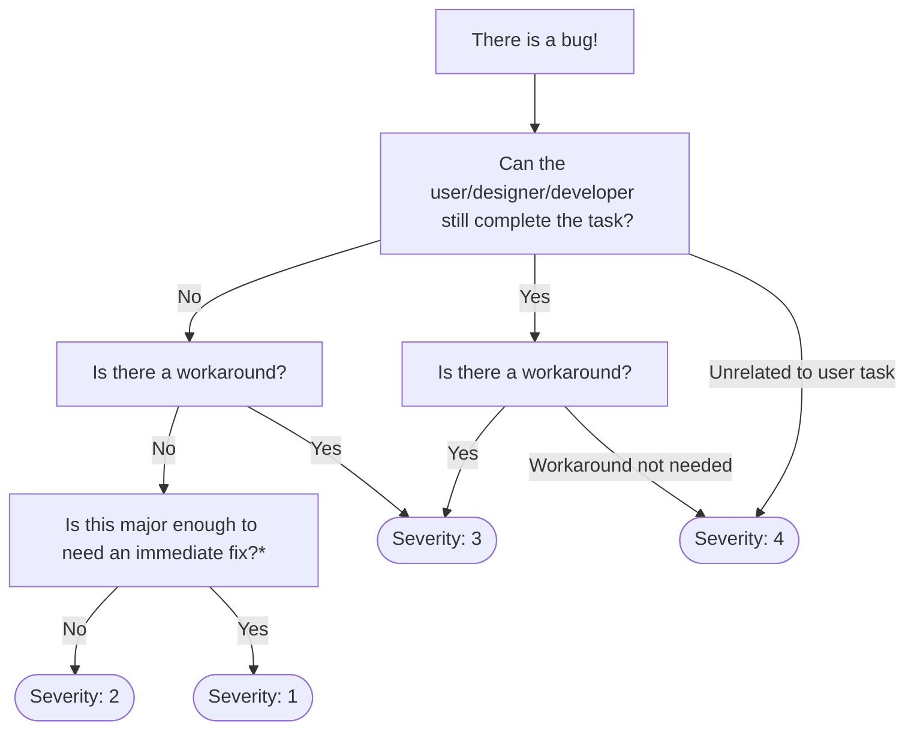

# Carbon system squad support and maintenance

<!-- prettier-ignore-start -->
<!-- START doctoc generated TOC please keep comment here to allow auto update -->
<!-- DON'T EDIT THIS SECTION, INSTEAD RE-RUN doctoc TO UPDATE -->
## Table of Contents

- [Overview](#overview)
  - [What does "ongoing support" mean?](#what-does-ongoing-support-mean)
  - [What repositories do we support?](#what-repositories-do-we-support)
- [Issues](#issues)
  - [Types of issues](#types-of-issues)
  - [Triaging a new issue](#triaging-a-new-issue)
  - [Triage Process](#triage-process)
    - [type: bug 🐛 & type: a11y ♿](#type-bug---type-a11y-)
    - [type: question ❓](#type-question-)
    - [type: enhancement 💡](#type-enhancement-)
  - [Severity](#severity)
  - [Impact](#impact)
  - [Other labels](#other-labels)
  - [Alerting a team or subject matter expert](#alerting-a-team-or-subject-matter-expert)
- [Pull requests](#pull-requests)
  - [WIP, RFC, and Draft pull requests](#wip-rfc-and-draft-pull-requests)
  - [Pull requests with failing tests or merge conflicts](#pull-requests-with-failing-tests-or-merge-conflicts)
  - [Pull Request Reviews](#pull-request-reviews)

<!-- END doctoc generated TOC please keep comment here to allow auto update -->
<!-- prettier-ignore-end -->

## Overview

Ongoing support for Carbon and previous version (which will be prioritized in
that order)

### What does "ongoing support" mean?

- Incoming pull requests (code review, initial communication, ongoing
  discussion, rejection or merge) from the community (i.e. not from the core
  team)
- Triage and shepherd issues to close. Answer questions and help our users find
  solutions to their problems
- Does not include feature enhancements or new feature requests

### What repositories do we support?

- carbon-design-system/carbon
- carbon-design-system/carbon-website

## Issues

When our users want to submit a new issues to one of our repositories they're
presented with the option to select from one of four templates. These templates
ask a series of specific questions that make first-aid and triage go smoothly.
They help us help them.

_If the user hasn't taken the time to fill out one of our templates feel free to
ask them to do so. Typically you'll need at least a good description of the
problem, a walkthrough of how to recreate the problem and a minimal test case to
observe the problem happening. That last one can be a real sticking point, but
there's lots of work to do and many many issues to triage — the onus is on them
to define the issue their having._

### Types of issues

Using these templates also helps Project-Bot automatically move issues and new
pull requests to the right workstreams by auto labeling the issues according to
the template type. There are three types of issues The Support and Maintenance
team are concerned with:

- type: a11y ♿
- type: question ❓
- type: bug 🐛
- type: enhancement 💡

### Triaging a new issue

Triage is the process of determining the severity and priority of issues _as
they come in_. We need to make sure we know how serious a problem is and how
quickly it should be addressed.

### Triage Process

For the different types of issues, we have created the process to triaging each
one so that they can be moved into our Backlog. For all types of issues, assign
yourself to the issue until it's moved to the Backlog pipeline so that others
know the issue is being addressed.

#### type: bug 🐛 & type: a11y ♿

_Process to triaged_

Is there a duplicate issue?

We receive enough duplicate issues that it is always a good idea to check before
moving on in the triage process. We have issues related to accessibility that
catalogue multiple problems so be sure to check especially with incoming
accessibility problems.

If you find a duplicate, comment to the author, label it as a duplicate, and
close the issue.

Is it actually a bug report?

Sometimes people mark their issues as a bug when in reality, they are an
enhancement request or a question.

If you find this to be the case, remove the bug label, add the
`type: question ❓` or `type: enhancement 💡` label, and then follow the
directions in that section.

Did they fill out the issue template?

The most important part of the issue template is the "steps to reproduce"
section, if the author didn't provide that (and reproduction isn't obvious)
comment asking for reproduction and other relevant details not filled out in the
template.

Can you reproduce the problem?

If you can reproduce the problem, proceed to label what component it affects,
what role it applies to (design, dev, both), assess the impact and severity
based on the guides below, and label any additional relevant metadata such as
browser or version info.

After all that, move the issue to the backlog pipeline in zenhub and then you're
done! 🎉

#### type: question ❓

_Process to triaged_

 Is it actually a feature request or bug?

This happens from time to time so it's always a good idea to make sure they are
asking a question and not really asking for a new feature or addressing a bug.
If they are, remove the question label, label as a `type: enhancement 💡` or
`type: bug 🐛` , and follow the instructions for feature enhancement issues.

Is there a duplicate question?

We tend to recieve more questions through Slack than through Github so with any
incoming question issues, search in both places to see if it has already been
answered. If you can find an answer, point the author to where they can find it
and close the issue.

Can you answer the question?

If you can answer the question immediately then great! Answer it and wait for
the author to communicate that it did in fact answer what they were asking. If
they don't respond within a week, feel free to close this issue.

Can't answer the question?

If you can't immediately answer the question, that's fine! The main thing here
is to get the ball rolling so the question can be answered. To do this, You can
post the question in the `carbon-support` Slack channel or `@` someone who you
think has relevant information, in the issue itself or on Slack. Also make sure
to tag the question with any appropriate labels.

As soon as you've started the process of getting the question answered, you can
move the issue to the backlog! 🎉

#### type: enhancement 💡

_Process to triaged_

Does the feature already exist or can be accomplished with existing code?

Certain components are more configurable than others so it's worth checking if
they can add the functionality they want without it being added to carbon core.
It's also possible that the feature already exists and they just don't know
about it yet. If that is the case, comment with the solution and close the
issue.

Is this a duplicate suggestion?

Like with the other types of issues, make sure that there isn't already a
proposal for the feature the author is suggesting. If there is, comment with the
link to the duplicate proposal, label as a duplicate, and close the issue.

Did they fill out the issue template?

After this step, the request will become a proposal so it's necessary that they
filled out all of the issue template. If they haven't, comment asking for the
missing info.

If they have filled out the template or they have responded with the missing
info, label the issue as an open proposal, label any relevant metadata, and move
the issue to the backlog pipeline! 🎉

### Severity

There are 4 levels of severity for issues in the Carbon core repositories:

- https://github.com/carbon-design-system/carbon/labels/severity%3A%201 - _"Must
  be fixed ASAP"_
- https://github.com/carbon-design-system/carbon/labels/severity%3A%202 - _"User
  cannot complete task, and/or no workaround"_
- https://github.com/carbon-design-system/carbon/labels/severity%3A%203 - _"User
  can complete task, and/or has a workaround"_
- https://github.com/carbon-design-system/carbon/labels/severity%3A%204 -
  _"Unrelated to a user task, has a workaround or does not need a workaround"_

Workarounds can be described as either of the following:

1. A workaround within the ux of a component. e.g. A MultiSelect item is not
   selected when clicking on the _icon_, but is still selected when clicking on
   the _text_.

2. A workaround within the implementation of a component. e.g. A `formatDate`
   function is not working, but there is an `onKeyDown` prop that can be used
   instead to format the date on every keystroke.

If either of these types of workarounds are available, the bug will be
classified as
https://github.com/carbon-design-system/carbon/labels/severity%3A%203 or
https://github.com/carbon-design-system/carbon/labels/severity%3A%204

These can be difficult (and vague!) concepts to wrap your head around. So here's
a handy flow chart to guide you through assigning issue severity:

> \* Is this major enough to need an immediate fix?

Clearly marking what qualifies as being "major enough" to warrant an immediate
fix is difficult. In general, you'll know these when you see them.

Here are some primary determining factors:

- A large number of projects (10+) impacted by an issue
- The degree to which something is broken (being unable to complete foundational
  tasks like clicking a button or opening a dropdown, for instance)

Also consider the response a
https://github.com/carbon-design-system/carbon/labels/severity%3A%201 issue
requires, and evaluate it against the bug:

- The response must be swift. When a
  https://github.com/carbon-design-system/carbon/labels/severity%3A%201 issue
  comes in, someone from the team must drop all current work and be immediately
  reassigned to address the issue.
- In the worst circumstances, this person may immediately revert a change from a
  previous release.
- It's likely a patch must be published once the fix or revert is in - the item
  can not wait to go out with the next scheduled release.
- We may need to publish a
  [postmortem](https://github.com/carbon-design-system/carbon/tree/main/docs/postmortems)
  identifying what happened and why, with a plan of how we intend to prevent it
  from happening again.

Due to this high threshold and intensity of response,
https://github.com/carbon-design-system/carbon/labels/severity%3A%201 issues
should be infrequent and should not be open for a long period of time.

For the vast majority of bugs that have invalid and blocking behavior with no
workaround, a
https://github.com/carbon-design-system/carbon/labels/severity%3A%202 or lower
is more appropriate.

### Other labels

There is a large collection of labels that can help communicate the nature of an
issue at a glance to developers and designers. Here's a few that you might add
that can be particularly helpful:

- v10 - any issue or question pertaining to legacy versions of Carbon Components
  should be tagged v10
- good first issue 👋 - these issues don't require a deep knowledge or
  understanding of our code base and would be great for someone looking to help
  out for the first time with some code

### Alerting a team or subject matter expert

Sometimes an issue comes in that is highly technical or about subject matter
you're unfamiliar with. Nothing wrong with that! Using Github ping system you
can alert specific sub-teams on Carbon:

- @carbon-design-system/design
- @carbon-design-system/developers
- @carbon-design-system/ibma

Using any of these @'s in a comment will send notifications to members of those
sub-teams. Typically a subject matter expert from that team will then take over.
You can also @username anyone Carbon's team if you specifically know someone who
has experience with a particular component or issue.

## Pull requests

A good turn around time on pull requests to Carbon's core repositories looks
professional and encourages our users to contribute and work with us to solve
further problems in the future. Shepherding pull requests to merged status isn't
typically _as complex_ as issue triage/tracking, but it's equally important!

### WIP, RFC, and Draft pull requests

If the pull request is a WIP (work in progress), RFC (request for comment), or
Draft then it can be moved to the appropriate swimlane. There are usually a fair
few of these active at a time and don't need the same regard as an _external_
pull requests, but they can be helpful to reference when a Work In Progress pull
request addresses an issue and the maker of that issue asks for a status report
or update (a common occurrence).

### Pull requests with failing tests or merge conflicts

When a new pull request comes in check and make sure our continuous integration
system (Circle CI) doesn't have any failing tests or merge conflicts, if it does
label it accordingly. Then politely ask the pull request maker to fix it.

### Pull Request Reviews

If you notice a pull request languishing without a review for too long. Post in
the carbon-core/carbon-devs channel asking for a review. Ideally pull requests
should have a three business day turn around time on reviews or requested
changes.
