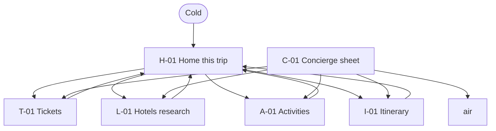
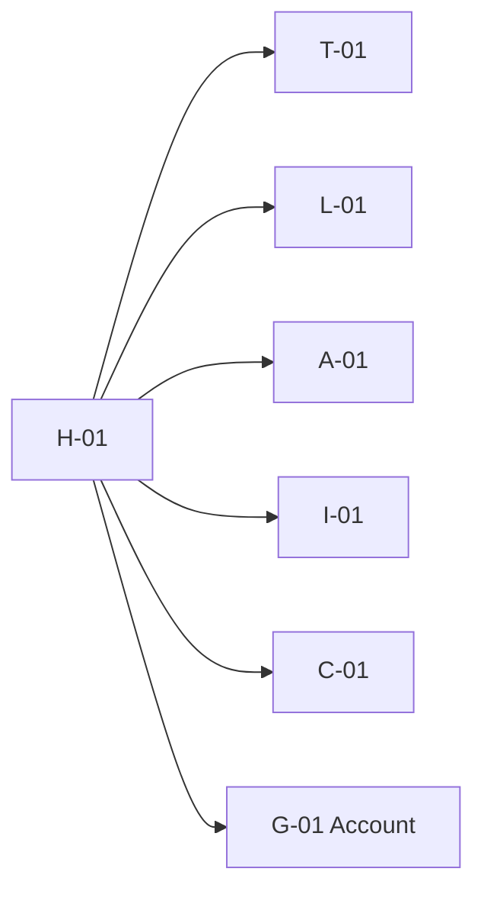
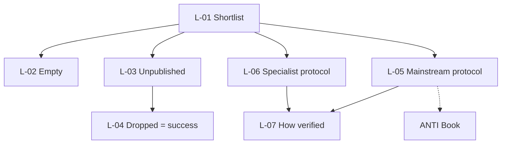
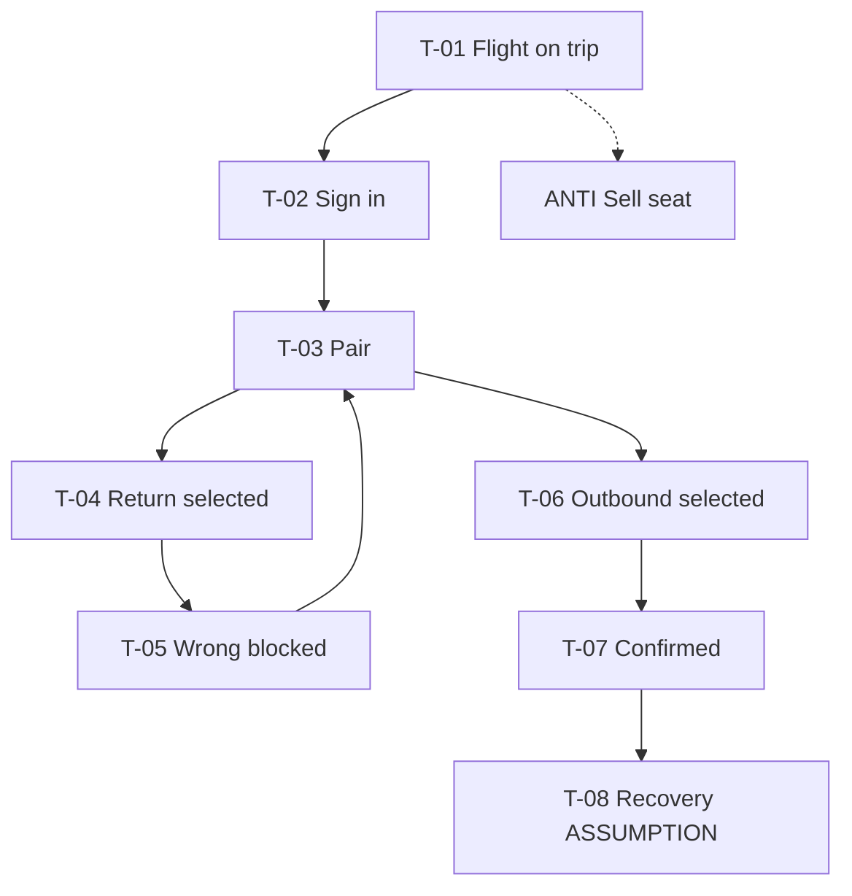
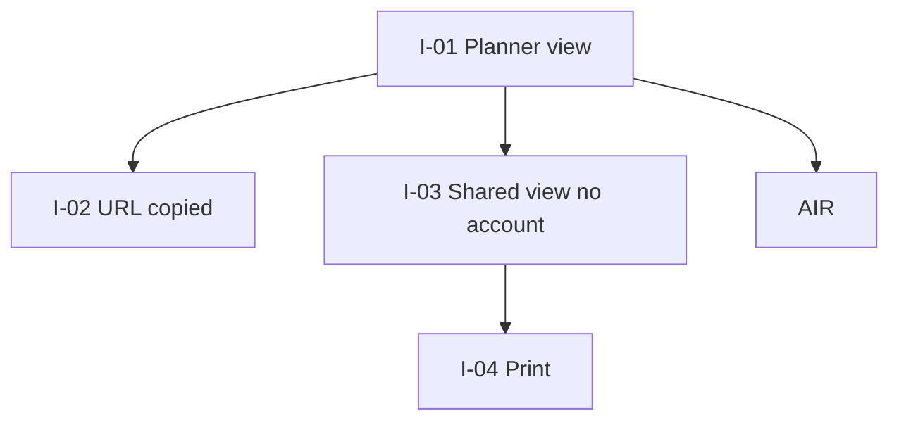
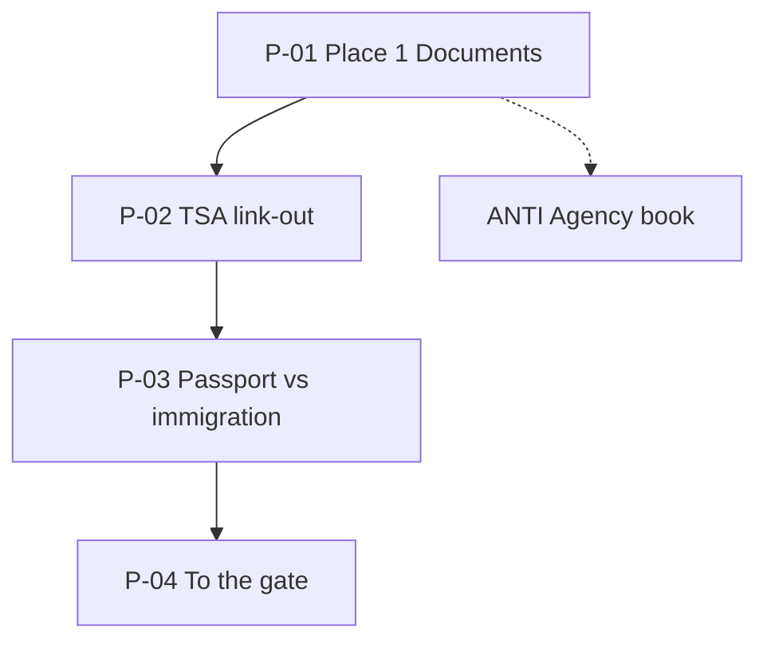
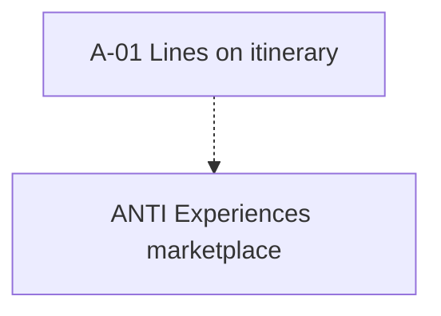

# Luma — complete Figma spec (running test)

**Purpose:** build the **travel concierge** in Figma from scratch.  
**This file only:** forget IBM Carbon / Community kit. No `cds-*`, no UI Shell
chrome, no Code Connect.  
**Still true:** Luma is not an OTA. Concierge supports the **end-to-end trip**,
it does not Book seats or rooms.  
**Corpus:** synthetic Madrid → Kraków, 18–25 Sep, eight people. Gate A
unsigned.  
**Live twin:** `http://127.0.0.1:5181/#/` (ignore Carbon look; copy **jobs and
states**).  
**Bench first:** [`COMPETITOR-BENCH-2026.md`](COMPETITOR-BENCH-2026.md).

---

## 1. Product in one paragraph

Luma is a **trip concierge** for a group already going. It walks the planner and
the other seven from **research → pack the right paper → share the plan → walk
the building → stay somewhere published → come home on the right pass**. It does
not sell flights, hotels, or experiences. Concierge is always available and only
**routes** into the job of this hour.

---

## 2. People (one per flow)

| ID                | Role on this trip                      | Job Luma owns                                     | Anti-path                             |
| ----------------- | -------------------------------------- | ------------------------------------------------- | ------------------------------------- |
| **P09 Halina**    | Needs the room to be physically usable | Hotel **protocol** before intent                  | Book / hold / pay                     |
| **P14 Bernard**   | Holds two boarding passes              | Impossible to present the **return** at departure | Sell seat; “big type for elderly”     |
| **P04 Reuben**    | Holds the plan in his head             | One URL the other seven can open                  | Collab editor; “I’ll plan it for you” |
| **P12 Jaden**     | In the airport                         | **Sequence of places** as the product             | Agency checkout; MyTSA clone          |
| **Recipients ×7** | On the trip, not in the app            | Read itinerary cold                               | Forced account                        |
| **Anyone**        | Between jobs                           | Concierge jump                                    | Concierge Book                        |

P01–P03 and remaining personas: **out** of this file.

---

## 3. Time is not the menu

Header jobs are **Tickets · Hotels · Activities · Itinerary**. Concierge is a
**layer** (always on). Airport is **not** a tab.

| Stage        | When                   | Surfaces                                                                |
| ------------ | ---------------------- | ----------------------------------------------------------------------- |
| 0 Cold       | Before open            | Home of **this trip**                                                   |
| 1–2 Research | Weeks out              | Hotels shortlist, empty, drop, protocol, how-verified; Activities lines |
| 3 Commit     | **Out**                | No Book                                                                 |
| 4 Share      | Before travel          | Itinerary, copy URL, shared view, print                                 |
| 5 Papers     | Night before / morning | Sign-in → document pair → confirm / block → recovery stub               |
| 6 Building   | Travel morning         | Airport places: docs → TSA (link) → passport vs immigration → gate      |
| 7 Stay       | 18–25 Sep              | Protocol still readable; activities on itinerary                        |
| 8 Return     | 25 Sep                 | Same pair; return card becomes “use today” (**ASSUMPTION** mirror)      |
| 9 After      | Later                  | Attribution **out**; recovery if charged                                |

---

## 4. Visual system (not Carbon)

New Figma file. IBM variable mode **off**. Do not instance Carbon.

| Token      | Value                                      | Use                                                                       |
| ---------- | ------------------------------------------ | ------------------------------------------------------------------------- |
| Bone       | `#eeece6`                                  | Page ground — never `#ffffff`                                             |
| Ink        | `#041222`                                  | Text, icons, focus                                                        |
| Coral      | `#f15b40`                                  | **One** large primary per view max (Confirm / Copy URL / Sign in)         |
| Coral text | `#b03822`                                  | Links only                                                                |
| Type       | **Anek Latin** 400/600/700                 | Display ~62px, H1 ~40px, H2 ~28px, body 16, caption 12 uppercase tracking |
| Mono       | Source Code Pro                            | Share URL, measurements (`85 cm`)                                         |
| Radius     | 0                                          | Sharp; editorial, not OTA round cards                                     |
| Grid       | 2 columns on phone stack; 2×2 jobs on ≥768 | 24 / 48 page inset                                                        |
| Imagery    | None required this file                    | If used later: protocol **photos of the room**, not hero beaches          |

**Do not:** glass, dark mode, price pills, star ratings, coral as body text,
decorative coral blocks, “Book now” even as ghost.

**Do:** kickers (`18–25 SEP · EIGHT PEOPLE`), measurements as label/value rows,
outbound card **larger and first**, return card **smaller and second**.

---

## 5. Figma file recipe

1. FigJam or Figma **Design** file named `Luma — trip concierge (test)`.
2. Pages (in this order):

| Page            | Contents                                                                                    |
| --------------- | ------------------------------------------------------------------------------------------- |
| `00 Cover`      | Promise, trip, anti-paths, link to bench                                                    |
| `01 Bench`      | Paste tables from `COMPETITOR-BENCH-2026.md`                                                |
| `02 Journey`    | FigJam or Fig frames: mermaid below as board                                                |
| `03 Flows`      | One frame per flow in §7                                                                    |
| `04 Screens`    | Every frame in §8 (mobile 390×844). Duplicate selected to `04b Desktop` 1440×900            |
| `05 Components` | Job door, concierge sheet, hotel card, measure row, document cards, place card, toast       |
| `06 Prototype`  | Connections from §9                                                                         |
| `07 Anti-paths` | Grey frames: Book hotel, sell seat, collab editor, agency checkout — marked **DO NOT SHIP** |

3. Start prototype from `H-01 Home`. Device: iPhone 14 / 390.
4. Prototype settings: smart animate none required; instant + dissolve.

---

## 6. Objects (what you draw)

| Object           | On screen           | Allowed                              | Forbidden                   |
| ---------------- | ------------------- | ------------------------------------ | --------------------------- |
| Trip             | Home masthead       | Open jobs                            | Sitewide search             |
| Hotel            | Card + protocol     | View, drop unpublished, how-verified | Book, pay, hold             |
| Access protocol  | Measure rows        | Mainstream **and** specialist        | Live assistance (later)     |
| Flight           | Tickets list        | Open documents                       | Checkout                    |
| Document set     | Two cards           | Select **one** leg, confirm          | Print both as one control   |
| Activity         | Itinerary line      | View                                 | Marketplace Book            |
| Itinerary        | Timeline            | Share URL, print                     | Force recipient account     |
| Airport sequence | One place at a time | Next / previous, TSA outbound        | Progress-as-checkout        |
| Concierge        | Sheet from header   | Deep-link jobs + airport             | Book; “I’ll plan it”        |
| Account          | Sheet               | Sign in only for stored docs         | Wall on hotels or share URL |

---

## 7. All flows (draw these on `03 Flows`)

### 7.1 Shell

### 7.2 Hotels — research is the gate (P09)

### 7.3 Tickets — near-miss (P14)

### 7.4 Itinerary — knowledge leaves his head (P04)

### 7.5 Airport — sequence is the product (P12)

### 7.6 Activities (ASSUMPTION)

### 7.7 End-to-end trip (happy path for Figma prototype)

Halina + Reuben + Bernard + Jaden as **one trip**, not four apps:

1. `H-01` → Hotels `L-01` → open Stare Miasto `L-05` → how-verified `L-07` →
   back.
2. Drop unpublished `L-03` → `L-04` (success).
3. `I-01` → Copy URL `I-02` → `I-03` as recipient.
4. `T-01` → `T-02` sign-in → `T-03` → select return `T-05` block → select
   outbound `T-07`.
5. Concierge → `P-01` … `P-04`.
6. Optional: `A-01` Old Town line.
7. Anti-path frames exist but are **not** wired into the happy path.

---

## 8. Screen inventory (draw every row)

Mobile 390×844. One `h1` per frame. Status: **In** = prototype this file.
**Anti** = `07 Anti-paths`. **Later** = empty frame + annotation only.

### 8.1 Shell

| ID   | Frame name              | Use cases              | Must show                                                                                                         | States  |
| ---- | ----------------------- | ---------------------- | ----------------------------------------------------------------------------------------------------------------- | ------- |
| H-01 | Home · Madrid to Kraków | UC-SHELL-1, UC-SHELL-2 | Kicker 18–25 Sep · eight people. Display title. Four job doors with **does / does not**.                          | default |
| H-02 | Home · after drop toast | UC-SHELL-3             | Same + optional “unpublished dropped” if returning from hotels                                                    | success |
| C-01 | Concierge sheet         | UC-CONC-1              | Title “This hour”. Links: Hotels protocol, Tickets on trip, Activities, Itinerary, Airport sequence. **No Book.** | open    |
| G-01 | Account sheet · cold    | UC-ACCT-1              | “Stored documents need sign-in”. Link to T-02. Hotels/share stay cold.                                            | cold    |
| G-02 | Account sheet · in      | UC-ACCT-1              | Sign out.                                                                                                         | authed  |
| N-01 | Menu overlay            | UC-SHELL-2             | Tickets, Hotels, Activities, Itinerary. Not Airport.                                                              | open    |

### 8.2 Hotels (P09)

| ID   | Frame name              | Use cases          | Must show                                                                                        | States      |
| ---- | ----------------------- | ------------------ | ------------------------------------------------------------------------------------------------ | ----------- |
| L-01 | Hotels · shortlist      | UC-P09-2, UC-P09-3 | Search labelled “Search hotels”. Two protocol cards with **cm rows**. Unpublished card, no Book. | default     |
| L-02 | Hotels · empty          | UC-P09-2           | Query that is not Kraków. Copy: no published access. Suggest Kraków / Stare Miasto.              | empty       |
| L-03 | Hotels · unpublished    | UC-P09-1           | Outline tag. Ghost “Drop unpublished hotel”.                                                     | unpublished |
| L-04 | Hotels · dropped        | UC-P09-1           | Success: “Research is the gate.” Unpublished gone.                                               | success     |
| L-05 | Protocol · Stare Miasto | UC-P09-3           | Mainstream. Door 85 cm, hoist 140 cm, photos. Link how-verified. **No Book.**                    | default     |
| L-06 | Protocol · specialist   | UC-P09-3           | Measured inventory. Bathroom / entrance / turning circle.                                        | default     |
| L-07 | How access is verified  | UC-P09-4           | Access Lead → written statement → match photos to **this** room type.                            | default     |
| X-09 | ANTI Book hotel         | UC-P09-5           | Big Book CTA on a hotel — stamped DO NOT SHIP                                                    | anti        |
| L-08 | Later · assistance live | UC-P09-6           | Annotation only                                                                                  | later       |
| L-09 | Later · chair photos    | UC-P09-7           | Annotation only                                                                                  | later       |
| L-10 | Later · return assist   | UC-P09-9           | Annotation only                                                                                  | later       |

**Card content (L-01):**

- Stare Miasto — Verified protocol — Door 85 cm · Hoist 140 cm · Photos yes.
- Specialist measured room — Measured — Bathroom photos · Turning circle ·
  Entrance photographed.
- No published access — Unpublished — Treat as inaccessible.

### 8.3 Tickets (P14)

| ID   | Frame name                     | Use cases   | Must show                                                                               | States         |
| ---- | ------------------------------ | ----------- | --------------------------------------------------------------------------------------- | -------------- |
| T-01 | Tickets · on itinerary         | UC-P14-0    | MAD → KRK 18 Sep. Does not buy a ticket. Link airport.                                  | default        |
| T-02 | Documents · sign-in            | UC-ACCT-1   | Email field. Large coral Sign in. Explain: hotels and share stay open.                  | auth wall      |
| T-03 | Pair · none selected           | UC-P14-1    | Large **Outbound / use today**. Small **Return / keep until 25 Sep**. Confirm disabled. | default        |
| T-04 | Pair · return selected         | UC-P14-2    | Return outlined. Confirm enabled.                                                       | selected-wrong |
| T-05 | Pair · wrong blocked           | UC-P14-2    | Error: return is 25 Sep KRK → MAD. Reselect allowed.                                    | error          |
| T-06 | Pair · outbound selected       | UC-P14-1    | Outbound outlined.                                                                      | selected-right |
| T-07 | Pair · confirmed               | UC-P14-1    | Success. Link recovery.                                                                 | success        |
| T-08 | Recovery                       | UC-P14-3    | Badge ASSUMPTION. Not legal advice.                                                     | stub           |
| X-14 | ANTI Sell seat                 | UC-P14-SELL | Checkout — DO NOT SHIP                                                                  | anti           |
| T-09 | ASSUMPTION · 25 Sep use return | —           | Mirror of T-03 with return as “use today”                                               | later          |

Outbound copy: `18 Sep · MAD → KRK`. Return copy: `25 Sep · KRK → MAD`.
Difference by **size, order, heading**, not colour alone.

### 8.4 Itinerary (P04)

| ID   | Frame name          | Use cases    | Must show                                                                                | States         |
| ---- | ------------------- | ------------ | ---------------------------------------------------------------------------------------- | -------------- |
| I-01 | Itinerary · planner | UC-P04-1     | Timeline: flight, hotel protocol, return. Share URL field. Coral Copy URL. Link airport. | default        |
| I-02 | Itinerary · copied  | UC-P04-2     | Success toast. Link “Open shared view”.                                                  | success        |
| I-03 | Shared view         | UC-P04-3     | Tag “Shared — no account”. Same timeline. Print. No sign-in.                             | cold recipient |
| I-04 | Print               | UC-P04-2     | Print-preview of I-03                                                                    | print          |
| X-04 | ANTI Collab editor  | UC-P04 later | Multi-cursor board — DO NOT SHIP                                                         | anti           |
| I-05 | Later · attribution | UC-P04-4     | Annotation                                                                               | later          |

Timeline lines:

1. Flight MAD → KRK · 18 Sep
2. Hotel Stare Miasto — protocol on Hotels
3. Old Town walking route — on itinerary
4. Return KRK → MAD · 25 Sep

Share URL example: `https://luma.example/#/itinerary/share`

### 8.5 Airport (P12)

| ID   | Frame name                        | Use cases          | Must show                                                                      | States  |
| ---- | --------------------------------- | ------------------ | ------------------------------------------------------------------------------ | ------- |
| P-01 | Place 1 · Documents I need        | UC-P12-1           | `1 / 4`. Passport + **outbound** pass only.                                    | current |
| P-02 | Place 2 · TSA                     | UC-P12-2           | Link to `https://www.tsa.gov/travel/security-screening`. Not a clone of MyTSA. | current |
| P-03 | Place 3 · Passport vs immigration | UC-P12-3           | Border check ≠ checkpoint.                                                     | current |
| P-04 | Place 4 · To the gate             | UC-P12-4, UC-P12-5 | Follow **outbound** gate, not return flight number.                            | current |
| X-12 | ANTI Agency checkout              | UC-P12-6           | Booking wizard — DO NOT SHIP                                                   | anti    |

Chrome on all four: stepper `1 2 3 4` (not a checkout bar). Previous / Next
place.

### 8.6 Activities (ASSUMPTION)

| ID    | Frame name                   | Use cases | Must show                                                            | States  |
| ----- | ---------------------------- | --------- | -------------------------------------------------------------------- | ------- |
| A-01  | Activities                   | UC-ACT-1  | ASSUMPTION banner. Old Town walking route. Tag On itinerary. No SKU. | default |
| X-ACT | ANTI Experiences marketplace | —         | Book tickets — DO NOT SHIP                                           | anti    |

### 8.7 Concierge + empty + error extras

| ID    | Frame name                | Use cases         | Notes                           |
| ----- | ------------------------- | ----------------- | ------------------------------- |
| C-02  | Concierge · from airport  | UC-CONC-1, UC-P12 | Same sheet, Airport highlighted |
| L-02b | Search with query `paris` | UC-P09-2          | Empty                           |

---

## 9. Prototype connections

Happy path (solid):

| From                      | Trigger | To                               |
| ------------------------- | ------- | -------------------------------- |
| H-01 Job Tickets          | tap     | T-01                             |
| H-01 Job Hotels           | tap     | L-01                             |
| H-01 Job Activities       | tap     | A-01                             |
| H-01 Job Itinerary        | tap     | I-01                             |
| Header mark Luma          | tap     | H-01                             |
| Header menu items         | tap     | T-01 / L-01 / A-01 / I-01        |
| Header concierge          | tap     | overlay C-01                     |
| C-01 each row             | tap     | L-01 / T-01 / A-01 / I-01 / P-01 |
| L-01 Stare Miasto         | tap     | L-05                             |
| L-01 Specialist           | tap     | L-06                             |
| L-01 Drop                 | tap     | L-04                             |
| L-01 Search Enter (empty) | —       | L-02                             |
| L-05 / L-06 How verified  | tap     | L-07                             |
| L-07 Back                 | tap     | L-01                             |
| T-01 flight               | tap     | T-02                             |
| T-02 Sign in              | tap     | T-03                             |
| T-03 Return card          | tap     | T-04                             |
| T-04 Confirm              | tap     | T-05                             |
| T-05 Outbound card        | tap     | T-06                             |
| T-06 Confirm              | tap     | T-07                             |
| T-07 Recovery             | tap     | T-08                             |
| T-01 / I-01 Airport       | tap     | P-01                             |
| P-01 Next                 | tap     | P-02 → P-03 → P-04               |
| I-01 Copy URL             | tap     | I-02                             |
| I-02 Open shared          | tap     | I-03                             |
| I-03 Print                | tap     | I-04                             |
| G-01 Stored documents     | tap     | T-02                             |
| G-02 Sign out             | tap     | H-01 cold                        |

Do **not** wire X-09, X-14, X-04, X-12, X-ACT into the prototype start flow.

---

## 10. Use-case coverage matrix

| ID           | In Figma       | Frames           | Competitor leftover                                |
| ------------ | -------------- | ---------------- | -------------------------------------------------- |
| UC-SHELL-1–3 | Yes            | H-01, N-01       | Expedia doors without Book                         |
| UC-CONC-1    | Yes            | C-01, C-02       | Romie / GuideGeek book; we route                   |
| UC-ACCT-1    | Yes            | T-02, G-01, G-02 | TripIt walls the whole trip; we wall **docs only** |
| UC-P09-1     | Yes            | L-03, L-04       | No competitor drop-as-success                      |
| UC-P09-2     | Yes            | L-01, L-02       | Booking empty is “0 stays” + Book elsewhere        |
| UC-P09-3     | Yes            | L-05, L-06       | WtW depth, our CTA is view                         |
| UC-P09-4     | Yes            | L-07             | Sociability / Access Lead checklist as **content** |
| UC-P09-5     | Anti frame     | X-09             | Market                                             |
| UC-P09-6/7/9 | Later frames   | L-08–10          | WtW ops                                            |
| UC-P14-0     | Yes            | T-01             | Flighty tracks; we don’t sell                      |
| UC-P14-1     | Yes            | T-03, T-06, T-07 | Wallet does not fix wrong leg                      |
| UC-P14-2     | Yes            | T-04, T-05       | Unowned in market                                  |
| UC-P14-3     | Yes stub       | T-08             | Unowned                                            |
| UC-P14-SELL  | Anti           | X-14             | OTA                                                |
| UC-P04-1–3   | Yes            | I-01–04          | Wanderlog collab; TripIt share often auth-shaped   |
| UC-P04-4     | Later          | I-05             | —                                                  |
| UC-ACT-1     | Yes ASSUMPTION | A-01             | Tripadvisor Book                                   |
| UC-P12-1–5   | Yes            | P-01–04          | MyTSA + CBP + airline, never joined                |
| UC-P12-6     | Anti           | X-12             | Agency                                             |

**Nothing in the joined use-case list is missing** except Later/Out, which have
labelled frames so Figma does not invent Book to “complete” the journey.

---

## 11. Copy deck (use verbatim)

**Home kicker:** `18–25 Sep · eight people`  
**Home h1:** `Madrid to Kraków`  
**Home lede:**
`Research the door. Keep the outbound pass. Share one URL. Walk the airport in order. Nothing here sells a seat or a room.`

**Job doors**

| Job        | Meta                      | Does                                                      | Does not                      |
| ---------- | ------------------------- | --------------------------------------------------------- | ----------------------------- |
| Tickets    | 18 Sep · MAD → KRK        | Flight already on this trip. Stored passes after sign-in. | Does not sell a seat.         |
| Hotels     | Published access          | Door width, hoist, photos on the card. Drop unpublished.  | Does not book a room.         |
| Activities | On the itinerary          | Access-gated stops already on the plan.                   | Does not sell experiences.    |
| Itinerary  | No account for recipients | Copy a URL. The other seven can open it.                  | Does not force a group login. |

**Hotels h1:** `Hotels with a protocol`  
**Drop success:** `Unpublished hotel dropped` /
`Research is the gate. That is a successful exit.`  
**Empty:** `No hotels with published access`

**Pair h1:** `Which pass at departure`  
**Wrong:** `The return pass is labelled 25 Sep KRK → MAD. Do not present it at departure today.`  
**Right:**
`Outbound confirmed` / `This is the document for MAD → KRK today.`

**Share tag:** `Shared view — no account`  
**Airport lede:** `Physical places in order. Not a checkout bar.`

---

## 12. Components to build on `05 Components`

| Component           | Variants                                              | Notes                                       |
| ------------------- | ----------------------------------------------------- | ------------------------------------------- |
| Job door            | 4 jobs                                                | Meta, title, does, does-not caption         |
| Header              | default / concierge-open / account-open / menu-open   | Wordmark Luma. Four jobs. Two icon buttons. |
| Concierge sheet     | 5 rows                                                | No primary coral Book                       |
| Hotel card          | verified / measured / unpublished                     | Measure rows or drop                        |
| Measure row         | —                                                     | Label left, tabular value right             |
| Document card       | outbound-large / return-small / selected / unselected |                                             |
| Toast               | success / error / info / assumption                   |                                             |
| Place card          | 1–4                                                   | Index `n / 4`                               |
| Primary button      | large only                                            | Coral fill                                  |
| Ghost / text button | small                                                 | Ink or coral-**text** for links             |
| Search field        | empty / filled                                        | Visible label, not placeholder-as-label     |

---

## 13. Acceptance (before calling the file done)

| Check                                              | Pass if                                                          |
| -------------------------------------------------- | ---------------------------------------------------------------- |
| Bench page exists                                  | 2026 table present; Mindtrip/Layla/Romie/WtW/Flighty/MyTSA named |
| Happy path clickable                               | §7.7 without dead ends                                           |
| Every **In** UC has a frame                        | §10                                                              |
| Every **Out** UC has an Anti frame                 | not wired                                                        |
| No Book / price / checkout on Hotels or Activities | search `Book` = only Anti page                                   |
| Recipients                                         | I-03 has no sign-in                                              |
| Pair                                               | T-03 outbound physically larger                                  |
| Airport                                            | four places, TSA is a **link-out**                               |
| Concierge                                          | cannot Book                                                      |
| Carbon                                             | zero IBM components in the file                                  |
| Colour                                             | bone page, ink type, coral only on large primaries               |

Human Gate A still unsigned. This spec is draft for the running test.
