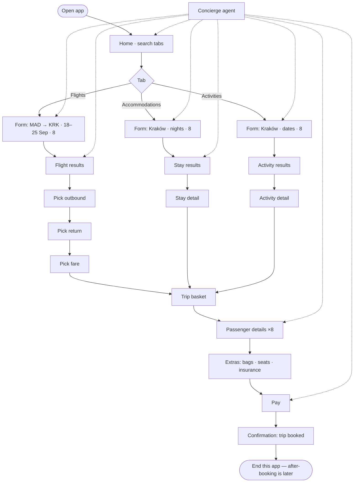
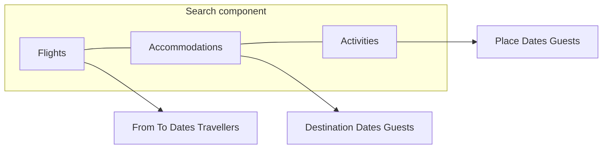

# New app user flow — land, search tabs, book MAD → KRK

**Plan:** [`Plans/luma-new-app.md`](../../../../../../Plans/luma-new-app.md)  
**Stop:** booking confirmation. After that = another product.  
**UI grammar:** Iberia / Kayak / eDreams. **Plus** concierge overlay.

Solid = this app. Dotted = concierge can jump. Dashed = out of this flow.

---

## Landing

The user opens the **app**. They do not open a cold itinerary named “Madrid to
Kraków”. They see:

- Wordmark
- **Search component** (tabs + form)
- Concierge entry (agent available)
- Optional recent/empty state — not a locked trip

Default tab: **Flights**.

---

## Search component (tabs)

One block. Switching tabs **keeps** dates and party; **changes** the fields.

| Tab                | Form (Kayak/Iberia-class)                                          | Primary CTA       |
| ------------------ | ------------------------------------------------------------------ | ----------------- |
| **Flights**        | Round-trip / one-way. From. To. Depart. Return. Travellers. Cabin. | Search flights    |
| **Accommodations** | Destination. Check-in. Check-out. Rooms / guests.                  | Search stays      |
| **Activities**     | Destination. Date(s). Guests.                                      | Search activities |

Concierge may say “Madrid to Kraków, 18–25 September, eight people” and **fill
Flights** (MAD, KRK, dates, 8). Same payload seeds Accommodations (Kraków, those
nights, 8) and Activities (Kraków, those dates, 8).

---

## End-to-end until Book

---

## Happy path (wire this)

Replica of Iberia/eDreams “search → select → pax → extras → purchase”, with
Kayak-style **tabbed search** on home.

1. **Land** on Home. Flights tab on.
2. Enter **Madrid → Kraków**, **18 Sep → 25 Sep**, **8 travellers**, round-trip.
   Search.  
   _Or_ open concierge: agent fills that and runs search.
3. **Results:** 2–3 fake options. Pick outbound MAD→KRK 18 Sep.
4. Pick return KRK→MAD 25 Sep.
5. Pick a **fare** (e.g. Basic vs Flexible). Continue.
6. Basket: “Add a stay?” — switch to **Accommodations** (dates/party already
   set) → results → one hotel → Book stay into basket.
7. Optional: tab **Activities** → one Kraków activity → add.
8. **Passengers:** 8 names (or concierge “use the group list”).
9. **Extras:** bags / seats / insurance (can skip).
10. **Pay** (synthetic card).
11. **You’re booked** — MAD→KRK 18–25 Sep, stay + optional activity. **Stop.**

No airport sequence, no document pair, no share-URL in this flow.

---

## Tab switching (same component)

Rules:

- Tabs do **not** navigate to a different app.
- Shared: destination city, date range, traveller count.
- Flights add origin airport + cabin.
- User can search **only flights** and still reach pay (hotel/activity
  optional).
- User can start on Accommodations; concierge can pull them back to Flights to
  complete the trip.

---

## Concierge (on top, not instead)

Always reachable (FAB or header). Does not hide the store.

| User says / does                             | Agent does                                  |
| -------------------------------------------- | ------------------------------------------- |
| “Madrid to Krakow in September, eight of us” | Switch to Flights, fill form, offer Search  |
| On results                                   | Point at one option; user still taps Select |
| “We also need a hotel”                       | Switch Accommodations tab, same dates       |
| “Is this stay accessible?”                   | Open stay detail; **Book remains**          |
| Passenger step                               | Offer to fill 8 names                       |
| Pay                                          | “Ready to book this trip” → user taps Pay   |

Anti: agent must not pay without the Pay screen. Agent must not remove tabs.

---

## Screens for this flow (Figma later)

| ID    | Screen                          | Notes                               |
| ----- | ------------------------------- | ----------------------------------- |
| A-00  | Splash / land                   | App, not a trip title               |
| A-01  | Home + **search tabs**          | Default Flights                     |
| A-01H | Home · Accommodations tab       | Same component, different fields    |
| A-01A | Home · Activities tab           | Same                                |
| A-01C | Concierge open on home          | Chat + form still visible           |
| F-01  | Flight results                  | List + sort/filter cheap            |
| F-02  | Outbound selected / return list | Iberia two-step                     |
| F-03  | Fare family                     | Basic / Flex                        |
| H-01  | Stay results                    | Kraków 18–25 Sep                    |
| H-02  | Stay detail                     | Photos, price, **Book**             |
| Y-01  | Activity results                |                                     |
| Y-02  | Activity detail                 | **Book** / Add                      |
| B-01  | Trip basket                     | Flight ± stay ± activity · Continue |
| B-02  | Passengers ×8                   |                                     |
| B-03  | Extras                          | Skip allowed                        |
| B-04  | Pay                             |                                     |
| B-05  | Confirmation                    | End                                 |

---

## Use cases (this app only)

| ID           | Actor  | Path                                         |
| ------------ | ------ | -------------------------------------------- |
| UC-LAND      | Anyone | Open app → A-01                              |
| UC-TAB-1     | Anyone | Switch Flights / Accommodations / Activities |
| UC-SEARCH-F  | Anyone | Search MAD–KRK round-trip                    |
| UC-SEARCH-H  | Anyone | Search Kraków stays                          |
| UC-SEARCH-A  | Anyone | Search Kraków activities                     |
| UC-CONC-FILL | Anyone | Agent fills search                           |
| UC-PICK-F    | Anyone | Outbound + return + fare                     |
| UC-PICK-H    | Anyone | Add stay to basket                           |
| UC-PICK-A    | Anyone | Add activity to basket                       |
| UC-SKIP-H    | Anyone | Flights only to pay                          |
| UC-PAX       | Anyone | 8 passenger records                          |
| UC-EXTRAS    | Anyone | Add or skip                                  |
| UC-PAY       | Anyone | Pay → B-05 booked                            |
| UC-CONC-PAY  | Anyone | Agent coaches Pay; user confirms             |

Out of this file: old UC-P09 drop-without-book, UC-P14 pair, UC-P12 airport,
UC-P04 share. Those belong to **after booking**.

---

## Copy (home, not cold)

**H1:** `Where to?`  
**Tabs:** `Flights` · `Accommodations` · `Activities`  
**Flight CTA:** `Search flights`  
**Agent seed:** `Madrid to Kraków · 18–25 Sep · 8 travellers`  
**Confirm:** `You’re booked` · `MAD → KRK 18 Sep · KRK → MAD 25 Sep`
