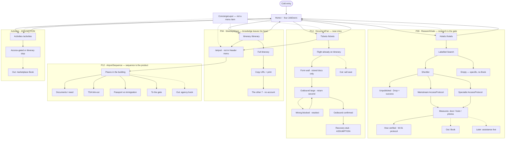

# Luma user flows — joined (v1 depth + v2 chrome)

**Plan:** [`FLOW-JOIN.md`](FLOW-JOIN.md). **IA:** `IA.md`. **Use cases:**
`USE-CASES.md`.  
**P2 polish:**
[`Plans/prototype-agentic-2.md`](../../../../../../Plans/prototype-agentic-2.md)
· audit [`PROTOTYPE-2-AUDIT.md`](PROTOTYPE-2-AUDIT.md).  
Solid = in prototype. Dotted = later. Dashed to Out = anti-path. Concierge is a
**layer** (always on); Header returns to Home from each menu job.

Goals check: P09 still has search / empty / drop / dual inventory / how-verified
/ no Book. P14 still has wrong/right/recovery, now after auth, still no
checkout. P04 still has zero-adoption share. P12 still has the seam; only the
**entry** moved off the Header.
