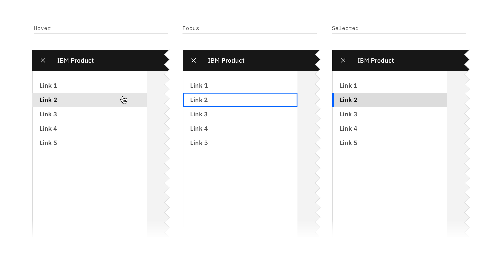
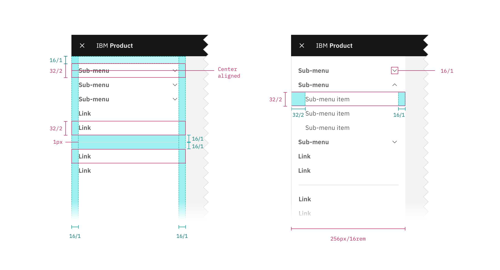
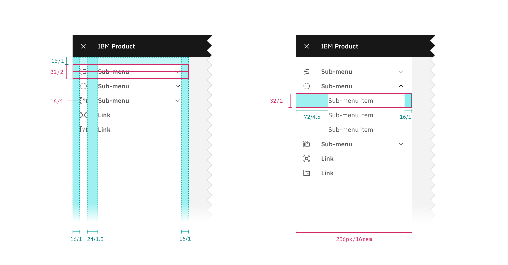

## Color

_Note: The UI Shell does not currently use the Carbon theme tokens; theming options for the shell will be available in the future. All color used in the UI Shell is from the [IBM Design Langauge palette](https://www.ibm.com/design/language/elements/color#specifications)._

| Class                            | Property         | Color value |
| -------------------------------- | ---------------- | ----------- |
| `.bx--side-nav__navigation`      | background color | White       |
| `.bx--side-nav__link`            | text color       | Gray 70     |
| `.bx--side-nav__submenu`         | text color       | Gray 70     |
| `.bx--side-nav__submenu-chevron` | fill             | Gray 70     |
| `.bx--side-nav__menu-item`       | text color       | Gray 70     |
| `.bx--side-nav__icon`            | fill             | Gray 70     |

### Link

| Class                          | Property         | Color value   |
| ------------------------------ | ---------------- | ------------- |
| `.bx--side-nav__link:hover`    | background color | Gray 10-hover |
| `.bx--side-nav__link:hover`    | text color       | Gray 100      |
| `.bx--side-nav__link:focus`    | border           | Blue 60       |
| `.bx--side-nav__link:active`   | background color | Gray 30       |
| `.bx--side-nav__link:active`   | text color       | Gray 100      |
| `.bx--side-nav__link--current` | background color | Gray 30       |
| `.bx--side-nav__link--current` | text color       | Gray 100      |
| `:before`                      | background color | Blue 60       |

### Sub-menu

| Class                               | Property         | Color value   |
| ----------------------------------- | ---------------- | ------------- |
| `.bx--side-nav__submenu:hover`      | background color | Gray 10-hover |
| `.bx--side-nav__submenu:hover`      | text color       | Gray 100      |
| `.bx--side-nav__submenu:focus`      | border           | Blue 60       |
| `.bx--side-nav__submenu:active`     | background color | Gray 30       |
| `.bx--side-nav__submenu:active`     | text color       | Gray 100      |
| `.bx--side-nav__menu-item:hover`    | background color | Gray 30       |
| `.bx--side-nav__menu-item:hover`    | text color       | Gray 100      |
| `.bx--side-nav__menu-item:focus`    | border           | Blue 60       |
| `.bx--side-nav__menu-item:active`   | background color | Gray 30       |
| `.bx--side-nav__menu-item:active`   | text color       | Gray 100      |
| `.bx--side-nav__menu-item--current` | background color | Gray 30       |
| `.bx--side-nav__menu-item--current` | text color       | Gray 100      |
| `:before`                           | background color | Blue 60       |

### Icon

| Class                          | Property | Color value |
| ------------------------------ | -------- | ----------- |
| `.bx--side-nav__icon:hover`    | fill     | Gray 100    |
| `.bx--side-nav__icon:active`   | fill     | Gray 100    |
| `.bx--side-nav__icon--current` | fill     | Gray 100    |

## Typography

Menu labels and text should be set in sentence case.

| Class                      | Font-size (px/rem) | Font-weight    | Type token       |
| -------------------------- | ------------------ | -------------- | ---------------- |
| `.bx--side-nav__link`      | 14 / 0.875         | SemiBold / 600 | `$heading-01`    |
| `.bx--side-nav__submenu`   | 14 / 0.875         | SemiBold / 600 | `$heading-01`    |
| `.bx--side-nav__menu-item` | 14 / 0.875         | Regular / 400  | `$body-short-01` |

<!--
### Text overflow

[Guidance for text overflow and wrapping for platform name or labels]

-->

## Structure

The panel spans the full height of the browser and is fixed to the left edge of the window.

| Class                       | Property                    | px/rem   | Spacing token |
| --------------------------- | --------------------------- | -------- | ------------- |
| `.bx--side-nav__navigation` | width                       | 256 / 16 | –             |
| `.bx--side-nav__link`       | height                      | 32 / 2   | –             |
| `.bx--side-nav__link`       | padding left, padding right | 16 / 1   | `$spacing-05` |
| `.bx--side-nav__submenu`    | height                      | 32 / 2   | –             |
| `.bx--side-nav__submenu`    | padding left, padding right | 16 / 1   | `$spacing-05` |
| `.bx--side-nav__menu-item`  | height                      | 32 / 2   | –             |
| `.bx--side-nav__menu-item`  | padding left                | 32 / 2   | `$spacing-07` |
| `.bx--side-nav__menu-item`  | padding right               | 16 / 1   | `$spacing-05` |
| `:before`                   | width                       | 4 / 0.25 | –             |
| `.bx--side-nav__icon`       | size                        | 16 / 1   | –             |

<!--
### Responsive behavior
-->

<!--
### Icon placement

[to do]
-->
