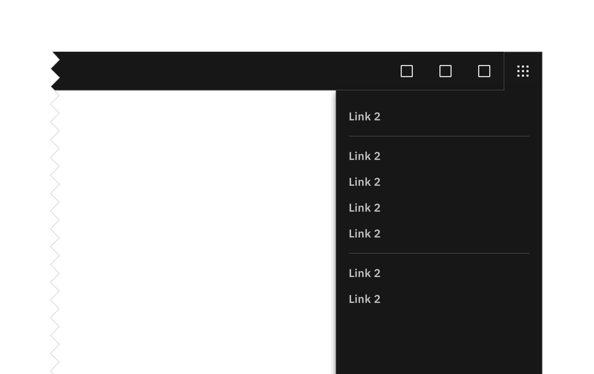
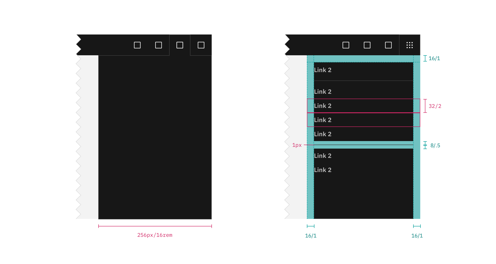

## Color

_Note: The UI Shell does not currently use the Carbon theme tokens; theming options for the shell will be available in the future. All color used in the UI Shell is from the [IBM Design Language palette](https://www.ibm.com/design/language/elements/color#specifications)._

| Class                         | Property                  | Color value |
| ----------------------------- | ------------------------- | ----------- |
| `.bx--header-panel`           | background color          | Gray 100    |
| `.bx--header-panel`           | border-left               | Gray 80     |
| `.bx--header__action--active` | border-left, border-right | Gray 80     |

### Context switcher

| Class                                | Property         | Color value    |
| ------------------------------------ | ---------------- | -------------- |
| `.bx--switcher__item`                | text color       | Gray 30        |
| `.bx--switcher__item:hover`          | background color | Gray 100-hover |
| `.bx--switcher__item:hover`          | text color       | Gray 10        |
| `.bx--switcher__item:focus`          | border           | White          |
| `.bx--switcher__item:active`         | background color | Gray 80        |
| `.bx--switcher__item:active`         | text color       | Gray 10        |
| `.bx--switcher__item-link--selected` | background color | Gray 90        |
| `.bx--switcher__item-link--selected` | text color       | Gray 10        |
| `.bx--switcher__item:disabled`       | text color       | Gray 30        |

## Typography

| Class                 | Font-size (px/rem) | Font-weight    | Type token    |
| --------------------- | ------------------ | -------------- | ------------- |
| `.bx--switcher__item` | 14 / 0.875         | SemiBold / 600 | `$heading-01` |

## Structure

The panel spans the full height of the browser and is fixed to the right edge of the window.

| Class                 | Property                    | px/rem    | Spacing token |
| --------------------- | --------------------------- | --------- | ------------- |
| `.bx--header-panel`   | width                       | 256 / 16  | –             |
| `.bx--switcher__item` | height                      | 32 / 2    | –             |
| `.bx--switcher__item` | padding left, padding right | 16 / 1    | `$spacing-05` |
| `.bx--header__action` | height, width               | 48 / 8    | –             |
| `.bx--header__action` | svg                         | 20 / 1.25 | –             |

