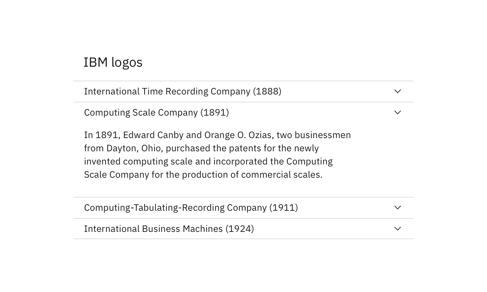

## General guidance

The accordion component delivers large amounts of content in a small space through progressive disclosure. That is, the user gets key details about the underlying content and can choose to expand that content within the constraints of the accordion. Accordions work especially well on mobile interfaces or whenever vertical space is at a premium.

Avoid "nested" accordions—that is, collapsible content within collapsible content. This type of pattern goes against UX best practices.

The Carbon accordion allows for multiple sections to be expanded simultaneously.

A chevron is used to indicate the "expand/collapse" action, though the entire header area is clickable for the same action.

