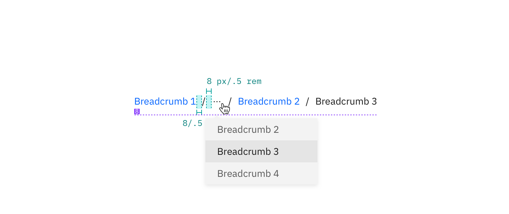

## Color

| Class                         | Property | Color token          |
| ----------------------------- | -------- | -------------------- |
| `.bx--link`                   | color    | `$link-01`           |
| `.bx--link:hover`             | color    | `$hover-primary-text`|
| `.bx--breadcrumb-item::after` | color    | `$text-01`           |

## Typography

When a user hovers overs a breadcrumb, the breadcrumb title should be underlined.

| Class       | Font-size (px/rem) | Font-weight   | Type token       |
| ----------- | ------------------ | ------------- | ---------------- |
| `.bx--link` | 14 / 0.875         | Regular / 400 | `$body-short-01` |

## Structure

The on-click dropdown should follow the [overflow menu](/components/overflow-menu) specs for sizing, padding, and interaction.

| Class                  | Property    | px/rem  | Spacing token |
| ---------------------- | ----------- | ------- | ------------- |
| `.bx--breadcrumb-item` | margin-left | 8 / 0.5 | `$spacing-03` |

## Recommended

Truncated breadcrumbs are not currently built into the breadcrumb component. The following colors from the [overflow menu](/overflow/style) are recommended for the overflow breadcrumb list.

### Color

| Class                                      | Property         | Color token  |
| ------------------------------------------ | ---------------- | ------------ |
| `.bx--overflow-menu-options__btn`          | color            | `$icon-01`   |
| `.bx--overflow-menu-options__option:hover` | background-color | `$hover-row` |

### Typography

| Class                             | Font-size (px/rem) | Font-weight   | Type token       |
| --------------------------------- | ------------------ | ------------- | ---------------- |
| `.bx--overflow-menu-options__btn` | 14 / 0.875         | Regular / 400 | `$body-short-01` |

### Structure

| Class                        | Property | px / rem | Spacing token |
| ---------------------------- | -------- | -------- | ------------- |
| `.bx--overflow-menu-options` | height   | 32 / 2   | –             |

