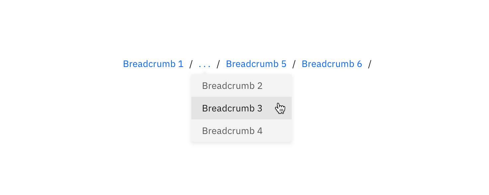

## General guidance

The _breadcrumb_ component (aka, breadcrumb trail) is a secondary navigation pattern that shows hierarchy among content or traces a user's path. Breadcrumbs enable users to move quickly up to a parent level or previous step. All links in a breadcrumb should be clickable.

Breadcrumbs are very effective in products and experiences that have a large amount of content organized in a heirarchy of more than two levels. They are also highly effective in flows that contain multiple steps, operating in a similar way to a progress indicator. Breadcrumbs are always treated as secondary and should never entirely replace the primary navigation.

Breadcrumbs' space-efficient design and high utility make them an easy choice for most designers.

## Variations

| Breadcrumb type  | Purpose                                                                                                                                                                                    |
| ---------------- | ------------------------------------------------------------------------------------------------------------------------------------------------------------------------------------------ |
| _Location-based_ | These illustrate the site's heirarchy and show the user where they are within that heirarchy.                                                                                              |
| _Path-based_     | These show the actual steps the user took to get to the current page, rather than reflecting the site's information architecture. Path-based breadcrumbs are always dynamically generated. |
