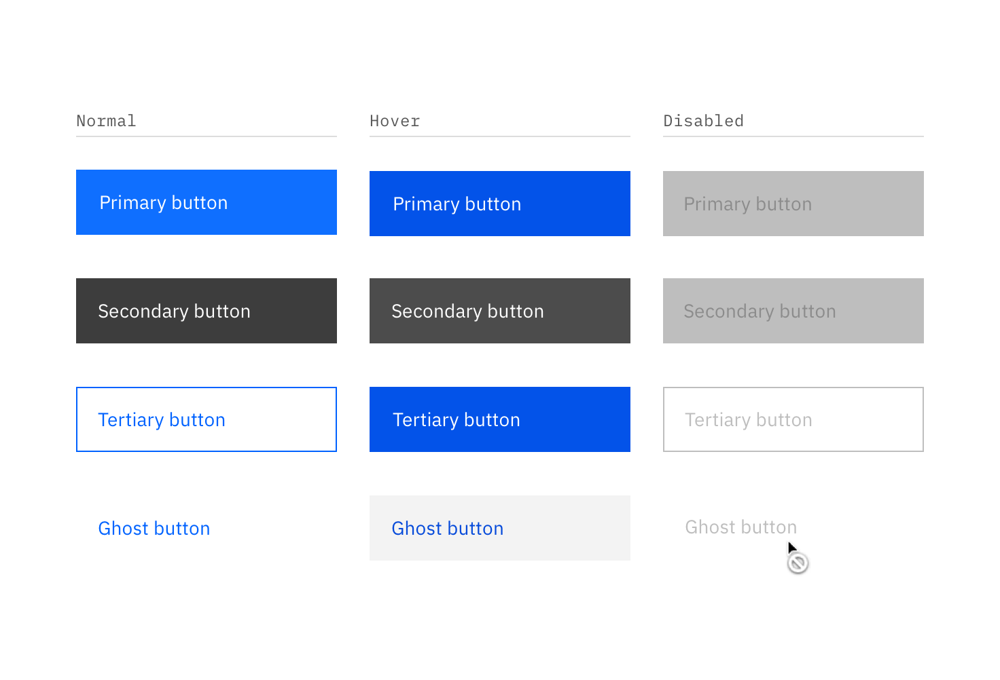
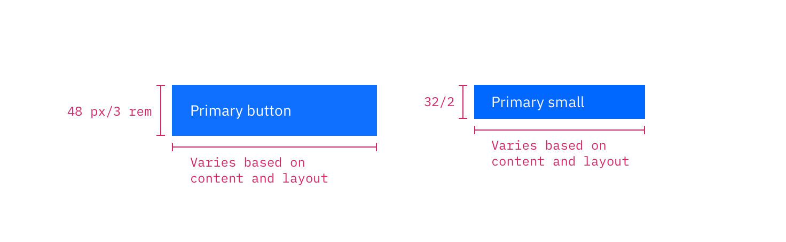
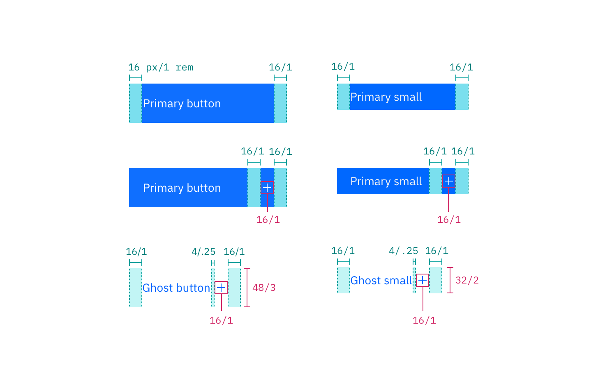

---

title: Button
tabs: ['Code', 'Usage', 'Style']
---

## Color

### Primary button

| Class                                                          | Property                 | Color token       |
| -------------------------------------------------------------- | ------------------------ | ----------------- |
| `.bx--btn--primary`                                            | text color               | `$text-04`        |
| `.bx--btn__icon`                                               | svg                      | `$icon-03 `       |
| `.bx--btn--primary`                                            | background-color         | `$interactive-01` |
| `:hover`                                                       | background-color         | `$hover-primary`  |
| `:active`                                                      | background-color         | `$active-primary` |
| `:focus`                                                       | border                   | `$focus`          |
| `:disabled`                                                    | background-color         | `$disabled-02`    |
| `:disabled`                                                    | text color               | `$disabled-03`    |

### Secondary button

| Class                                                          | Property                 | Color token         |
| -------------------------------------------------------------- | ------------------------ | ------------------- |
| `.bx--btn--secondary`                                          | text color               | `$text-04`          |
| `.bx--btn__icon`                                               | svg                      | `$icon-03`          |
| `.bx--btn--secondary`                                          | background-color         | `$interactive-02`   |
| `.bx--btn--secondary`                                          | border                   | `$interactive-02`   |
| `:hover`                                                       | background-color         | `$hover-secondary`  |
| `:active`                                                      | background-color         | `$active-secondary` |
| `:focus`                                                       | border                   | `$focus`            |
| `:disabled`                                                    | background-color         | `$disabled-02`      |
| `:disabled`                                                    | text color               | `$disabled-03`      |

### Tertiary button

| Class                                                          | Property                 | Color token        |
| -------------------------------------------------------------- | ------------------------ | ------------------ |
| `.bx--btn--tertiary`                                           | text color               | `$interactive-03`  |
| `.bx--btn__icon`                                               | svg                      | `$interactive-03`  |
| `.bx--btn--tertiary`                                           | background-color         | `transparent`      |
| `.bx--btn--tertiary`                                           | border                   | `$interactive-03`  |
| `:hover`                                                       | text color               | `$text-04`         |
| `:hover`                                                       | svg                      | `$icon-03`         |
| `:hover`                                                       | background-color         | `$hover-tertiary`  |
| `:active`                                                      | background-color         | `$active-tertiary` |
| `:focus`                                                       | border                   | `$focus`           |
| `:disabled`                                                    | background-color         | `$disabled-02`     |
| `:disabled`                                                    | text color               | `$disabled-03`     |

### Ghost button

| Class                                                          | Property                 | Color token      |
| -------------------------------------------------------------- | ------------------------ | ---------------- |
| `.bx--btn--ghost`                                              | text color               | `$link-01`       |
| `.bx--btn__icon`                                               | svg                      | `$link-01`       |
| `.bx--btn--ghost`                                              | background-color         | –                |
| `:hover`                                                       | text color               | `$hover-primary-text` |
| `:hover`                                                       | svg                      | `$hover-primary-text` |
| `:hover`                                                       | background-color         | `$hover-ui`      |
| `:active`                                                      | background-color         | `$active-ui`     |
| `:focus`                                                       | border                   | `$focus`         |
| `:disabled`                                                    | text color               | `$disabled-03`   |

### Danger button

| Class                                                          | Property                 | Color token        |
| -------------------------------------------------------------- | ------------------------ | ------------------ |
| `.bx--btn--danger--primar`                                     | text color               | `$text-04`         |
| `.bx--btn__icon`                                               | svg                      | `$icon-03`         |
| `.bx--btn--danger--primary`                                    | background-color         | `$support-01`      |
| `:hover`                                                       | background-color         | `$hover-danger`    |
| `:active`                                                      | background-color         | `$active-danger`   |
| `:focus`                                                       | border                   | `$focus`           |
| `:disabled`                                                    | background-color         | `$disabled-02`     |
| `:disabled`                                                    | text color               | `$disabled-03`     |

## Typography

Button text should be set in sentence case, with only the first word in a phrase and any proper nouns capitalized.

| Class      | Font-size (px/rem) | Font-weight     | Type style       |
| ---------- | ------------------ | --------------- | ---------------- |
| `.bx--btn` | 14 / 0.875         | Regular / 400 | `$body-short-01` |

## Structure

A button cannot have any element or text within 16 pixels / 1 rem of its borders. For button groups, the primary button is positioned on the outside of the set, while the secondary button is positioned inside. For a button with a glyph, the space between the button label and the glyph must be greater than or equal to 16 pixels / 1 rem. This is to accommodate for instances where two or more buttons with glyphs appear together.

| Class                            | Property                    | px / rem | Spacing token   |
| -------------------------------- | --------------------------- | -------- | --------------- |
| `.bx--btn--primary`              | height                      | 48 / 3   | –               |
| `.bx--btn--sm`                   | height                      | 32 / 2   | –               |
| `.bx--btn__icon`                 | size                        | 16 x 16  | –               |
| `.bx--btn`                       | padding-left                | 16 / 1   | `$spacing-05`   |
| `.bx--btn`                       | padding-right               | 64 / 1   | –               |
| `.bx--btn--sm`                   | padding-left                | 16 / 1   | `$spacing-05`   |
| `.bx--btn--sm`                   | padding-right               | 64 / 4   | –               |
| `.bx--btn__icon`                 | margin-left, margin-right   | 16 / 1   | `$spacing-05`   |
| `.bx--btn--ghost`                | padding-left, padding-right | 16 / 2   | `$spacing-05`   |

### Recommended

The following specs are not built into any of the button components but are recommended by design as the proper distance between buttons.

| Attribute        | Property                  | px / rem   | Spacing token |
| ---------------- | ------------------------- | ---------- | ------------- |
| External: button | margin                    | 1px        | -             |
| Button pairings  | margin-left, margin-right | 0          | –   |
