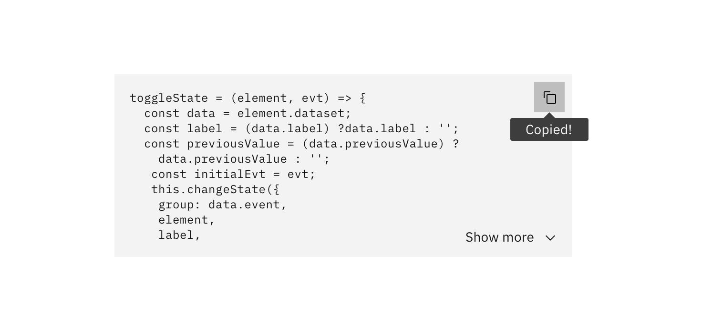

## General guidance

_Code snippets_ are small blocks of reusable code that can be inserted in a code file.

Our code snippets are built with basic styling. We recommend using [Base16](https://github.com/chriskempson/base16) for more complex syntax highlighting. Base16 provides carefully chosen syntax highlighting and a default set of sixteen colors suitable for a wide range of applications. The theme we recommend using is **Solarflare**.

#### Overflow

If there are more than nine lines of code, apply vertical scrolling to the code snippet.

Terminal commands are often longer strings and should only appear on one line. Apply horizontal scrolling to maintain the set width of the box for those longer strings.

## Interaction

Code snippets are accompanied by a **copy icon**, which allows users to copy the provided code to their clipboard. The copy icon must be accompanied by a confirmation that states the successful action of copying an item to the users clipboard.

