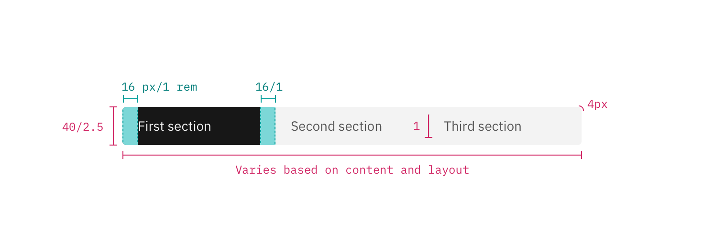

## Color

Content switchers have two main states: `selected` and `unselected`. By default, content switcher buttons are unselected with the selected state using a high contrast color. 

| Class                                                            | Property                  | Color token    |
| ---------------------------------------------------------------- | ------------------------- | -------------- |
| `.bx--content-switcher-btn`                                      | background-color          | `$ui-01`         |
| `.bx--content-switcher-btn`                                      | text color                | `$text-02`       |
| `--selected`                                                     | background-color          | `$ui-05 `        |
| `--selected`                                                     | text color                | `$text-04 `      |
| `:after`                                                         | divider                   | `$ui-03`       |

### Interactive states
Hover states only apply to `unselected` buttons.

| State                                                            | Property                  | Color token    |
| ---------------------------------------------------------------- | ------------------------- | -------------- |
| `:hover`                                                         | background-color          | `$hover-ui`      |
| `:hover`                                                         | text color                | `$text-01`       |
| `:focus`                                                         | border                    | `$focus  `       |
| `:disabled`                                                      | background-color          | `$disabled-01`   |
| `:disabled`                                                      | text color                | `$disabled-02`   |

## Typography

Content switcher text should be set in sentence case, with only the first word in a phrase and any proper nouns capitalized. The text should not exceed three words.

| Class                       | Font-size (px/rem) | Font-weight   | Type style       |
| --------------------------- | ------------------ | ------------- | ---------------- |
| `.bx--content-switcher-btn` | 14 / 0.875         | Regular / 400 | `$body-short-01` |

## Structure

Content switchers must have at least two options for the user to choose from. Each container that makes up the content switcher is equal in size. The width of a container is determined by the length of the longest container option text plus the 16 px / 1rem on both sides of the text.

| Class                                 | Property                                | px / rem | Spacing token |
| ------------------------------------- | --------------------------------------- | -------- | ------------- |
| `.bx--content-switcher`               | height                                  | 40 / 2.5 | –             |
| `.bx--content-switcher`               | corner radius                           | 4px      | –             |
| `:after`                              | divider                                 | 1px      | –             |
| `.bx--content-switcher-btn`           | padding-left, padding-right             | 16 / 1   | `$spacing-05` |

