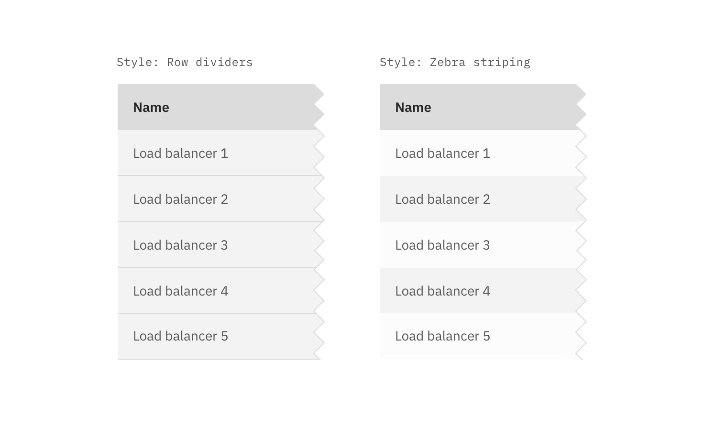
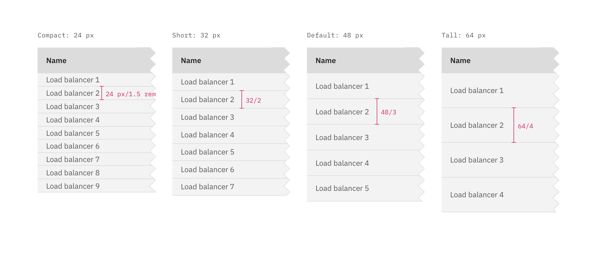

## Color

| Class                                                                                                                 | Property                              | Color token |
| --------------------------------------------------------------------------------------------------------------------- | ------------------------------------- | ----------- |
| `.bx--data-table-header`                                                                                           | background-color                      | `$ui-01`    |
| `.bx--data-table-header`                                                                                           | text color                            | `$text-01`  |
| `.bx--data-table thead`                                                                                            | background-color                      | `$ui-03`    |
| `.bx--table-header-label`                                                                                             | text color                            | `$text-01`  |
| `.bx--data-table tbody`                                                                                            | background-color                      | `$ui-01`    |
| `.bx--data-table td`                                                                                               | text color                            | `$text-02`  |
| `.bx--data-table--zebra`                                                                                           | background-color                      | –           |
| `.bx--expandable-row-v2`                                                                                              | background-color                      | `$ui-01`    |
| `.bx--table-sort-v2__icon`   `.bx--table-expand-v2__svg`   `.bx--overflow-menu__icon`                         | fill                                  | `$icon-01`  |
| `.bx--batch-actions--active`                                                                                          | background-color                      | `$interactive-01` |
| `.bx--batch-summary__para`                                                                                            | background-color                      | `$text-04`  |
| `.bx--batch-actions .bx--btn`                                                                                         | text-color                            | `$text-04`  |

### Interactive states

| Class                                                              | Property                              | Color token         |
| -------------------------------------------------------------------| ------------------------------------- | ------------------- |
| `.bx--data-table tr:hover td`                                   | background-color                      | `$hover-row`        |
| `.bx--data-table td:hover`                                      | text color                            | `$text-01`          |
| `.bx--data-table td:focus`                                      | border                                | `$focus`            |
| `.bx--data-table--selected`                                     | background-color                      | `$selected-ui`      |
| `.bx--data-table--selected td`                                  | text color                            | `$text-01`          |
| `.bx--data-table--selected:hover`                               | background-color                      | `$hover-selected-ui`|
| `.bx--batch-actions .bx--btn:hover`                                | background color                      | `$hover-primary`    |

### Style options

Specific styling on the data table component can be toggled on/off based on user or team preference.

**Row dividers, zebra striping, & table border**

If zebra striping is turned off, you must have row dividers.

<!-- This section is commented out until themes are ready

**Background colors**

Data tables are built to be accessible against the `$ui-background` color:

-->

## Typography

| Class                       | Font-size (px/rem) | Font-weight    | Type token        |
| --------------------------- | ------------------ | -------------- | ----------------- |
| `.bx--data-table-header` | 18 / 1.125         | Regular / 400  | `$heading-03`     |
| `.bx--table-header-label`   | 14 / 0.875         | SemiBold / 600 | `$heading-01`     |
| `.bx--data-table td`     | 14 / 0.875         | Regular / 400  | `$body-short-01`  |

## Structure

Tables are a configurable and customizable component. Designers can pick and choose certain elements and interactions.

### Row sizes

Short and Default are offered as **user preferences** that can be accessed from the table settings menu.

Row sizes are customizable. The column header row `.bx--data-table thead` should always match the row size of the table. Tall row heights are only recommended if your data is expected to have 2 lines of content in a single row.

| Class                         | Size    | Row Height (px/rem) |
| ----------------------------- | ------- | ------------------- |
| `.bx--data-table--compact` | Compact | 24 / 1.5            |
| `.bx--data-table--short`   | Short   | 32 / 2              |
| `.bx--data-table tr`       | Default | 48 / 3              |
| `.bx--data-table--tall`    | Tall    | 64 / 4              |

### Basics

The basic table style is the required base from which tables can be developed. Basic tables are composed of a header row followed by rows of data below. At a minimum, tables require three or more columns.

Column widths can vary by content and only requires a minimum spacing between columns.

| Class                                                                            | Property                    | px / rem  | Spacing token |
| -------------------------------------------------------------------------------- | --------------------------- | --------- | ------------- |
| `.bx--data-table-header`                                                      | margin-bottom               | 16 / 1    | `$spacing-05` |
| `.bx--table-sort-v2__icon`                                                       | padding                     | 8 / 0.5   | `$spacing-03` |
| `.bx--data-table td:first-of-type`   `.bx--data-table td:last-of-type` | padding-left, padding-right | 16 / 1    | `$spacing-05` |

### Enhancements

After the simple table structure, tables can be enhanced by adding any of the following: selectable rows, expanding rows, nested tables, row menus, table batch actions, overall table menu, and/or table filter.

| Class                       | Property      | px / rem   | Spacing token |
| --------------------------- | ------------- | ---------- | ------------- |
| `.bx--table-toolbar`        | height        | 48 / 3     | –             |
| `.bx--table-toolbar--small` | height        | 32 / 2     | –             |
| `.bx--table-expand-v2__svg` | height        | 16 / 1     | –             |
| `.bx--checkbox-appearance`  | height, width | 20 / 1.25  | –             |

_Structure and spacing measurements for a basic and an enhanced data table | px / rem_

### Recommended

| Spacing between | Property | px / rem   | Spacing token |
| --------------- | -------- | ---------- | ------------- |
| Columns         | padding  | 16 /1      | `$spacing-05` |

### Toolbar

| Class                       | Property                  | px/rem   | Spacing token |
| --------------------------- | ------------------------- | -------- | ------------- |
| `.bx--toolbar-action `      | height, width             | 48 / 3   | –             |
| `.bx--toolbar`              | margin-top, margin-bottom | 16 / 1   | `$spacing-05` |
| `.bx--toolbar-action--small`| height, width             | 32 / 2   | –             |
| `.bx--toolbar--small`       | margin-top, margin-bottom | 8 / 0.5  | `$spacing-03` |

_Structure and spacing measurements for toolbar icons | px / rem_
