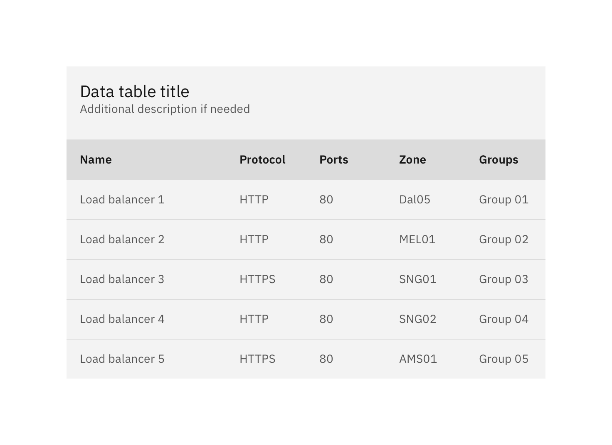
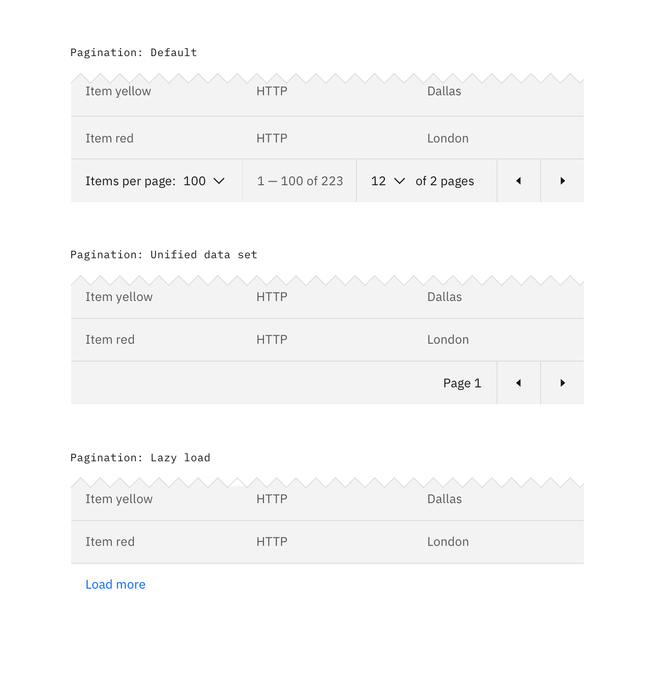
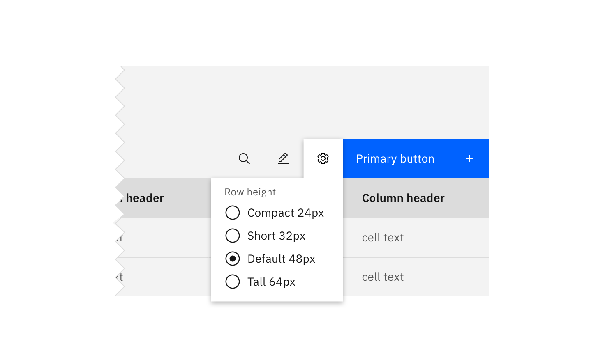
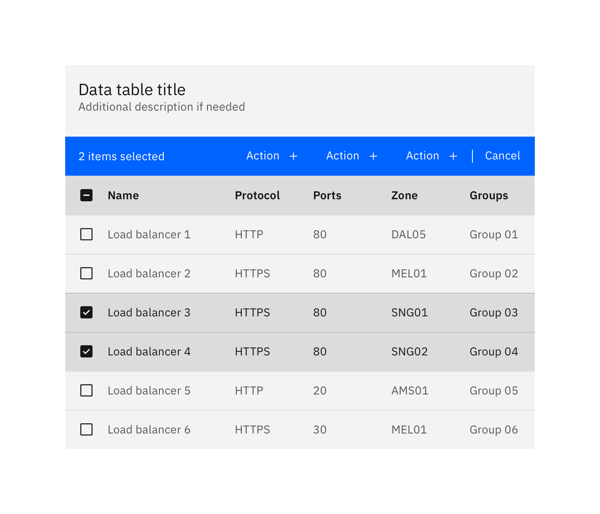
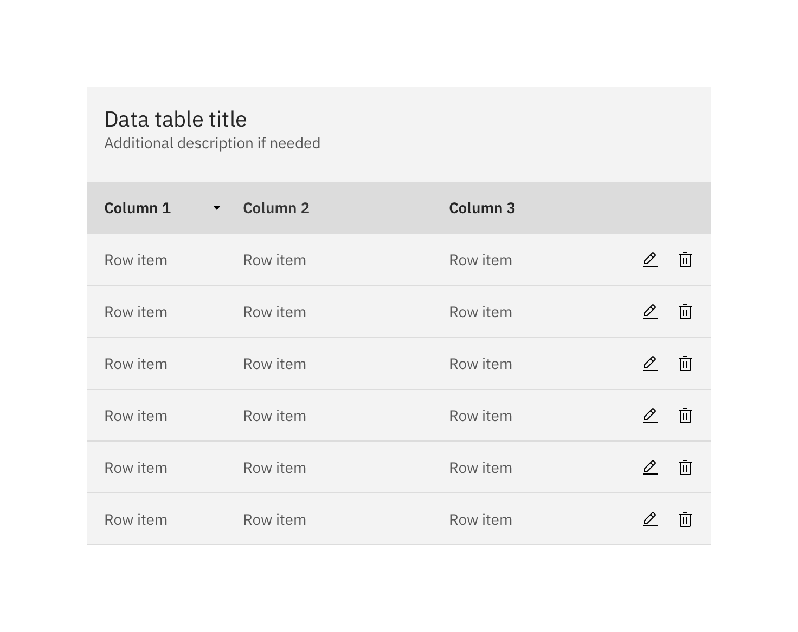
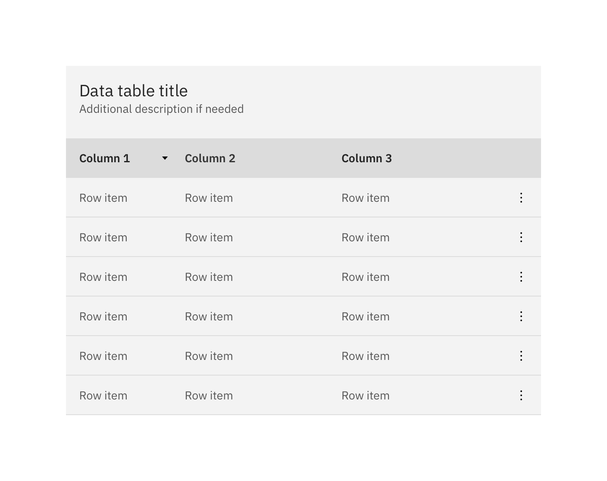
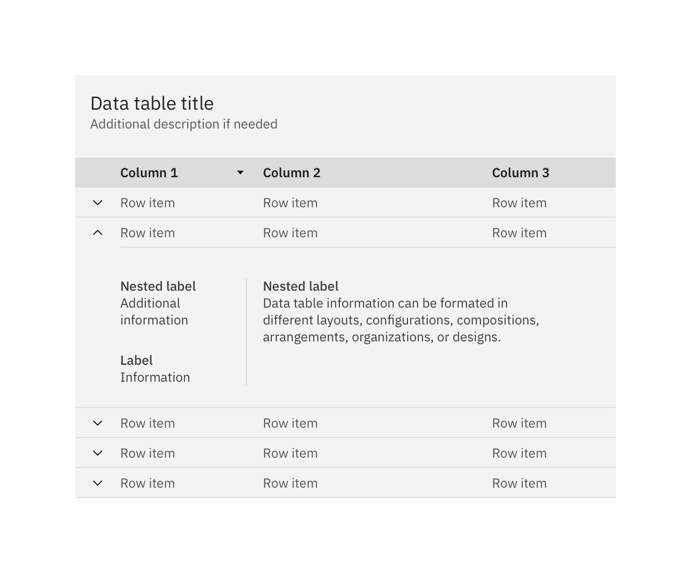
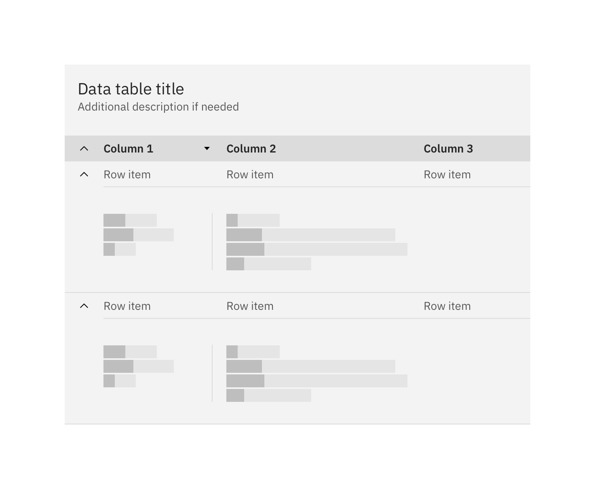

## Basic data table

The data table component is designed in a way for additional functionality to be added on to fit your team's needs.

The basic data table is shipped with a base style, which includes:

- Borders
- No zebra striping, row dividers instead.
- No Pagination, search, table toolbar, or multi-select

## Additional functionality

The following can be added to the data table to increase its functionality.

### Pagination

Pagination divides table data into separate pages. Pagination is accompanied by an option that enables the user to change the number of items per page. See the [pagination](/components/Pagination) component for further guidelines.

### Search

Search returns results based on matches. It is used to locate and display a set of results. Search functionality within a table follows [small search](/components/search) conventions. Search should be closed by default, and live below the table title.

### Sorting

Improve table usability by making data sortable. Clickable headers enable users to sort table data up or down. The specific attribute being sorted is accompanied by a caret icon. The caret will only appear on the column headers once that particular column is being sorted. You can see a demo of this on Carbon's [Codepen.](https://codepen.io/tjegan/pen/PjjyVN)

### Table toolbar

The table toolbar is reserved for global table actions such as table settings, complex filter, export, or editing table data. Additional options can be added if you have an icon to support that function. Icons should be 16x16 px (glyphs). We recommend using no more than 5 icons within the table toolbar.

### Multi-select / batch action

Batch actions are functions that may be performed on multiple items within a table. Once the user selects at least one row from the table, the **batch action bar** appears at the top of the table, presenting the user with actions they can take. To exit or escape "batch action mode," the user can cancel out or deselect the items.

### Inline actions

Inline actions are functions that may be performed on a specific table item. Each row is accompanied by an [overflow menu](/components/overflow-menu) that contains actions related specifically to that table row.

When the overflow menu contains less than three options, keep the actions inline as icon buttons instead. This reduces 1 click and makes available actions visible to users at a glance.

#### Persistent overflow menu

By default, the overflow menu icon appears on hover or focus. This reduces visual clutter and drives user interactions with clear context and results.

Data table also supports persistent overflow menu icons. Overflow icons should only persist if the actions contained within them are core to the function of your table. Enabling persistent overflow icons may complicate data presentation and impact general usability.

### Expandable

The expandable data table is useful for presenting large amounts of data in a small space. Use the expanded section for suplementary information or data that needs additional query time.

By default, the expand-all chevron is not shown. Keeping detailed information in expanded section saves user loading time by postponing some data queries until needed. Expanding all rows at once will typically negate this advantages of the expandable table. If additional load time is expected to display expanded information, use skeleton states instead of spinners.

