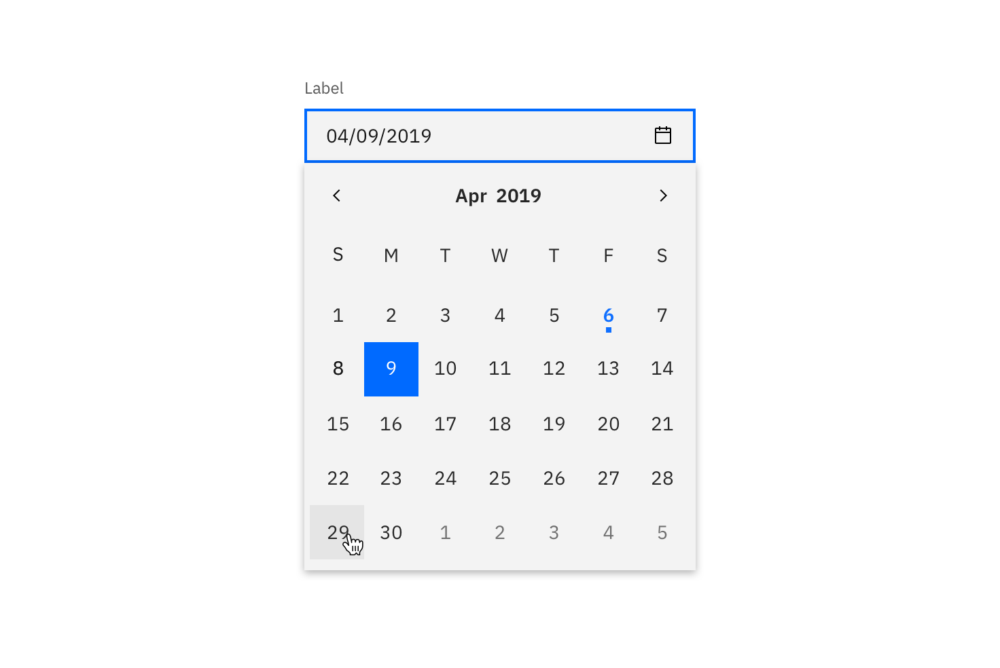
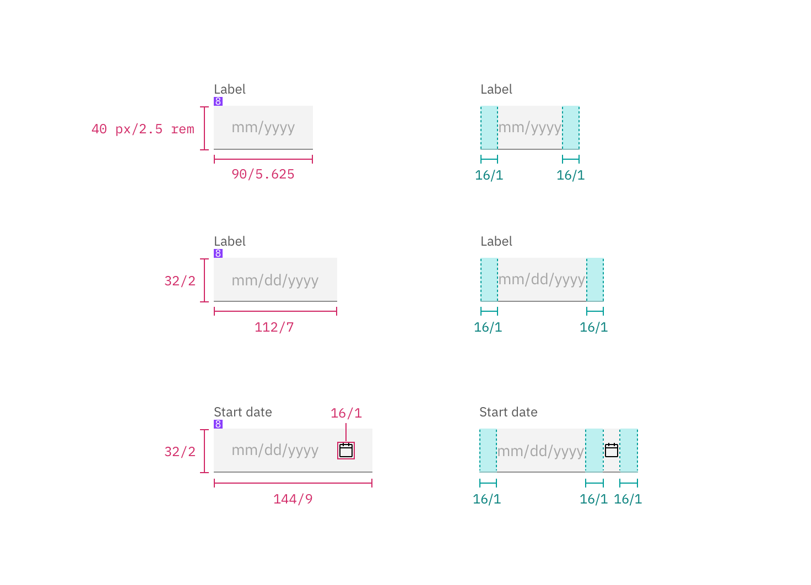
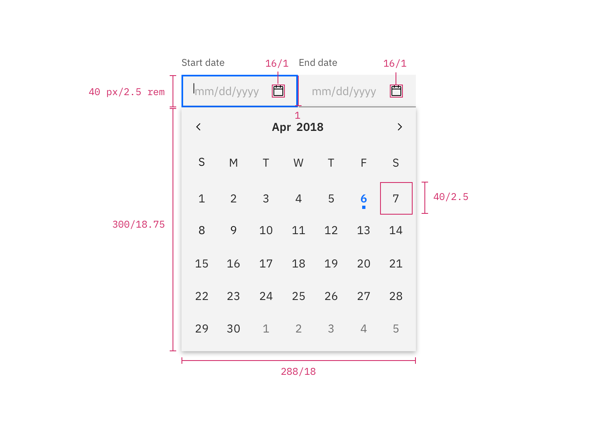
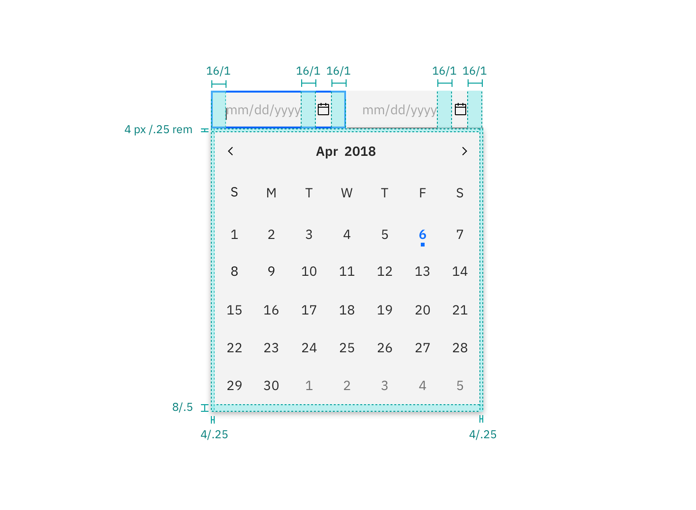
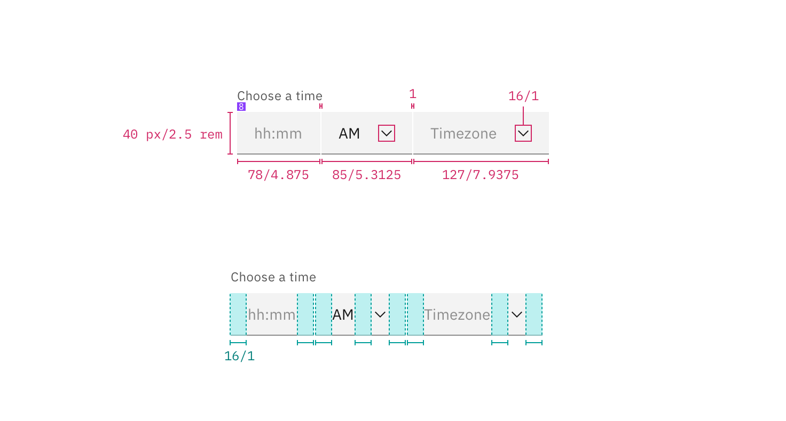

## Color

Inputs come in two different colors. The default input color is `$field-01` and is used on `$ui-background` and `$ui-02` page backgrounds. The `--light` version input color is `$field-02` and is used on `$ui-01` page backgrounds.

If a `min date` is set on the calendar, then any text appearing before that date will be `$disabled-03`, otherwise all text should be `$text-01` (unless the number is selected or highlighted). 

| Class                                           | Property         | Color token |
| ----------------------------------------------- | ---------------- | --------- |
| `.bx--label`                                    | text color       | `$text-02`  |
| `.bx--date-picker__input`                       | background-color | `$field-01` |
| `.bx--date-picker__input`   `.bx--text-input--light` | background-color | `$field-02` |
| `.bx--date-picker__input`                       | border-bottom    | `$ui-04`    |
| `.bx--date-picker__input`                       | text color       | `$text-01`  |
| `:placeholder`                                  | text color       | `$text-03`  |
| `.bx--date-picker__icon`                        | color            | `$icon-01`  |
| `calendar`                                      | background-color | `$ui-01`    |
| `calendar`                                      | box-shadow       |`0 12px 24px 0`   `rgba(0, 0, 0, 0.1)`|
| `day`                                           | text color       | `$text-01`  |
| `day.selected`                                  | text color       | `$text-04`  |
| `day.selected`                                  | background-color | `$interactive-01` |
| `day.inRange`                                   | text color       | `$interactive-01` |
| `day.endRange`                                  | border           | `$interactive-01` |
| `day.nextMonthDay`                              | text color       | `$text-02` |
| `.today`                                        | background-color | `$interactive-01` |

### Interactive states

| Class                                                      | Property      | Color token |
| ---------------------------------------------------------- | ------------- | ----------- |
| `input:focus`                                              | border        | `$focus `     |
| `input[data-invalid]`                                      | border-bottom | `$support-01` |
| `.bx--form-requirement`                                    | text color    | `$support-01` |
| `input[data-invalid]:focus`                                | border-bottom | `$support-01` |
| `day:focus`                                                | border        | `$focus `     |
| `day:hover`                                                | background-color | `$hover-ui` |
| `.bx--label:disabled`                                      | text color    | `$disabled-02` |
| `input:disabled`                                           | background-color | `$disabled-01` |
| `input:disabled`                                           | text color    | `$disabled-02` |
| `icon:disabled`                                            | color         | `$disabled-02` |

**Active:** Placeholder text should remain when the user clicks into the text input and gets a cursor. Once the user starts typing the hint text is replaced with the user input text.

**Error:** Error messages appear below the input field and are always present while invalid.

**Disabled:** Disabled state should have a `.not-allowed` cursor on hover.

## Typography

Labels should be set in sentence case, with only the first word in a phrase and any proper nouns capitalized, and no more than three words.

| Class                                       | Font-size  | Font-weight     | Type token          |
| ------------------------------------------- | ---------- | --------------- | ------------------- |
| `.bx--label`                                | 14 / 0.875 | Regular / 400   | `$label-01`         |
| `.bx--date-picker__input`                   | 14 / 0.875 | Regular / 400   | `$body-short-01`    |
| `.bx--form-requirement`                     | 12 / 0.75  | Regular / 400   | `$label-01`         |

## Structure

### Simple date pickers

| Class                                              | Property                    | px / rem    | Spacing token |
| -------------------------------------------------- | --------------------------- | ----------- | ------------- |
| `.bx--label`                                       | padding-bottom              | 8 / 0.5     | `$spacing-03` |
| `.bx--date-picker__input`                          | height                      | 40 / 2.5    | –             |
| `.bx--date-picker__input`                          | border-bottom               | 1px         | -             |
| `.bx--date-picker__input`                          | padding-left, padding-right | 16 / 1      | `$spacing-05` |

### Single & range date pickers

| Class                                                              | Property                                 | px / rem     | Spacing token |
| ------------------------------------------------------------------ | ---------------------------------------- | ------------ | ------------- |
| `.bx--label`                                                       | padding-bottom                           | 8 / 0.5      | `$spacing-03` |
| `.bx--date-picker__input`                                          | height                                   | 40 / 2.5     | –             |
| `.bx--date-picker__input`                                          | width                                    | 288 / 18     | –             |
| `.bx--date-picker__input`                                          | padding-right, padding-left              | 16 / 1       | `$spacing-05` |
| `.bx--date-picker__calendar`                                       | height                                   | 336 / 21     | –             |
| `.bx--date-picker__calendar`                                       | width                                    | 288          | –             |
| `.bx--date-picker__calendar`                                       | padding-top, padding-right, padding-left | 4 / 0.25     | `$spacing-02` |
| `.bx--date-picker__calendar`                                       | padding-bottom                           | 8 / 0.5      | `$spacing-03` |
| `.bx--date-picker__icon`                                           | height, width                            | 16 / 1       | –             |
| `.bx--date-picker__icon`                                           | padding-right, padding-left              | 16 / 1       | `$spacing-05` |
| `.today` dot                                                       | height & width                           | 4 /0.25      | –             |
| `day`                                                              | height & width                           | 40 / 2.5     | – |

### Time picker

There are two types of time pickers; a 12-hour and 24-hour time picker. The 12-hour Time Picker is accompanied by a time period (am/pm) input, while the 24-hour clock is not. Refer to [select](/components/select), for inline select styling.

| Class                           | Property                    | px / rem | Spacing token |
| ------------------------------- | --------------------------- | -------- | ------------- |
| `.bx--label`                    | padding-bottom              | 8 / 0.5  | `$spacing-03` |
| `.bx--time-picker__input-field` | height                      | 40 / 2.5 | -             |
| `.bx--time-picker__input-field` | padding-right, padding-left | 16 / 1   | `$spacing-05` |
| `.bx--select-input`             | padding-right, padding-left | 16 / 1   | `$spacing-05` |

