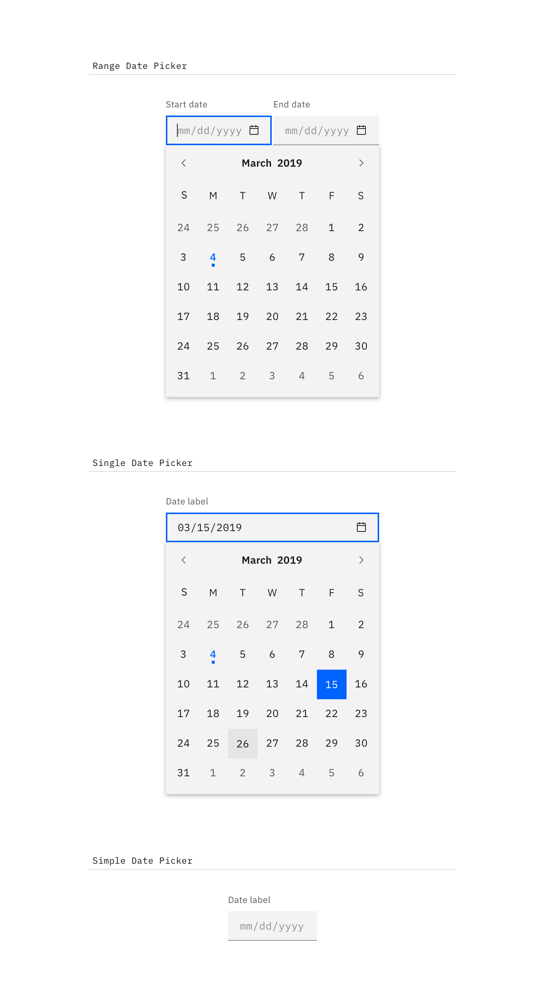
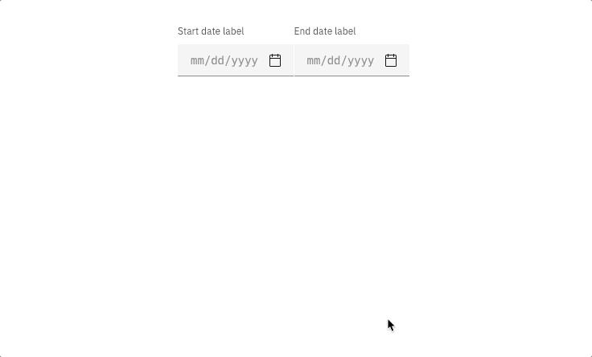

### Date and time pickers allow users to select a single or a range of dates and times.

<AnchorLinks>

<AnchorLink>Variations</AnchorLink>
<AnchorLink>Content</AnchorLink>
<AnchorLink>Interaction</AnchorLink>
<AnchorLink>Time picker</AnchorLink>

</AnchorLinks>

## Variations

| Type                 | Purpose                                                                                    |
| -------------------- | ------------------------------------------------------------------------------------------ |
| _Range date picker_  | To select a range of dates, accompanied by a calendar widget.                              |
| _Single date picker_ | When a user needs to select one date, accompanied by a calendar widget.                    |
| _Simple date picker_ | When the date is known by the user and they don't need a calendar to anticipate the dates. |

## Content

#### Labels

Both date and time pickers are accompanied by labels, and follow the same accessibility guidelines for all [forms](/components/form).

#### Format

For date pickers, use placeholder text so users input the date in the correct format. It can be formatted in a variety of ways. See the date picker code [documentation](https://github.com/carbon-design-system/carbon-components/blob/master/packages/components/src/components/date-picker/README.md) for more info.

## Interaction

#### Calendar widget

It is recommended to use the date picker with a calendar widget when the user is browsing between a range of dates. Aid the user in making the proper choices by providing a visual reference of dates to choose from. The calendar widget appears once the user has interacted with the date input field (typically on `:focus`).

#### Simple date picker

The simple date picker provides the user with a text input in which they can input month/day/year. Simple date pickers are typically used when the date is known by the user, such as a birthday or credit card expiration.

## Time picker

Time pickers provide the user with a text input in which they can input hours/minutes. Additionally, they can be accompanied by an “AM/PM” selection and a time zone selection, which is styled as an [inline select](/components/select).
