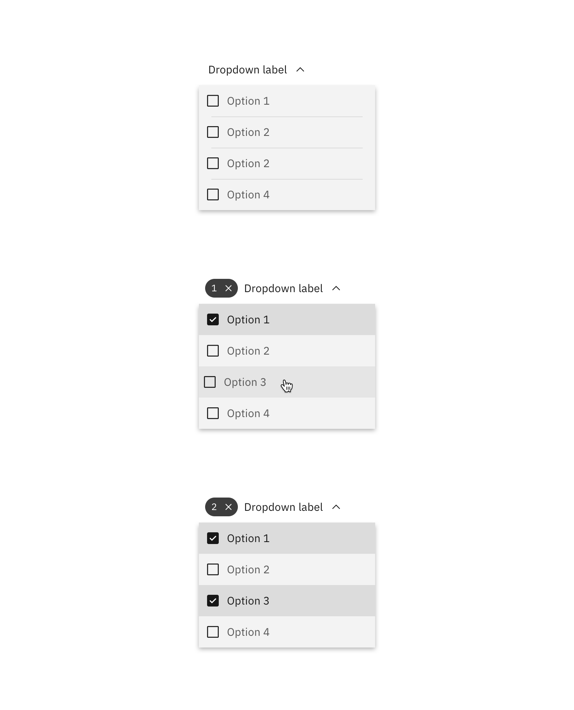
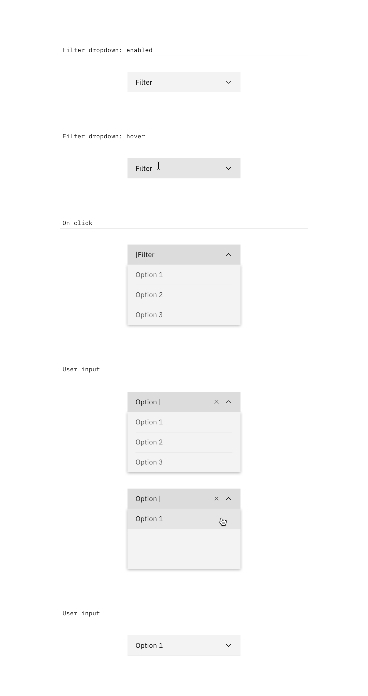
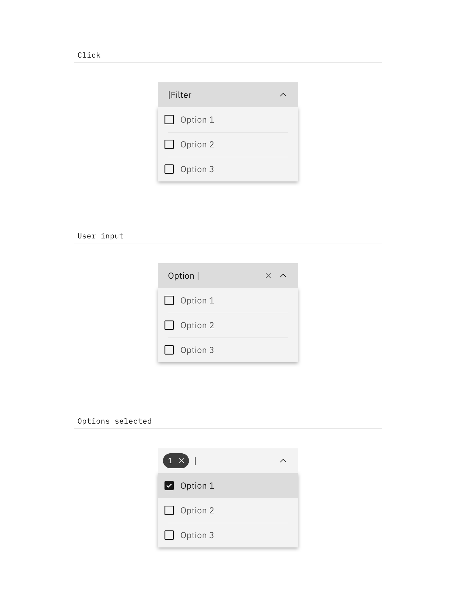

<AnchorLinks>

<AnchorLink>General guidance</AnchorLink>
<AnchorLink>Variations</AnchorLink>
<AnchorLink>Content</AnchorLink>
<AnchorLink>Interaction</AnchorLink>

</AnchorLinks>

## General guidance

_Dropdowns_ present a list of options that can be used to filter existing content. They can also be used as menus. This can be seen in [tabs](/components/tabs), when used in a smaller screen size, collapses into a dropdown.

## Variations

| Type                           | Purpose                                                                                                                                                                                  |
| ------------------------------ | ---------------------------------------------------------------------------------------------------------------------------------------------------------------------------------------- |
| _Dropdown_                     | User needs to pick one option from a list.                                                                                                                                               |
| _Filter dropdown_              | When a list contains more than 25 items, use filtering to help find options from the list. May only be used with dropdown or multi-select dropdown. Cannot be used with inline dropdown. |
| _Multi-select dropdown_        | User needs to select multiple options from a dropdown.                                                                                                                                   |
| _Inline dropdown_              | A stylized dropdown that can be formatted to appear inline with other content and allows the user to select one option.                                                                  |
| _Inline multi-select dropdown_ | A stylized dropdown that can be formatted to appear inline with other content and allows the user to select more than one option.                                                        |

## Content

#### Labels

Labels inform users what to expect in the list of dropdown options. Use clear labels for the dropdown trigger so that users understand the purpose. Keep the label short and concise by limiting it to a single line of text.

#### Dropdown options

Describe the dropdown option succinctly in one line of text. Never use images or icons within a dropdown. Avoid having multiple lines of text in a dropdown, but if text wrapping is necessary, limit it to two lines and an ellipsis (...) for overflow content. We recommend presenting the options in alphabetical order.

## Interaction

By default, the dropdown displays a label when closed. An open dropdown appears on click rather than on hover. Open dropdown drawers should appear above all other UI elements. They can be dismissed by clicking outside of the dropdown item or on the parent element.

Interactions for _inline dropdown_ are the same as above, however we currently don't support an _inline filter dropdown_ (single or multi-select).

### Dropdown

Selecting an item from the dropdown will close the drawer and the selected option will replace the label.

### Multi-select dropdown

The label remains persistent within the dropdown. Once the user chooses an option from the list, a number badge will appear to the left of the label containing the total number of selected items. Selected options float to the top of the list in alphanumeric order.

#### Clear all

To clear all selected items from a list, hover over the number badge and click the "x" icon next to the value. To help with clarity, a browser tooltip appears when the user hovers over the "x" (or `close`) icon to indicate the click action results.

### Filter dropdown

By default, the dropdown displays a label when closed. When the user hovers over the label area, a text cursor will appear. The drawer opens on click (anywhere in the field) and the user can type to filter through the list of options below. Once the user begins typing, the `close` (x) icon will appear to the right of the label. This will clear any user-inputted text. Selecting an item from the dropdown will close the drawer and the selected option will replace the default label.

### Multi-select filter dropdown

This variation of dropdown follows the same interaction patterns described above with the following exceptions:

- The label will remain persistent except when the user is inputting text.
- Selected options will appear at the top of the list.
- The drawer does not close once the user makes a selection. The user will need to click outside of the dropdown or on the parent element to close the drawer.

