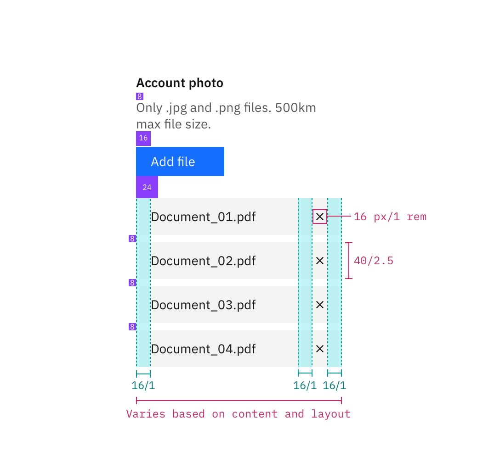

## Color

| Class                      | Property   | Color token |
| -------------------------- | ---------- | ----------- |
| `.bx--label`               | text color | `$text-01`  |
| `.bx--label-description`   | text color | `$text-02`  |
| `.bx--file-filename`       | color      | `$text-01`  |
| `.bx--file__selected-file` | background | `$ui-01`    |
| `.bx--file-close`          | fill       | `$icon-01`  |

### Interactive states
| Class                         | Property   | Color token |
| ----------------------------- | ---------- | ----------- |
| File name: invalid            | text color | `$disabled-02`|
| Error message                 | text color | `$support-01` |
| `.bx--file-filename`          | border-bottom | `$support-01` |

## Typography

The file uploader label and instruction text should be set in sentence case, with only the first letter of the first word in the sentence capitalized.

| Class                    | Font-size (px/rem) | Font-weight     | Type token          |
| ------------------------ | ------------------ | --------------- | ------------------- |
| `.bx--label`             | 14 / 0.875         | Semi-bold / 600 | `$heading-01`       |
| `.bx--label-description` | 14 / 0.875         | Regular / 400   | `$body-short-01`    |
| `.bx--file-filename`     | 14 / 0.875         | Regular / 400   | `$body-short-01`    |

## Structure

The width of an uploaded file varies based on the content and layout of a design. Refer to the [button](/components/button) guidelines for styling and usage of the “Add files” button.

| Class                      | Property                    | px / rem   | Spacing token |
| -------------------------- | --------------------------- | ---------- | ------------- |
| `.bx--file-filename`       | height                      | 40 / 2.5   | –             |
| `.bx--file-filename`       | width                       | 224 / 14   | –             |
| `.bx--file__selected-file` | padding-left                | 16 / 1     | `$spacing-03` |
| `.bx--file__selected-file` | margin-bottom               | 8 / 0.5    | `$spacing-05` |

### Recommended

The following specs are not built into the file uploader component but are recommended by design as the proper amount between file uploader elements.

| Class             | Property                  | px / rem | Spacing token |
| ----------------- | ------------------------- | -------- | ------------- |
| `.bx--file-close` | height, width             | 16 / 1   | –             |
| `.bx--file-close` | margin-left, margin-right | 16 / 1   | `$spacing-05` |

