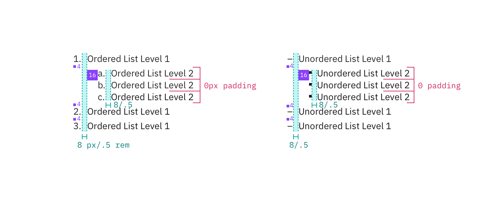

## Color

| Attribute         | Property | Color token |
| ----------------- | -------- | ----------- |
| `.bx--list__item` | color    | `$text-01`  |

## Typography

Level 1 and 2 of any list type should be set in bold and sentence case, with only the first word in a phrase and any proper noun capitalized. **Line height** for lists should be set at 24px / 1.5rem.

| Class               | Font-size (px/rem) | Font-weight   | Type token       |
| ------------------- | ------------------ | ------------- | ---------------- |
| `.bx--list__item`   | 14 / 0.875         | Regular / 400 | `$body-short-01` |
| `.bx--list--nested` | 14 / 0.875         | Regular / 400 | `$body-short-01` |

## Structure

There are two types of Lists, ordered and unordered.
Level 1 ordered list points are marked numerically while Level 2 points are marked with a dash.
Level 1 unordered list points are bulleted while Level 2 points are marked with a dash.

| Item    | Property      | px / rem | Spacing token |
| ------- | ------------- | -------- | ------------- |
| Level 1 | margin-bottom | 4 / 0.25 | `$spacing-02` |
| Level 2 | margin-bottom | 0        | –             |
| Level 2 | padding-left  | 16 / 1   | `$spacing-05` |

