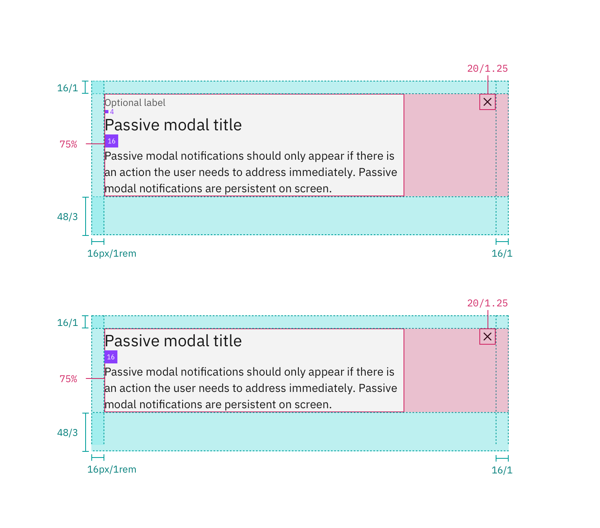
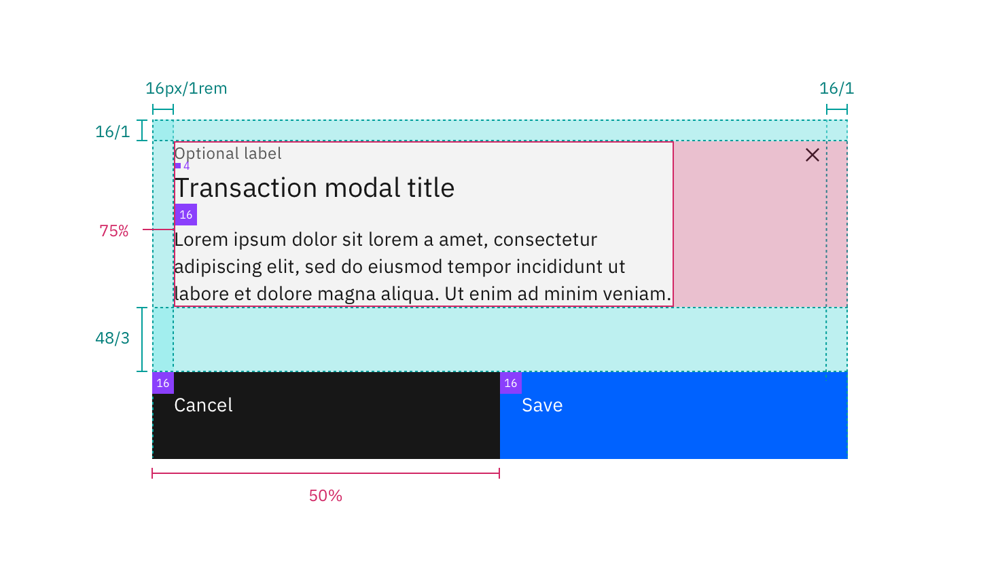
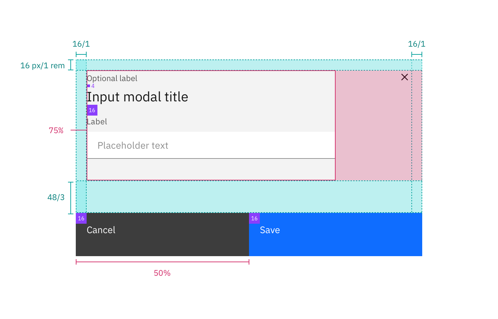
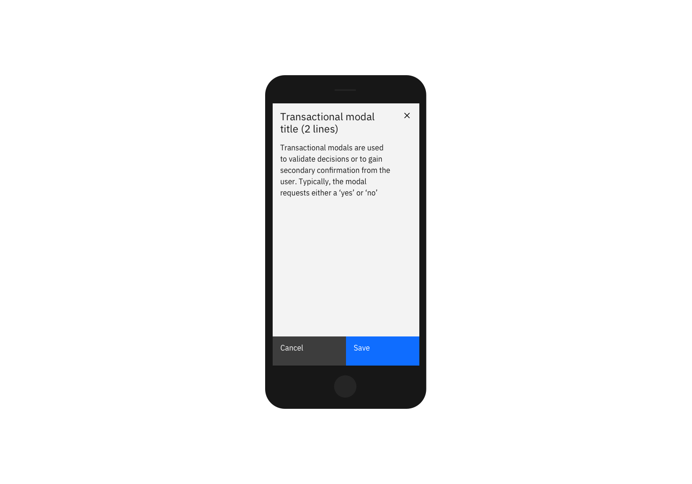

## Color

Refer to the [button](/components/button/style) for primary and secondary button styling in the transactional modal.

| Class                        | Property         | Color token   |
| ---------------------------- | ---------------- | ------------- |
| `.bx--modal-container`       | background-color | `$ui-01`      |
| `.bx--modal-header__label`   | text color       | `$text-02`    |
| `.bx--modal-header__heading` | text color       | `$text-01`    |
| `.bx--modal-content`         | text color       | `$text-01`    |
| `.bx--modal-close__icon`     | fill             | `$icon-01`    |
| `.bx--modal-close:hover`     | background-color | `$hover-ui`   |
| Overlay                      | color            | `$overlay-01` |

## Typography

Modal titles and labels should be set in sentence case. Keep all titles and labels concise and to the point. Modal labels are optional.

| Class                        | Font-size (px/rem) | Font-weight   | Type token      |
| ---------------------------- | ------------------ | ------------- | --------------- |
| `.bx--modal-header__label`   | 12 / 0.75          | Regular / 400 | `$label-01`     |
| `.bx--modal-header__heading` | 20 / 1.25          | Regular / 400 | `$heading-03`   |
| `.bx--modal-content`         | 14 / 0.875         | Regular / 400 | `$body-long-01` |

## Structure

| Class                      | Property                  | px / rem | Spacing token |
| -------------------------- | ------------------------- | -------- | ------------- |
| `.bx--modal-close`         | height, width             | 48 x 48  | –             |
| `.bx--modal-close__icon`   | height, width             | 16 x 16  | –             |
| `.bx--modal-header__label` | margin-bottom             | 4 / 0.25 | `$spacing-02` |
| `.bx--modal-header`        | padding top, padding left | 16 / 1   | `$spacing-05` |
| `.bx--modal-header`        | margin-bottom             | 8 / 0.5  | `$spacing-03` |
| `.bx--modal-content`       | width                     | 75%      | –             |
| `.bx--modal-content`       | padding-left              | 16 / 1   | `$spacing-05` |
| `.bx--modal-content`       | margin-bottom             | 48 / 3   | `$spacing-09` |
| `.bx--btn--primary`        | width                     | 50%      | –             |
| `.bx--btn--secondary`      | width                     | 50%      | –             |

### Mobile

Modals should be full screen on mobile.

