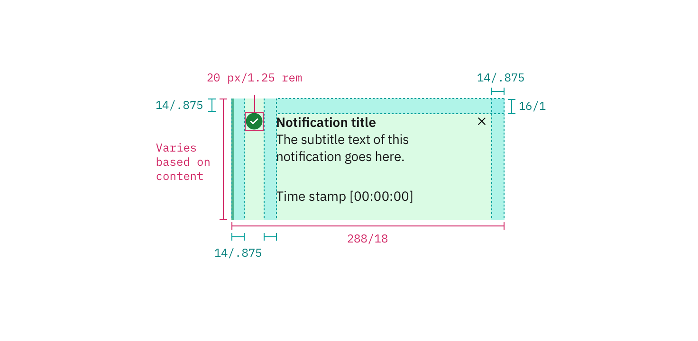
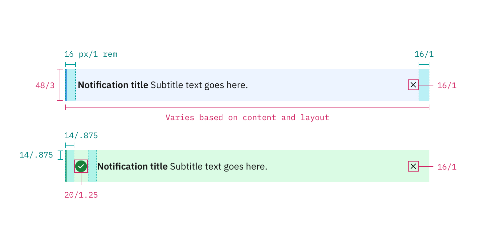

## Color

| Class                   | Property         | Color token            |
| ----------------------- | ---------------- | ---------------------- |
| `title`                 | text color       | `$text-01`             |
| `subtitle`              | text color       | `$text-01`             |
| `close-icon`            | fill             | `$icon-01`             |
| `notification--error`   | background-color | `#fff0f1`              |
| `notification--error`   | border-left      | `$support-01`          |
| `svg.error--filled`     | fill             | `$support-01`          |
| `notification--success` | background-color | `#dafbe4`              |
| `notification--success` | border-left      | `$support-02`          |
| `svg.checkmark-filled`  | fill             | `$support-02`          |
| `notification--warning` | background-color | `#fff0f1`              |
| `notification--warning` | border-left      | `$support-03`          |
| `svg.warning-filled`    | fill             | `$support-03`          |
| `notification--info`    | background-color | `rgba(253,209,58,.15)` |
| `notification--info`    | border-left      | `$support-04`          |

## Typography

Notification text should be set in sentence case with only the first word capitalized. Notification titles should be concise and to the point.

| Class                                                                          | Font-size (px/rem) | Font-weight    | Type token       |
| ------------------------------------------------------------------------------ | ------------------ | -------------- | ---------------- |
| `.bx--toast-notification__title`   `.bx--inline-notification__title`       | 14 / 0.875         | SemiBold / 600 | `$heading-03`    |
| `.bx--toast-notification__subtitle`   `.bx--inline-notification__subtitle` | 14 / 0.875         | Regular / 400  | `$body-short-01` |  |

## Structure

### Toast notification

| Property                                 | Property                 | px / rem | Spacing token |
| ---------------------------------------- | ------------------------ | -------- | ------------- |
| `.bx--toast-notification`                | width                    | 288 / 18 | –             |
| `.bx--toast-notification`                | border-left              | 3px      | –             |
| `.bx--toast-notification`                | padding-right            | 16 / 1   | `$spacing-05` |
| `.bx--toast-notification__title`         | margin-top               | 16 / 1   | `$spacing-05` |
| `.bx--toast-notification__subtitle`      | margin-bottom            | 24 / 1.5 | `$spacing-06` |
| `.bx--toast-notification__details`       | padding-right            | 16 / 1   | `$spacing-05` |
| `.bx--toast-notification__caption`       | margin-bottom            | 16 / 1   | `$spacing-05` |
| `.bx--inline-notification__close-button` | height, width            | 48 / 3   | –             |
| `close-icon`                             | margin-top, margin-right | 16 / 1   | `$spacing-05` |

### Inline notification

The width of an _inline notification_ will vary based on content or layout.

| Property                                 | Property                    | px / rem  | Spacing token |
| ---------------------------------------- | --------------------------- | --------- | ------------- |
| `.bx--inline-notification`               | min-height                  | 48 / 3    | `$spacing-09` |
| `.bx--inline-notification`               | border-left                 | 3px       | –             |
| `.bx--inline-notification__details`      | margin-left, margin-right   | 16 / 1    | `$spacing-05` |
| `.bx--inline-notification__text-wrapper` | padding-top, padding-bottom | 12 / 0.75 | `$spacing-04` |
| `.bx--inline-notification__icon`         | margin-right                | 16 / 1    | `$spacing-05` |
| `.bx--inline-notification__close-button` | height, width               | 48 / 3    | –             |
| `close-icon`                             | icon size                   | 16 x 16   | –             |

