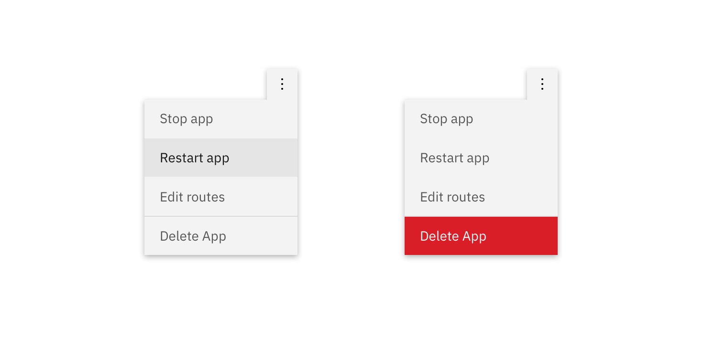
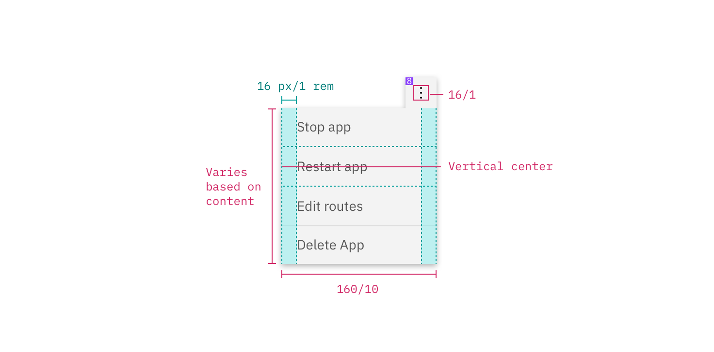

---

title: Overflow menu
tabs: ['Code', 'Usage', 'Style']
---

## Color

| Class                                              | Property         | Color token   |
| -------------------------------------------------- | ---------------- | ------------- |
| `.bx--overflow-menu__icon`                         | fill             | `$icon-01`    |
| `.bx--overflow-menu-options`                       | background-color | `$ui-01`      |
| `.bx--overflow-menu-options__btn`                  | color            | `$text-02`    |
| `.bx--overflow-menu-options__option--danger`       | background-color | `$support-01` |
| `.bx--overflow-menu-options`                       | box-shadow       | `0 2px 6px 0 rgba(0, 0, 0, 0.3)` |

### Interactive states

| Class                                              | Property         | Color token   |
| -------------------------------------------------- | ---------------- | ------------- |
| `.bx--overflow-menu:focus`                         | border           | `$focus`      |
| `option:focus`                                     | border           | `$focus`      |
| `.bx--overflow-menu:hover`                         | background-color | `$hover-ui `  |
| `option:hover`                                     | background-color | `$hover-row ` |
| `option:hover`                                     | text color       | `$text-01`    |
| `option--danger:hover`                             | background-color | `$hover-danger`|
| `option:disabled`                                  | text color       | `$disabled-02`|

## Typography

Overflow menu text should be set in set in sentence case with the first letter of the first word capitalized.

| Property                          | Font-size (px/rem) | Font-weight   | Type token       |
| --------------------------------- | ------------------ | ------------- | ---------------- |
| `.bx--overflow-menu-options__btn` | 14 / 0.875         | Regular / 400 | `$body-short-01` |

## Structure

The height of an overflow menu is determined by the amount of content in the menu. The overflow menu icon can be found in the [iconography](/style/iconography/library) library.

| Class                                        | Property                    | px / rem    | Spacing token |
| -------------------------------------------- | --------------------------- | ----------- | ------------- |
| `.bx--overflow-menu__icon`                   | icon size                   | 16 x 16px   | –             |
| `.bx--overflow-menu-options__btn`            | padding-right, padding-left | 16 / 1      | `$spacing-05` |
| `.bx--overflow-menu-options`                 | height                      | 32 / 2      | –             |
| `.bx--overflow-menu-options__option--danger` | border-top                  | 1px         | –             |

