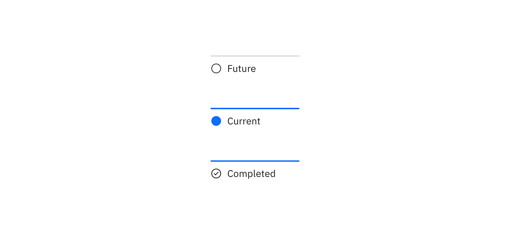
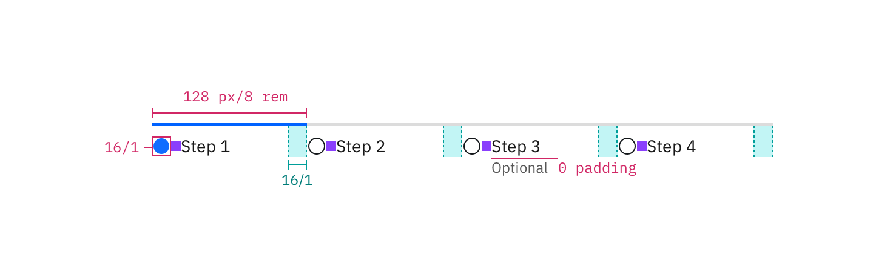
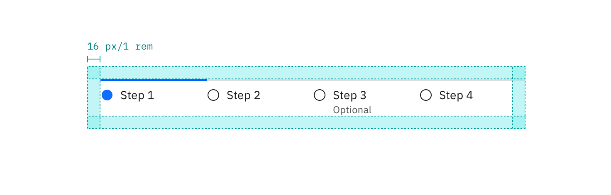

---

title: Progress indicator
tabs: ['Code', 'Usage', 'Style']
---

## Color

All steps that have been completed are indicated by an outlined circle with a checkmark. The current step the user is on is indicated by a filled circle. Steps the user has not encountered yet, or future steps, are indicated by an outlined circle.

| Class                                                        | Property         | Color token       |
| ------------------------------------------------------------ | ---------------- | ----------------- |
| `.bx--progress-step--complete svg`                           | fill             | `$interactive-04` |
| `.bx--progress-step--incomplete svg`                         | fill             | `$interactive-04` |
| `.bx--progress-step--current`   `.bx--progress-line`     | background-color | `$interactive-04` |
| `.bx--progress-step--incomplete`   `.bx--progress-line`  | background-color | `$ui-03`          |
| `.bx--progress-label`                                        | text color       | `$text-01`        |
| `.bx--progress-optional`                                     | text color       | `$text-02`        |

### Interactive states

| Class                                                        | Property         | Color token       |
| ------------------------------------------------------------ | ---------------- | ----------------- |
| `.bx--progress-step:focus`                                   | border           | `$focus`          |
| `.bx--progress-label:hover`                                  | text color       | `$link-01`        |
| `.bx--progress__warning`                                     | fill             | `$support-01`     |

## Typography

Labels should be one to two words only, with a limit of 16 characters total per label. All labels should be set in sentence case.

| Class                         | Font-size (px/rem) | Font-weight     | Type token       |
| ----------------------------- | ------------------ | --------------- | ---------------- |
| `.bx--progress-label`         | 14 / 0.875         | Regular / 400   | `$body-short-01` |
| `.bx--progress-optional`      | 14 / 0.875         | Regular / 400   | `$label-01`      |

## Structure

The checkmark icon can be found in the [iconography](/style/iconography/library) library.

| Class                    | Property       | px / rem | Spacing token |
| ------------------------ | -------------- | -------- | ------------- |
| `.bx--progress-step`     | min-width      | 128 / 8  | –             |
| `.bx--progress-step svg` | height, width  | 16 / 1   | –             |
| `.bx--progress-step svg` | margin-top, margin-right | 16 / 1  | `$spacing-05` |
| `.bx--progress-label`    | margin-top     | 16 / 1  | `$spacing-05` |

### Recommended

The following specs are not built into the progress indicator component but are recommended by design as the proper amount between progress indicator elements.

| Class           | Property | px / rem | Spacing token |
| --------------- | -------- | -------- | ------------- |
| `.bx--progress` | margin   | 16 / 1   | `$spacing-05` |

