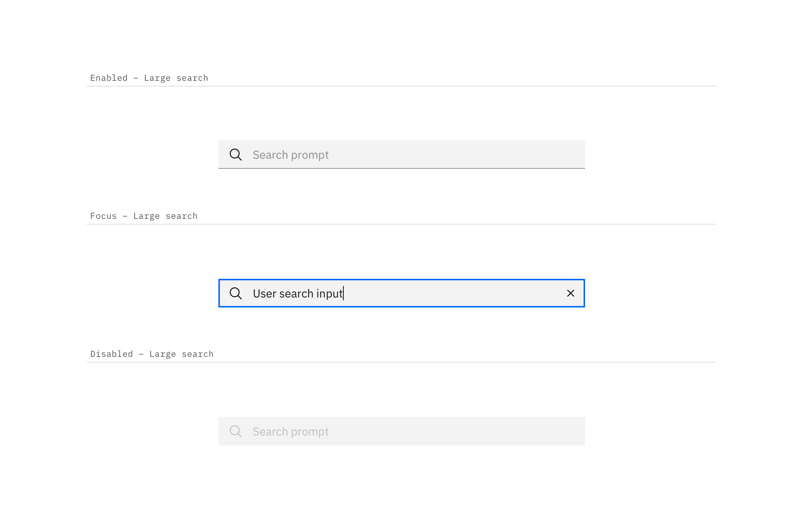

---

title: Search
tabs: ['Code', 'Usage', 'Style']
---

## Color

Inputs come in two different colors. The default input color is `$field-01` and is used on `$ui-background` and `$ui-02` page backgrounds. The `--light` version input color is `$field-02` and is used on `$ui-01` page backgrounds.

| Class                            | Property         | Color token |
| -------------------------------- | ---------------- | ----------- |
| `.bx--search-input`              | background-color | `$field-01` |
| `.bx--search--light`             | background-color | `$field-02` |
| `.bx--search-input`              | border-bottom    | `$ui-04`    |
| `.bx--search-input`              | text color       | `$text-01`  |
| `.bx--search-input::placeholder` | text color       | `$text-03`  |
| `.bx--search-magnifier`          | fill             | `$icon-01`  |

### Interactive colors

| Class                            | Property         | Color token |
| -------------------------------- | ---------------- | ----------- |
| `.bx--search-input:focus`        | border           | `$focus`    |
| `.bx--search-input:disabled`     | background-color | `$disabled-01` |
| `.bx--search-input:disabled`     | text color       | `$disabled-02` |
| `.bx--search-magnifier:disabled` | fill             | `$disabled-02` |

## Typography

Search text should be set in sentence case, with only the first letter of the first word capitalized.

| Property                        | Font-size  | Font-weight     | Type token       |
| ------------------------------- | ---------- | --------------- | ---------------- |
| `.bx--search--lg`               | 16 / 1     | Regular / 400   | `$body-short-02` |
| `.bx--search--sm`               | 14 / 0.875 | Regular / 400   | `$body-short-01` |

## Structure

The width of the search field should appropriately fit the design and layout of content.

| Class                                             | Property                    | px / rem | Spacing token |
| ------------------------------------------------- | --------------------------- | -------- | ------------- |
| `.bx--search--lg`                                 | height                      | 48 / 3   | –             |
| `.bx--search--sm`                                 | height                      | 32 / 2   | –             |
| `.bx--search-magnifier`   `.bx--search-close` | height, width               | 16 / 1   | –             |
| `.bx--search--lg`                                 | padding-left, padding-right | 48 / 3   | `$spacing-09` |
| `.bx--search--sm`                                 | padding-left, padding-right | 32 / 2   | `$spacing-07` |

