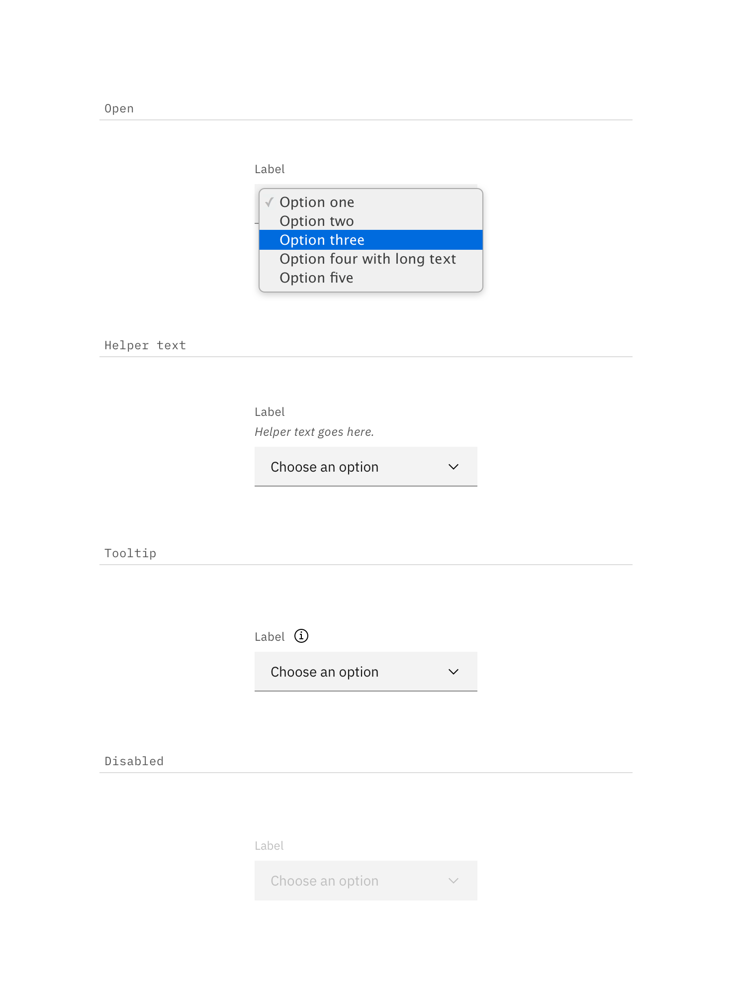
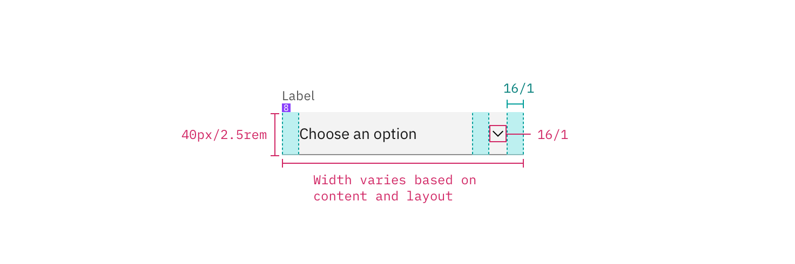
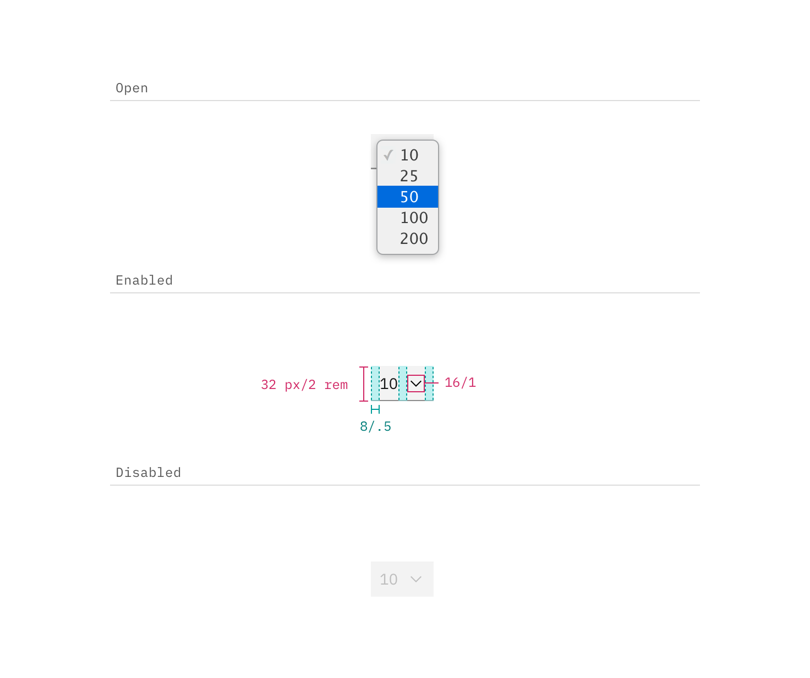

---

title: Select
tabs: ['Code', 'Usage', 'Style']
---

## Color

Inputs come in two different colors. The default input color is `$field-01` and is used on `$ui-background` and `$ui-02` page backgrounds. The `--light` version input color is `$field-02` and is used on `$ui-01` page backgrounds.

| Class                                  | Property   | Color toke    |
| -------------------------------------- | ---------- | ------------- |
| `.bx--select-input`                    | background | `$field-01`   |
| `.bx--select--light`                   | background | `$field-02`   |
| `.bx--select--inline`                  | background | transparent   |
| `.bx--label`                           | text color | `$text-01`    |
| `.bx--select-input`                    | text color | `$text-01`    |
| `.bx--select--inline`                  | text color | `$icon-01`    |
| `.bx--select__arrow`                   | fill       | `$icon-01`    |

### Interaction states

| Class                                                | Property      | Color token   |
| ---------------------------------------------------- | ------------- | ------------- |
| `.bx--select-input:focus`                            | border        | `$focus`      |
| `.bx--select-input[data-invalid]`                    | border        | `$support-01` |
| `.bx--form-requirement`                              | text color    | `$support-01` |
| `.bx--select-input:disabled`                         | background    | `$disabled-01`|
| `.bx--select-input:disabled`                         | text color    | `$disabled-02`|

**Open:** Style determined by browser

**Help text:** Help text appears below the label when the input is active. Help text remains visible while the input is focused and disappears after focus away.

**Error:** Error messages appear below the input field and are always present while invalid.

**Disabled:** Disabled state has a `.not-allowed` cursor hover.

## Typography

Select text should be set in sentence case, with only the first word in a phrase and any proper nouns capitalized. Select text should be three words or less.

| Class                                  | Font-size (px/rem) | Font-weight     | Type token          |
| -------------------------------------- | ------------------ | --------------- | ------------------- |
| `.bx--label`                           | 12 / 0. 75         | Regular / 400   | `$label-01`         |
| `.bx--select-input`                    | 14 / 0.875         | Regular / 400   | `$body-short-01`    |
| `.bx--select--inline`                  | 14 / 0.875         | Regular / 400   | `$body-short-01`    |
| `.bx--form-requirement`                | 12 / 0.75          | Regular / 400   | `$label-01`         |

## Structure

### Select

| Class                     | Property      | px / rem | Spacing token |
| ------------------------- | ------------- | -------- | ------------- |
| `.bx--select-input`       | height        | 40 / 2.5 | –             |
| `.bx--label`              | margin-bottom | 8 / 0.5  | `$spacing-03` |
| `.bx--select-input`       | padding-left  | 16 / 1   | `$spacing-05` |
| `.bx--select__arrow`      | padding-left, padding-right  | 16 / 1   | `$spacing-05` |
| `.bx--select-input`       | border-bottom | 1px      | –             |
| `.bx--select-input:focus` | border        | 2px      | –             |

### Small Select

| Class               | Property                    | px / rem | Spacing token |
| ------------------- | --------------------------- | -------- | ------------- |
| `.bx--select-input` | height                      | 32 / 2   | –             |
| `.bx--select-input` | padding-left                | 8 / 0.5  | `$spacing-03` |
| `.bx--select__arrow`| padding-left, padding-right | 8 / 0.5  | `$spacing-03` |

### Inline select

| Class                 | Property                    | px / rem | Spacing token |
| --------------------- | --------------------------- | -------- | ------------- |
| `.bx--select-input`   | height                      | 32 / 2   | –             |
| `.bx--select-input`   | padding-left                | 8 / 0.5  | `$spacing-03` |
| `.bx--select__arrow`  | padding-left, padding-right | 8 / 0.5  | `$spacing-03` |

