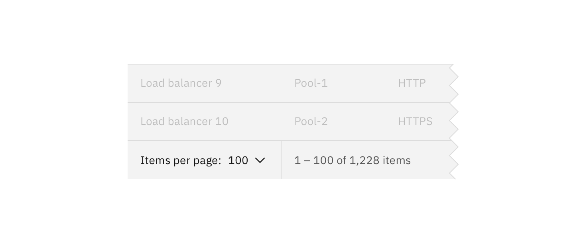

## General guidance

_Select_ is a type of input that is used in forms, where a user is submitting data and chooses one option from a list.

## Variations

| Select type     | Purpose                                                                                                                         |
| --------------- | ------------------------------------------------------------------------------------------------------------------------------- |
| _Default_       | Typically used in forms with a variety of other components.                                                                     |
| _Small select_  | When vertical space is a concern, or select is being paired with a larger component like [data tables](/components/data-table). |
| _Inline select_ | When multiple selects are grouped together.                                                                                     |

#### Small select

_Small selects_ are commonly used in [data tables](/components/data-table). When using a small select for a number selection, the increments in the select should be 10, 25, 50 and 100. The maximum amount of items a user can see per page is 100.

#### Inline select

Inline select is useful when you have multiple select fields within a form. Inline selects have less visual weight on a page because they are borderless.

## General guidelines

### Labels

Labels are essential to the usability of forms. Do not place a label inside a _select_ element. Use sentence case and no more than three words.

### Validation

Real-time validation helps to streamline the process and keep data clean when the user is filling out forms. For full guidelines, refer to the [forms](/components/form) usage page.

### Order

The order of the select list should be based on the frequency of use. If applicable, the list should be in increasing order relative to the content. In cases of forms, alternative orders such as alphabetical may be more fitting. A horizontal rule can be used to group similar items together.

## Accessibility

### Styling select dropdowns

To maximize accessibility, it is strongly recommended not to style select dropdowns.
One of the [WCAG 2.0 standards](https://www.w3.org/TR/WCAG20-TECHS/G202.html) for accessibility is “ensuring keyboard control for all functionality.” CSS alternatives to select elements do not meet this requirement.

While you can make a select element easily usable by a mouse, making it usable with keyboard navigation is complex. The default select element should follow this process:

| State    | Mouse                                    | Keyboard                                            |
| -------- | ---------------------------------------- | --------------------------------------------------- |
| _:hover_ | move your cursor over the select element | use the tab key to focus the select element         |
| _:focus_ | click on the select element              | press enter                                         |
| _:_      | move your cursor over the desired option | use the top and bottom arrow keys to pick an option |
| :select  | click on the desired option              | press enter                                         |
