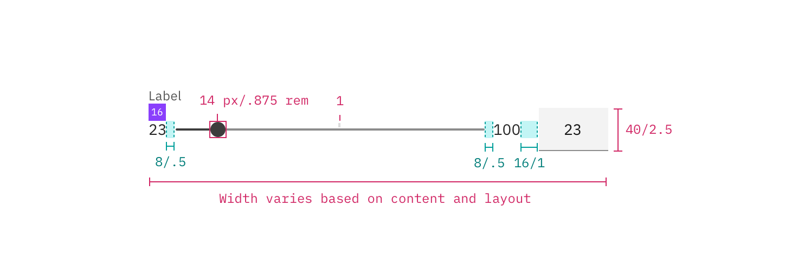

---

title: Slider
tabs: ['Code', 'Usage', 'Style']
---

## Color

| Class                       | Property         | Color token | 
| --------------------------- | ---------------- | ----------- | 
| `.bx--slider__thumb`        | fill             | `$ui-05`    | 
| `.bx--slider__filled-track` | background-color | `$ui-05`    | 
| `.bx--slider__track`        | background-color | `$ui-03`    | 
| `.bx--label`                | text color       | `$text-02`  | 
| `.bx--slider__range-label`  | text color       | `$text-01`  | 

### Interactive states

| Class                              | Property         | Color token       | 
| ---------------------------------- | ---------------- | ----------------- | 
| `.bx--slider__thumb:focus`         | border           | `$focus`          | 
| `.bx--slider__thumb:active`        | fill             | `$interactive-04` | 
| `.bx--slider__filled-track:active` | background-color | `$interactive-04` |
| `.bx--label:disabled`              | text color       | `$disabled-02`    | 
| `.bx--slider__thumb:disabled`      | fill             | `$disabled-02`    | 
| `.bx--slider__track:disabled`      | background-color | `$disabled-02`    | 

## Typography

_Slider_ labels should be set in sentence case, with only the first word in a phrase and any proper nouns capitalized, and no more than three words.

| Class                      | Font-size (px/rem) | Font-weight     | Type token       |
| -------------------------- | ------------------ | --------------- | ---------------- |
| `.bx--label`               | 12 / 0.75          | Regular / 400   | `$label-01`      |
| `.bx--slider__range-label` | 14 / 0.875         | Regular / 400   | `$body-short-01` |

## Structure

The width of a slider varies based on page content and layout.

| Class                                   | Property                  | px / rem   | Spacing token |
| --------------------------------------- | ------------------------- | ---------- | ------------- |
| `.bx--slider__thumb`                    | height, width             | 14 / 0.875 | –             |
| `.bx--slider__thumb:active`             | height, width             | 20 / 1.25  | –             |
| `.bx--slider__track`                    | height                    | 4 / 0.25   | –             |
| `.bx--label`                            | margin-bottom             | 16 / 1     | `$spacing-05` |
| `.bx--slider__track`                    | margin-left, margin-right | 8 / 0.5    | `$spacing-03` |
| `.bx--slider__range-label:last-of-type` | margin-right              | 16 / 1     | `$spacing-05` |

### Recommended

The following specs are not built into the slider component but are recommended by design as the proper sizing for the slider tracking line.

| Class               | Property  | px / rem   | Spacing token |
| ------------------- | --------- | ---------- | ------------- |
| `.bx--slider-track` | min-width | 200 / 12.5 | –             |
| `.bx--slider-track` | max-width | 640 / 40   | –             |
