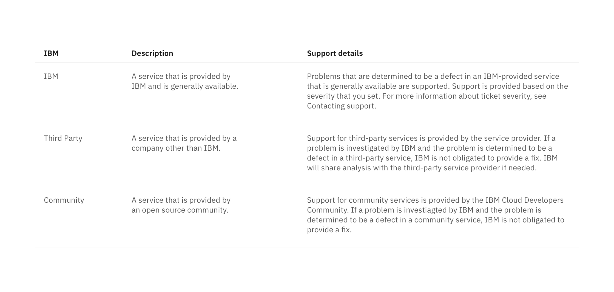

## General guidance

_Structured lists_ group content that is similar or related, such as terms and definitions.

## Content

- Row height varies based on content and can expand to fit multiple lines.
- In a single list, all rows do not have to be the same height.
- Column widths can either be equally proportional or proportioned based on content.
- If a list extends past 25 items, consider using a [data table](/components/data-table) to present this larger set of content.
- A maximum of one paragraph of text is recommended per row.
- Nesting items is not recommended, as structured lists are used to present simple data. If you have additional content that needs to be shown, consider using a [data table](/components/data-table), which supports nesting items.

## Interaction

Structured lists can be single-select if a user is choosing between a set of options.

**Guidelines:**

- Only one item can be selected from the list.
- By default, one option should be selected.
- If you need to select multiple items, use a [data table.](/components/data-table)
- When the user selects an item from the list, the selected row will appear with the `checkmark--filled` icon.
