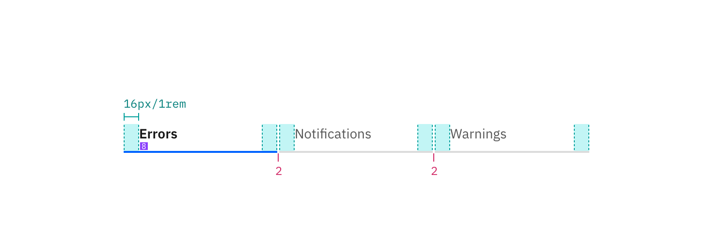

---

title: Tabs
tabs: ['Code', 'Usage', 'Style']
---

## Color

| Class                                               | Property      | Color token         |
| --------------------------------------------------- | ------------- | ------------------- |
| `.bx--tabs__nav-link`                               | text color    | `$text-02 `         |
| `.bx--tabs__nav-item`                               | border-bottom | `$ui-03`            |
| `.bx--tabs__nav-link:selected`                      | text color    | `$text-01`          |
| `.bx--tabs__nav-item--selected`                     | border-bottom | `$interactive-04`   |

### Interactive states

| Class                                               | Property      | Color token         |
| --------------------------------------------------- | ------------- | ------------------- |
| `.bx--tabs__nav-link:hover`                         | text color    | `$text-04`          |
| `.bx--tabs__nav-item:hover`                         | border-bottom | `$ui-04`            |
| `.bx--tabs__nav-item:focus`                         | border        | `$focus`            |

## Typography

Tab label should be set in sentence case, and should not exceed three words.

| Class                          | Font-size (px/rem) | Font-weight     | Type token       | 
| ------------------------------ | ------------------ | --------------- | ---------------- |
| `.bx--tabs__nav-link:selected` | 14 / 0.875         | SemiBold / 600  | `$heading-01`   |
| `.bx--tabs__nav-link`          | 14 / 0.875         | Regular / 400   | `$body-long-01`  |

## Structure

| Class                                       | Property                    | px / rem | Spacing token |
| ------------------------------------------- | --------------------------- | -------- | ------------- |
| `.bx--tabs__nav-item`                       | border-bottom               | 3px      | –             |
| `.bx--tabs__nav-link`                       | padding-left, padding-right | 16 / 1   | `$spacing-05` |
| `.bx--tabs__nav-link`                       | padding-top, padding-bottom | 8 / 0.5  | `$spacing-03` |
| `bx--tabs__nav-item`                        | margin-left                 | 2px      | `$spacing-01` |

