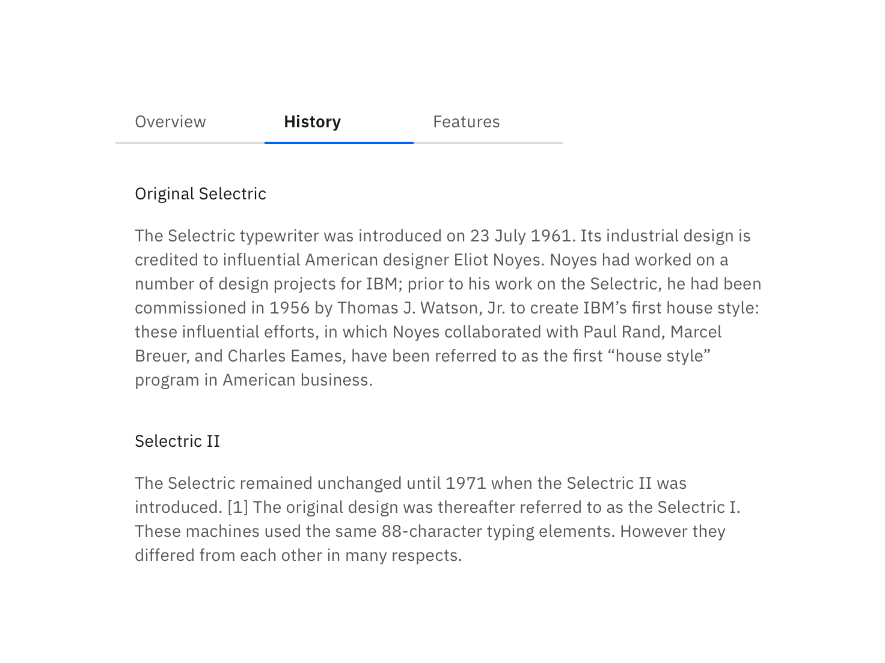

## General guidance
_Tabs_ are used to quickly navigate between views within the same context.

## Format

#### Text

Each tab label describes its content and sets user expectations. Labels are concise and use one to two words maximum. Keep in mind that at mobile widths, the character length of a title will impact the experience. Icons are not permitted in tab labels.

#### Number of tabs

A maximum of six tabs may be displayed. This is to maintain an uncluttered UI and reduce cognitive load for users.

#### Order

Tab order should be consistent across an experience. Tabs with related content should be grouped adjacent to each other.

