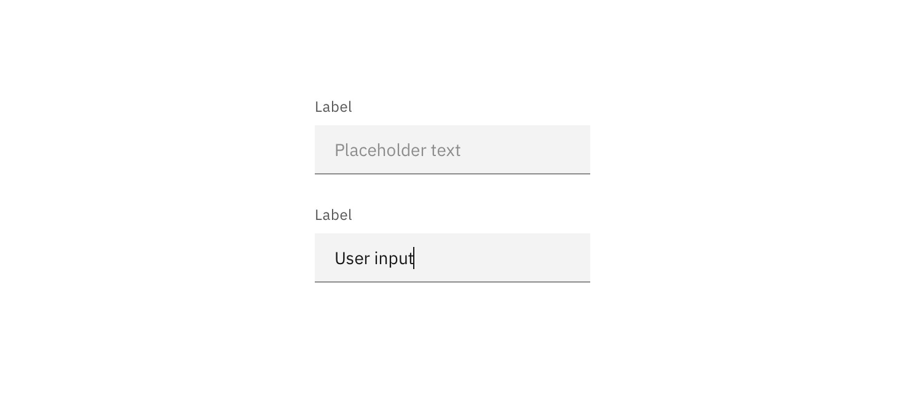
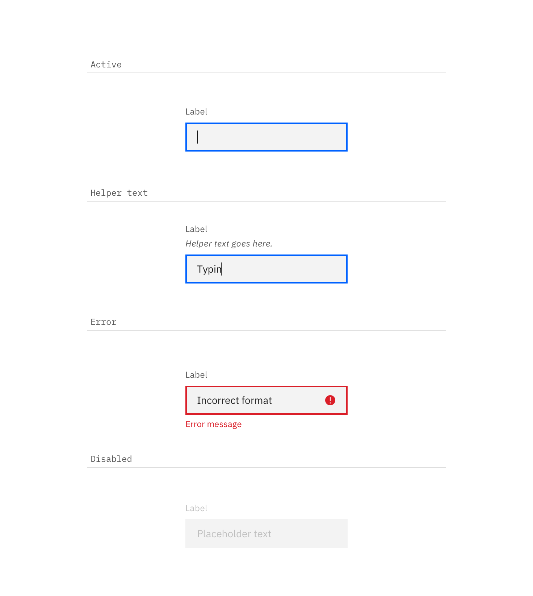

---

title: Text input
tabs: ['Code', 'Usage', 'Style']
---

## Color

Inputs come in two different colors. The default input color is `$field-01` and is used on `$ui-background` and `$ui-01` page backgrounds. The `--light` version input color is `$field-02` and is used on `$ui-02` page backgrounds.

| Class                          | Property         | Color token |
| ------------------------------ | ---------------- | ----------- |
| `.bx--label`                   | text color       | `$text-02`  |
| `.bx--text-input`              | text color       | `$text-01`  |
| `.bx--text-input::placeholder` | text color       | `$text-03`  |
| `.bx--form__helper-text`       | text color       | `$text-02 ` |
| `.bx--text-input`              | background-color | `$field-01` |
| `.bx--text-input--light`       | background-color | `$field-02` |
| `.bx--text-input`              | border-bottom    | `$ui-04`    |

### Interactive states

| Class                                                                | Property   | Color token   |
| -------------------------------------------------------------------- | ---------- | ------------- |
| `.bx--text-input:focus`                                              | border     | `$focus`      |
| `.bx--text-input[data-invalid]`                                      | boorder    | `$support-01` |
| `.bx--form-requirement`                                              | text color | `$support-01` |
| `warning--filled`                                                    | svg        | `$support-01` |

## Typography

Text input labels and placeholder text should be set in sentence case, with only the first word in a phrase and any proper nouns capitalized. Text input labels should be three words or less.

| Class                    | Font-size (px/rem) | Font-weight     | Type token          |
| ------------------------ | ------------------ | --------------- | ------------------- |
| `.bx--label`             | 12 / 0.75          | Regular / 400   | `$label-01`         |
| `.bx--text-input`        | 14 / 0.875         | Regular / 400   | `$body-long-01`     |
| `.bx--form__helper-text` | 12 / 0.75          | Regular / 400   | `$label-01`         |
| `.bx--form-requirement`  | 12 / 0.75          | Regular / 400   | `$label-01`         |

## Structure

| Class                   | Property                    | px / rem | Spacing token |
| ----------------------- | --------------------------- | -------- | ------------- |
| `.bx--text-input`       | height                      | 40 / 2.5 | –             |
| `.bx--label`            | margin-bottom               | 8 / 0.5  | `$spacing-03` |
| `.bx--text-input`       | padding-left, padding-right | 16 / 1   | `$spacing-05` |
| `.bx--text-input`       | border-bottom               | 1px      | –             |
| `.bx--text-input:focus` | border                      | 2px      | –             |

