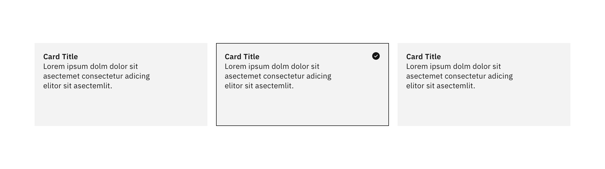
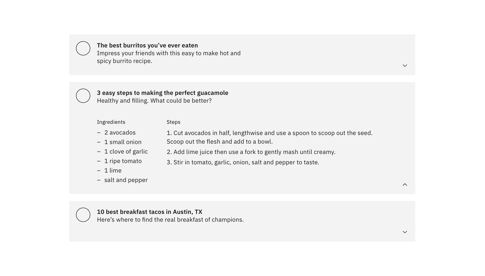

## General guidance

Tiles are a highly flexible component for displaying a wide variety of content, including informational, getting started, how-to, next steps, and more.

Carbon ships a basic tile structure that responds to the grid. Tiles have no pre-set styles for the content within them. You can customize tiles to fit your specific use case.

When using a call-to-action (CTA) within a tile, use a [secondary button](/components/button). Primary buttons should be reserved for the most important action a user can take on the page.

## Variations

_All of the images below represent examples of types of content that could be presented within a tile. The styling in these examples is for illustration only; you are free to create your own layout and design within a tile._

### Read-only

Read-only tiles are used to display information to the user, such as features or services offered. Read-only tiles are often seen on marketing pages to promote content. These tiles can have internal calls-to-action (CTAs), such as a [button](/components/button) or a [link](/components/link).

### Clickable

Clickable tiles can be used as navigational items, where the entire tile is a clickable state, which redirects the user to a new page. Clickable tiles cannot contain separate internal CTAs.

### Selectable

Selectable tiles work like a [radio button](/components/radio-button), where the entire tile is a click target. Selectable tiles may contain internal CTAs (like links to docs) if the internal CTA is given its own click target. Selectable tiles work well for presenting options to a user in a structured manner, such as a set of pricing plans.

### Expandable

Expandable tiles are helpful for hiding/showing larger amounts of content to a user. They can only be stacked in a single column, and cannot live in a row or horizontal grid. When expanded, tiles push content down the page. Expandable tiles may contain internal CTAs (like links to docs) if the internal CTA is given its own click target.

