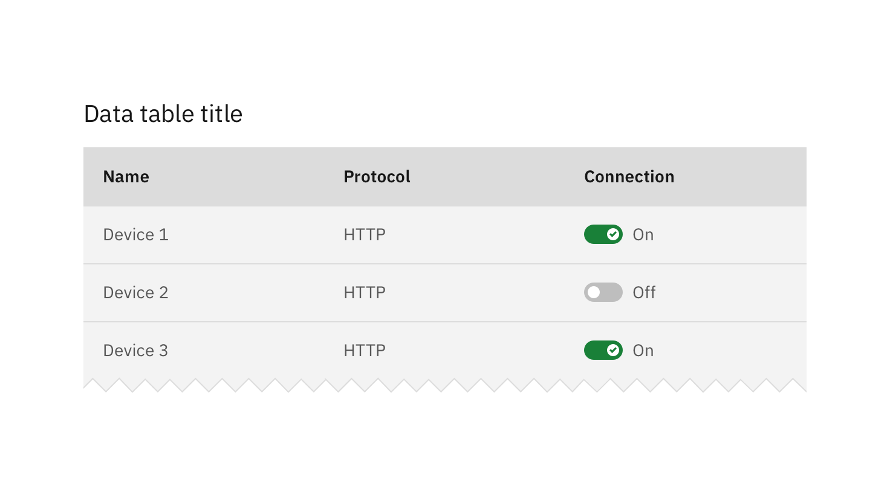

## General guidance

_Toggle_ is a control that is used to quickly switch between two possible states. Toggles are only used for these binary actions that occur immediately after the user “flips” the toggle switch. They are commonly used for “on/off” switches.

#### Heading

A heading may accompany a toggle to further clarify on the action the toggle will perform.

#### Labels

Use labels with a toggle so the action is clear. Labels should be three words or less and appear on the side of a toggle.

#### Language

Use adjectives rather than verbs to describe labels and the state of the object affected.

## Small toggle

Small toggles are more compact in size, therefore they can be used in use cases such as [data tables](/components/data-table/code).

