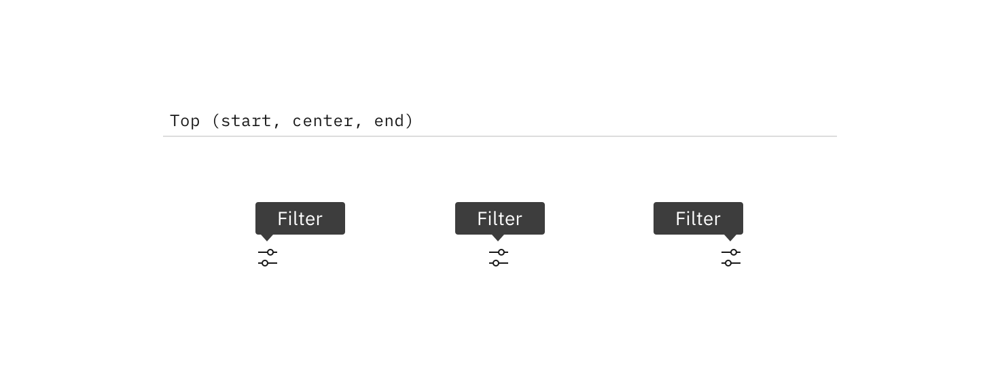
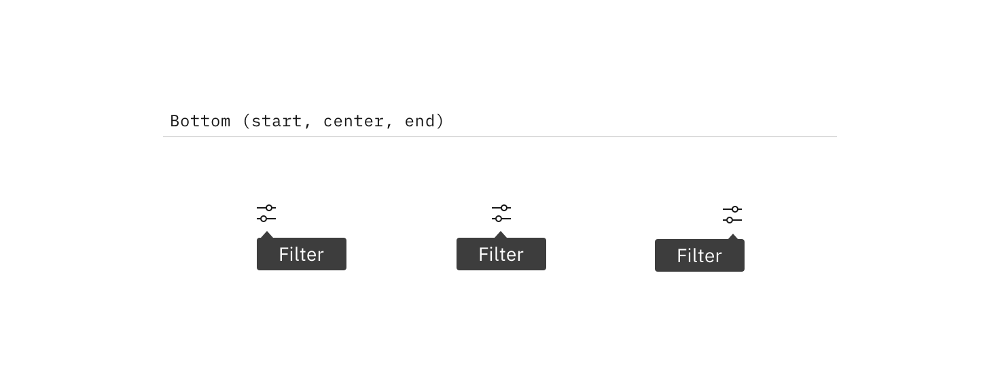
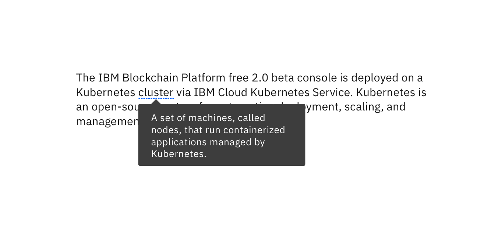
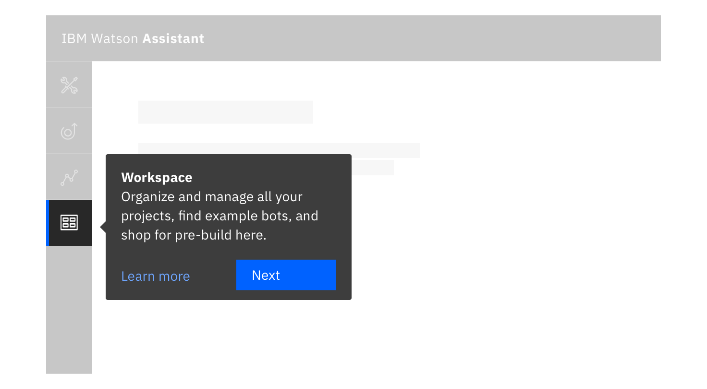

## General guidance

Tooltips provide additional information upon hover or focus. The information should be contextual, useful, and nonessential information. Keep tooltips short.

## Placement

Icon tooltips and interactive tooltips may be positioned **top**, **bottom**, **left**, or **right** to the trigger item. The container of the tooltip text may be aligned to **start**, **center** or **end**.

Note that left and right positioning is not available for [definition tooltip](#definition-tooltip). This ensures the tooltip does not obstruct important information to the left or right of the trigger word.

## Variants

Tooltips provide additional, contextual information. Each variant achieves this for different design needs.

### Icon tooltip

An icon tooltip is used to clarify the action or name of an interactive icon button.

#### Guidance:

* The tooltip content should only contain one or two words.

#### Behavior:

* Icon tooltips appear on `hover` and `focus`.

### Definition tooltip

The definition tooltip provides additional help or defines an item or term. It may be used on the label of a UI element, or on a word embedded in a paragraph.

#### Guidance:

* Should contain brief, read-only text
* Use on proper nouns, technical terms, or acronyms with two letters or more
* Do not use a definition tooltip on words with fewer than two letters

#### Behavior:

* Definition tooltips appear on `hover` and `focus`

### Interactive tooltips

Interactive tooltips may contain rich text and other interactive elements like buttons or links. In general, hiding interactive content in a tooltip is discouraged. Interactive tooltips are best used for onboarding experiences and product tours.

#### Guidance:

* If a user may need to visit an external resource, like while using a form, include a link in your interactive tooltip
* Don't use without a label. Consider the context a user needs before clicking a link

#### Behavior:

* Interactive tooltips appear when the user clicks on an info icon
* They persistent until intentionally dismissed by clicking outside of the tooltip
