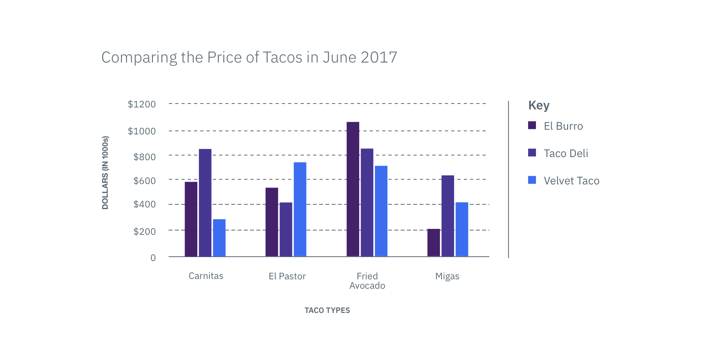

## General guidelines

Bar graphs use rectangles or bars to represent quantitative information. Bars
makes it easy to identify individual values and compare them as each bar is
visually distinct in position, color, and/or length. The width of the bar
doesn't hold meaning but its length matches to a quantitive value on its axis.
The base of every bar should always start at the value zero, otherwise it's
difficult to make relative comparisons between the values. When displaying a
time-series, vertical bar graphs are always used to show change over time by
placing time on the x-axis so it reads chronologically from left to right.

 _Example of a Bar Graph_
