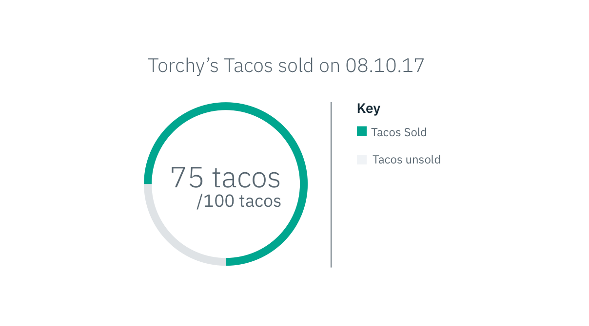

## General guidelines

Gauge graphs show the part-to-whole relationship of one value compared to its
total.

 _Example of a Gauge_

The gauge starts at 12 o'clock and moves clockwise or counterclockwise depending
on its content. When a value is expressing the amount used out of a total, the
gauge will start empty and fill in clockwise. In contrast, if a value is showing
the amount remaining out of a total, the gauge will start full then empty
counterclockwise.

 _Examples of a Gauge clockwise
motion_

 _Examples of a Gauge
counterclockwise motion_
