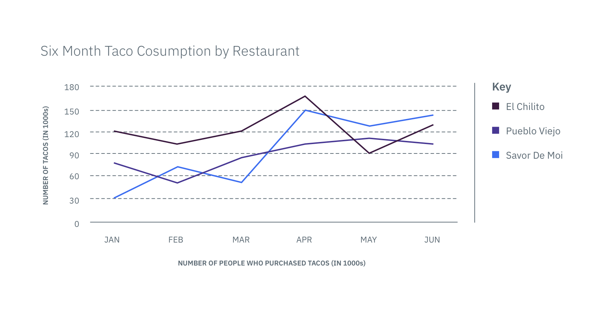

## General guidelines

Line graphs connect individual data values together to show the continuity from
one value to the next, making it a great way to display the shape of values as
they change over time. When displaying a time-series, always place time on the
x-axis so it reads chronologically from left to right.

 _Example of a Line graph_
