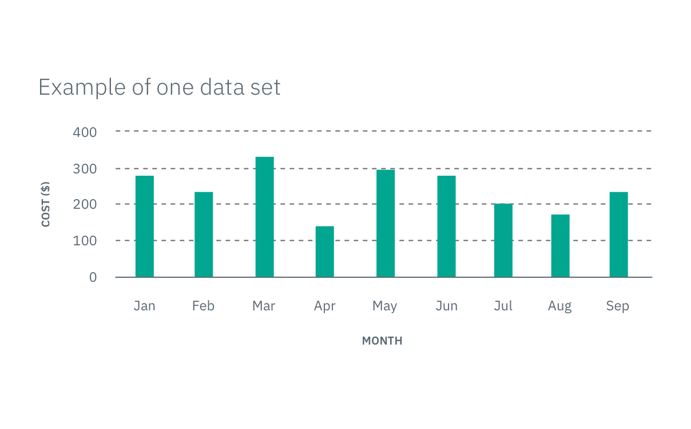
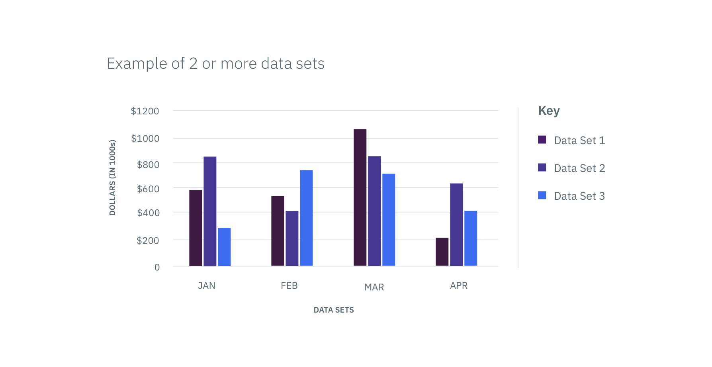

## Color usage best practices

### Color order

For data visualizations with touching colors (no white space between blocks of
color representing data), make sure to use the colors in the order they are
shown from left to right (dark to light). For example, if you are comparing
three sets of data, the colors `primary-01`, `primary-02`, and `primary-03` are
used in that order, respectively.

### One variable

The primary palette is always applied to the first data visualization of any
given page. When there is only one data set, use the color `primary-04`.

 _Example
of primary-04 applied to one data set_

### Two or more variables

When comparing multiple variables (items listed under a key) in one graph, start
by using colors from the primary palette so that each variable has its own
assigned color.

_Example of primary theme applied to two+ data sets_

### Two or more graphs on a page

If there are multiple graphs on a page, the secondary and/or tertiary color
palettes may be used. In cases where your first graph only has one data set
(using `primary-04` as its color) and your second graph requires multiple data
sets, choose from the remaining primary palette colors first. Once the primary
palette colors have been exhausted, feel free to move on to another palette.

_Example of two themes applied to two data visualizations_
