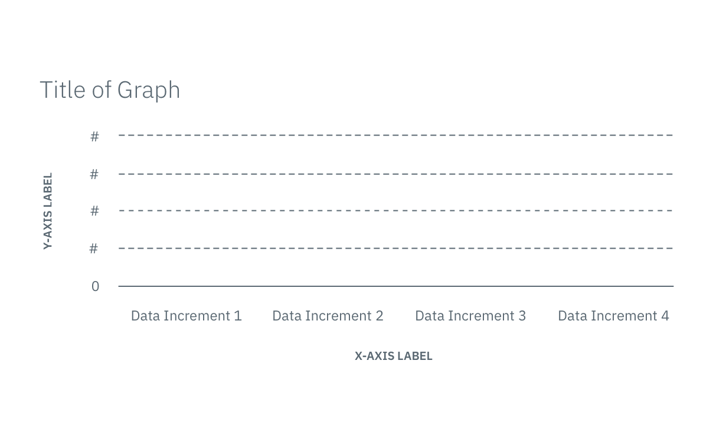

## Graph basics

Data visualization should communicate quantitative information in a way that
tells a story about data. Graphs express data visually, making it easy to see
the general shape of the data to reveal patterns and trends that text or a table
alone cannot.

A graph's story displays the relationship between a set of values, two
quantitative values or a quantitative and categorical value. For example, if we
were to depict cost over time, cost would be the quantitative value and time
would be the categorical value. How this set of values changes over time shows
the pattern of their relationship.

An effective visualization provides enough context to show the graph's purpose,
whether it is to analyze, communicate, monitor, or plan. Below are basic
elements that make up a successful graph.


_Example of base graph with terminology labels_

### Title

A title describes what the graph is about and is set in title case
capitalization. It may state the type of quantitative and categorical
relationship the data presents, for example “2017 Account Cost by Month.”

### X & Y Axes

Typical graphs have two axes, the x-axis that runs horizontally and the y-axis
that runs vertically. Together, the axes outline the area where visual
information is displayed.

### Axis label

An axis label describes the quantitative or categorical value of an axis. For a
quantitative label, make sure to include the unit, either in the label name or
in parentheses after it. In this case, “Cost in Dollars” is the y-axis label
title and “Time” is the x-axis label title.

### Grid lines

Grid lines are points of reference aligned to data increments that divide the
area of a graph into smaller regions, enhancing the ability to notice subtle
differences that makes comparing data easier. Grid lines are not required on a
graph and can be toggled on as a filter option.

### Data representation

The position where a quantitative and categorical value meet is portrayed as
either a point, bar, or line.

### Data increments

Keep the distance between tick marks on the x and y-axis consistently spaced.
This provides a predictable reference and limits the likelihood of distorting
data. The larger the data range, the more tick marks a graph should contain.

Categorical values should be labeled in logical increments, such as consecutive
months. For quantitative values, choose round numbers that fit the given data
range and always include an additional increment greater than the dataset. It is
also best practice to have a quantitative scale begin at zero to avoid
exaggerating value differences.

### Key

A key explains what the plotted data in a graph represents. We recommend using
up to six data sets (and no more) in a key because any more loses the
comparative value of graphs. The key is generally located to the right of a
graph. However, if the amount of items listed in the key exceeds that space or
the span of the graph is limited, place the key below.

### Tooltips

A tooltip appears when hovering over content in a graph, showing the exact
value(s) for that point of intersection of the x and y-axes.

### Empty state

Empty states appear when no data is available, which may be due to a number of
reasons. When applicable, include a call to action that helps users to get the
graph up and running.

### Abbreviations

Abbreviate labels if spacing is a concern. Follow these conventions across
graphs:

---

| Attribute        | Abbreviations                                                                                                                                                                                       |
| ---------------- | --------------------------------------------------------------------------------------------------------------------------------------------------------------------------------------------------- |
| Days of the week | Sun, Mon, Tues, Wed, Thu, Fri, Sat                                                                                                                                                                  |
| Months           | Jan, Feb, Mar, Apr, May, Jun, Jul, Aug, Sep, Oct, Nov, Dec                                                                                                                                          |
| 12 hour time     | 9am, 12pm, 6pm                                                                                                                                                                                      |
| Numbers          | Describe the unabbreviated number in the axis label and use abbreviated numbers in the data increments. For example, the axis label “Cost in thousands” may have data increments 1K, 1.5K, 2K, etc. |
| Currency         | For instance, if an axis label uses “Dollars”, the data increment may be $100, $200, \$300, etc.                                                                                                    |

## Accessibility

Data visualization presents some of the most challenging accessibility problems
on the web. Although there is no one solution for these challenges, here are our
recommendations:

1. Every data visualization is accompanied by an alternative data table view.

2. Use an accessible color palette. See the
   [Colors](/data-visualization/overview/colors) tab for more information about
   colors and how to apply them to your use case.

3. **Use inline SVG:** SVG 2.0 is currently in a draft state. In the meantime we
   can make the most of SVG 1.0 by utilizing the “title” and “desc” attributes
   in combination with ARIA roles and attributes. Below is an example section of
   code using this technique. To see a full example go to
   [Describler](http://describler.com/#intro) and select “aria-bar-chart.svg”
   from the dropdown on the left. Make sure to turn on your sound so you can
   hear the chart read to you!

```html
<g id="ChartRoot" role="chart" aria-charttype="bar">
  <g id="dataarea" role="dataset">
    <g id="datapoint_0" role="datapoint">
      <title role="datavalue" aria-labelledby="x-Saturday">8 Hours</title>
    </g>
  </g>
</g>
```

#### _References_

_“The Visual Display of Quantitative Information” by Edward Tufte_

_“Show Me the Numbers: Designing Tables and Graphs to Enlighten” by Stephen Few_

_“Interactive Data Visualization for the Web, 2nd Edition” by Scott Murray_
