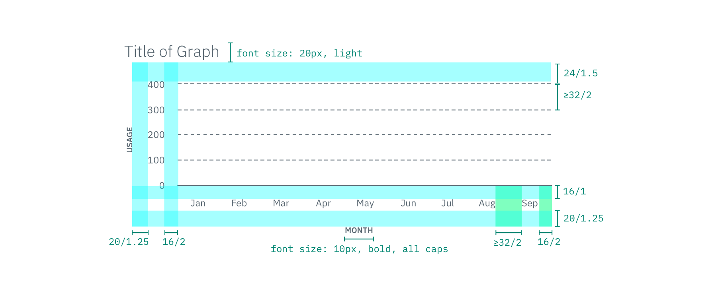
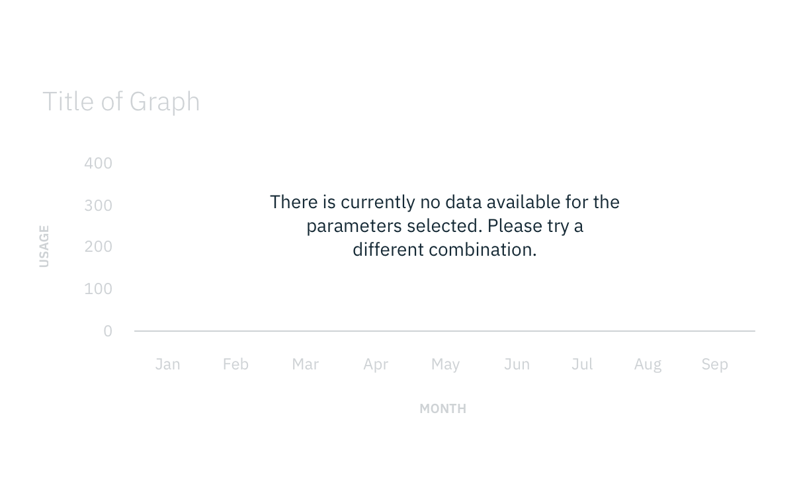

## Color

| Color           | SCSS      | HEX     |
| --------------- | --------- | ------- |
| Graph title     | \$text-02 | #5a6872 |
| Axis labels     | \$text-02 | #5a6872 |
| Grid lines      | \$text-02 | #5a6872 |
| Data Increments | \$text-02 | #5a6872 |
| Tooltip: text   | \$text-02 | #5a6872 |

## Typography

Note that all axis labels should be set in uppercase.

| Property       | Font-size (px/rem) | Font-weight |
| -------------- | ------------------ | ----------- |
| Graph title    | 20 / 1.25          | Light / 300 |
| Axis labels    | 10 / 0.625         | Bold / 700  |
| Data increment | 12 / 0.75          | Roman / 400 |
| Key label      | 16 /1              | Bold / 700  |
| Key label      | 14 /1              | Roman / 400 |

## Structure

Typically graphs should have a height to width ratio of 1:1.5, respectively.
This ensures that graphs are always wider than they are tall. Reference the
chart below to see how much suggested screen real estate a graph should be
covering at different screen sizes.

If using a a data visualization in a modal, only use tiles that take up 50% or
more of the screen.

| Size              | % of Browser viewport |
| ----------------- | --------------------- |
| XS (<576px)       | 100%                  |
| S (576-768px)     | 100%                  |
| M (768-992px)     | 50-100%               |
| L (992-1200px)    | 50-100%               |
| XL (1200-1600+px) | 50-100%               |

| Spacing                                       | px  | rem   |
| --------------------------------------------- | --- | ----- |
| Title & grid line                             | 24  | 1.5   |
| Base grid line & data increment               | 16  | 1     |
| Data increment & edge of graph                | 16  | 1     |
| Data increment & label                        | 20  | 1.25  |
| Between: grid lines (minimum)                 | 32  | 2     |
| Between: horizontal data increments (minimum) | 32  | 2     |
| Key: graph & border line                      | 24  | 1.5   |
| Key: border line & key text                   | 24  | 1.5   |
| Key: key label & data value labels            | 10  | 0.625 |
| Key: data value labels                        | 20  | 1.25  |
| Key: color swatch and data value label        | 10  | 0.625 |

**  **
_Structure and spacing for the base graph | px / rem_

### States

When a graph is not yet populated with data or has been filtered down so much
that there is no data to display, an empty graph state should be shown. The base
graph should be set to 30% opacity and have a message prompting the user to
reset filters or another call to action to help get the data up and running.

**

** _Example of a graph with no data matching the filter parameters_
