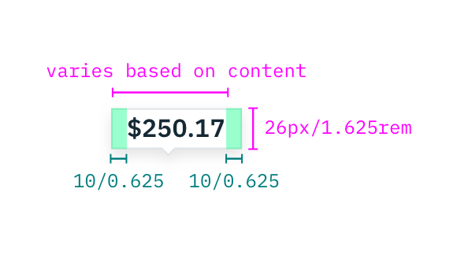
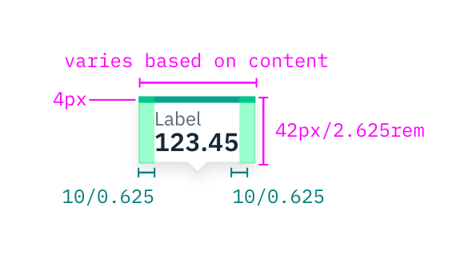
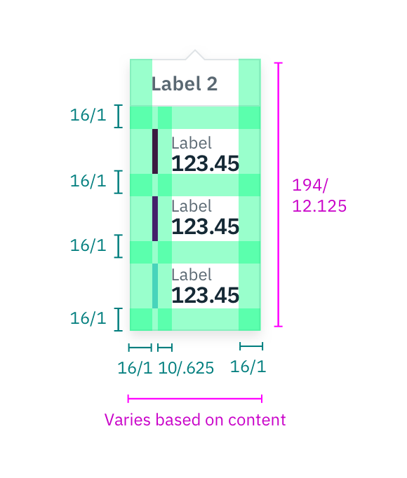
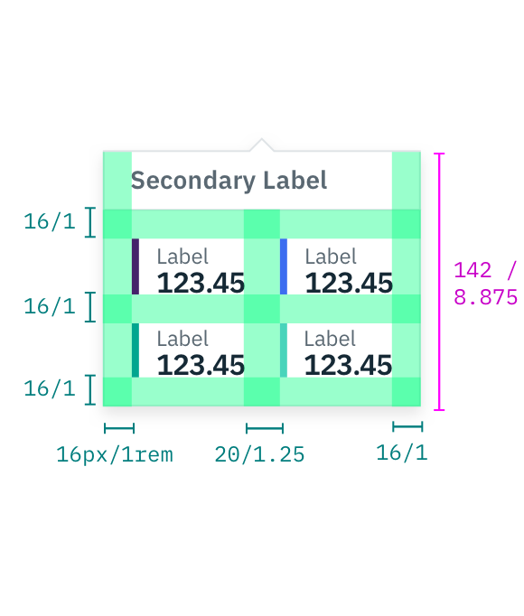
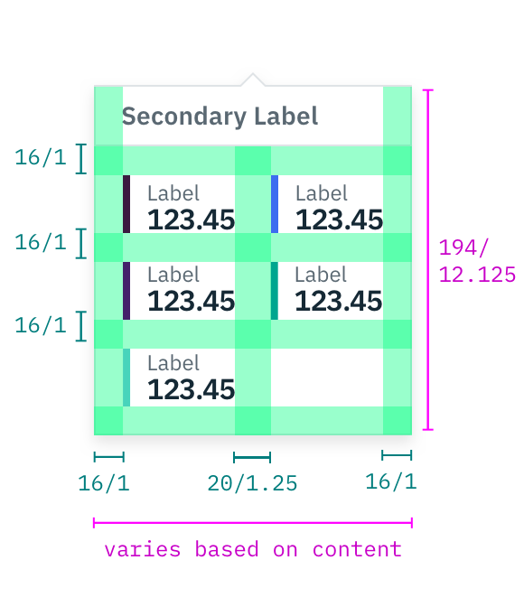
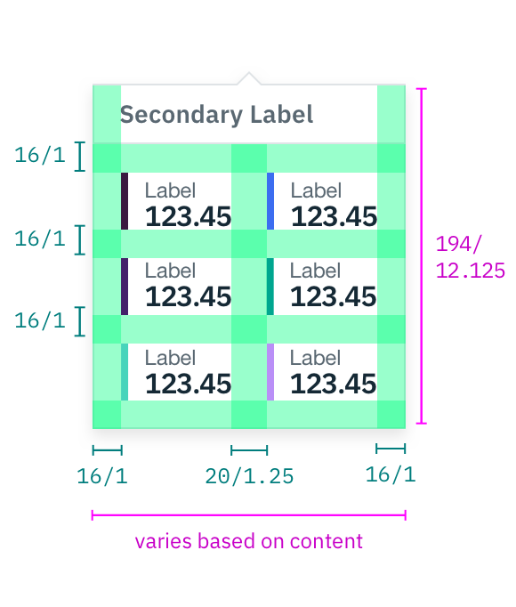
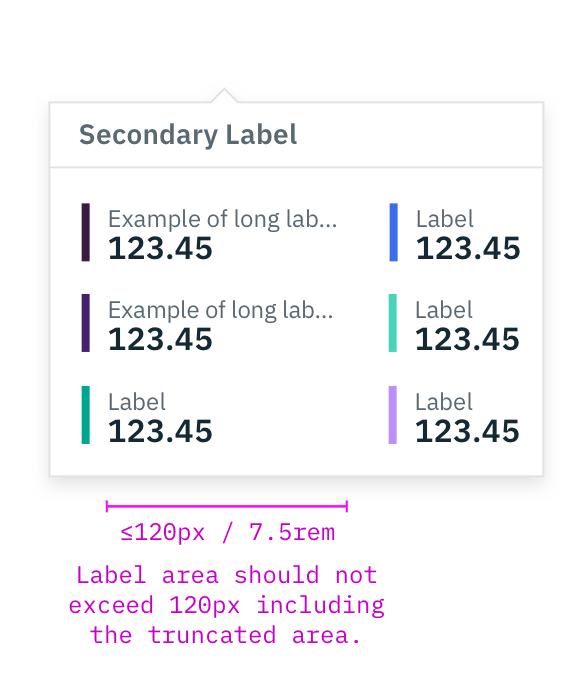
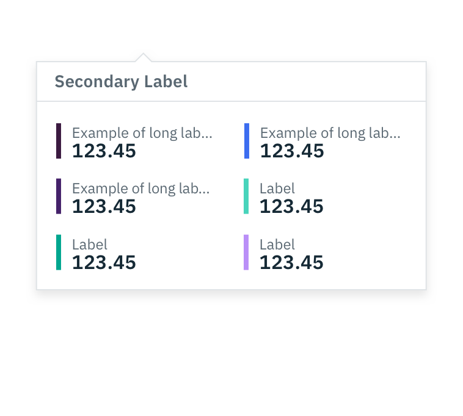

## Color

Note that the color value of top bar of the Small and Medium Tooltips and the
side color bars on Large Tooltip vary based on colors chosen for your data.
Refer to the style tab on the
[Data Vis Overview page](/data-visualization/overview/colors) for base graph
style specifications.

| Color                                     | SCSS      | HEX     |
| ----------------------------------------- | --------- | ------- |
| Background                                | \$ui-01   | #ffffff |
| Border                                    | \$ui-04   | #8897a2 |
| Quantitative data value label             | \$text-01 | #152935 |
| Additional data value label (qualitative) | \$text-02 | #5a6872 |
| Data increment label                      | \$text-02 | #5a6872 |

## Typography

| Property                                  | Font-size (px/rem) | Font-weight |
| ----------------------------------------- | ------------------ | ----------- |
| Quantitative data value label             | 16/1               | Bold / 700  |
| Additional data value label (qualitative) | 12/0.75            | Roman / 400 |
| Data increment label                      | 14/0.875           | Bold / 700  |

## Layer

| Layer   | Elevation | Box-shadow                      |
| ------- | --------- | ------------------------------- |
| Overlay | 8         | `0 4px 8px 0 rgba(0,0,0,0.10);` |

## Structure

There are three different tooltips types. Refer to the
[usage tab](/data-visualization/tooltip/usage) for when to use which tooltip
size.

### Small Tooltip

Width varies based on content length.

| Size              | px  | rem   |
| ----------------- | --- | ----- |
| Height            | 26  | 1.625 |
| Padding: Internal | 10  | 0.625 |

 _Example of a Small
Tooltip_

### Medium Tooltip

Width varies based on content length.

| Size                | px  | rem   |
| ------------------- | --- | ----- |
| Height              | 42  | 2.625 |
| Padding: internal   | 10  | 0.625 |
| Color bar           | 4   | -     |
| Maximum label width | 120 | 7.5   |

 _Example of a Medium
Tooltip_

### Large Tooltip

Width varies based on content length.

| Size                              | px  | rem   |
| --------------------------------- | --- | ----- |
| Height                            | 188 | 11.75 |
| Padding: internal                 | 16  | 1     |
| Padding: data sets (vertically)   | 20  | 1.25  |
| Padding: data sets (horizontally) | 16  | 1     |
| Padding: color bar & data labels  | 10  | 0.625 |
| Color bar                         | 4   | -     |
| Maximum label width               | 120 | 7.5   |

 _Example of a
Large Tooltip_

## Tooltip responsiveness

The below images show how a Tooltip would respond to different amounts of data
values. It also shows how the width of Tooltip changes when a label is at its
max-widtgit h.

<grid-wrapper>

  

   
  

  

    
  

  

    
  

  

    
  

</grid-wrapper>

_Examples of Tooltip responsiveness for different data value amounts_

<grid-wrapper>

  

    
  

  

    
  

</grid-wrapper>

_Example of max-width labels, one column, and two-column Tooltips_
