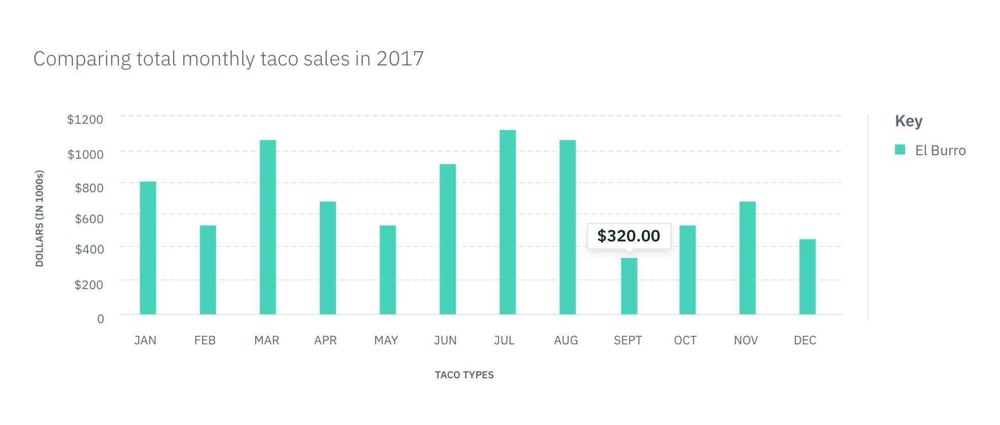
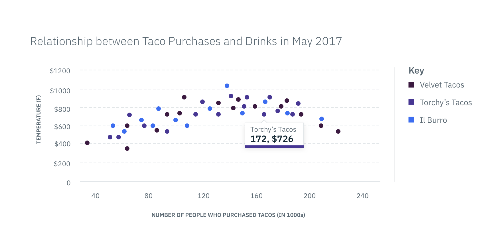
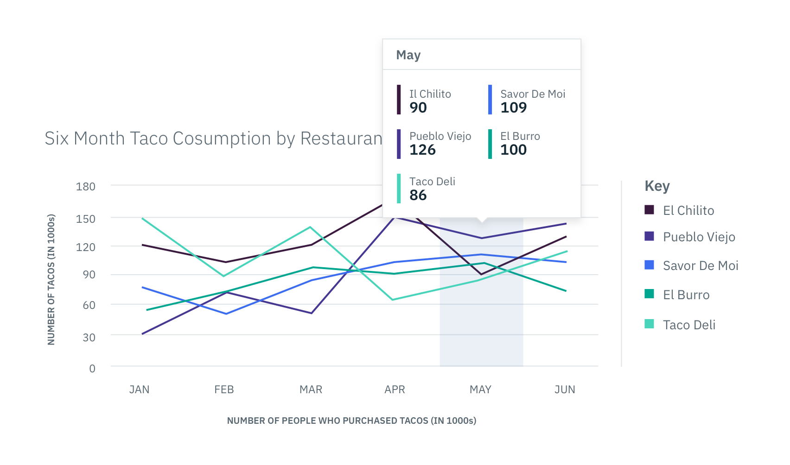

## General Guidelines

There are three different types of Tooltips: Small, Medium, and Large. Tooltips
appear above or below a data representation depending on the use case. The
quantitative value on the Tooltip corresponds to the numerical value that the
data representation is depicting. Choose the type of Tooltip that is the best
fit for your data set based on the descriptions below.

#### Small Tooltip

Use the Small Tooltip when there is one data set. Since only one set of data is
being shown, the label and color border are not necessary.

 _In
context example of a Small Tooltip_

#### Medium Tooltip

The Medium Tooltip is used in scenarios where two or more sets of data are being
compared. The top border color on the Tooltip should match the color of the data
it is representing, as shown in the key. The label can either be referring to
the corresponding name in the key or the intersecting data increment on the
x-axis. Whichever you choose, make sure the labels are consistent across all
Tooltips.

 _In
context example of a Medium Tooltip_

#### Large Tooltip

The Large Tooltip is used when there are multiple data sets represented in a
particular data increment. For example, a Line Graph may have several lines
passing through one data increment or increment range. All of these data points
need to be shown in the Tooltip on hover. The top label describes the data
increment being shown while additional labels correspond to the name of the data
value in the key. The left side border's color should match the color of the
data it is representing, as shown in the key.

 _In
context example of a Large Tooltip_
