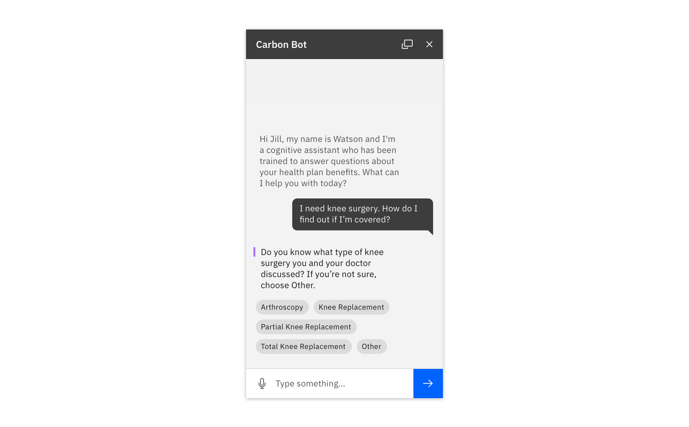

### Use a chatbot when a user would benefit from requesting information on-demand with natural language. They should receive a useful and trustworthy response related to their question or task. 

#### Status:

Experimental

#### Maintainer:

[Vincent Snagg](https://github.com/vincentsnagg)

<AnchorLinks>

<AnchorLink>Common use cases</AnchorLink>
<AnchorLink>User needs</AnchorLink>
<AnchorLink>Why a chatbot?</AnchorLink>
<AnchorLink>Supported components</AnchorLink>

</AnchorLinks>

  

## Common use cases

Bots have become an increasingly popular way to solve common business problems across domains, including:

- **Providing in-context help and guidance** (e.g., scaling a company's FAQ or helping a user get started)
- **Triaging or setting priority of cases** by soliciting information from the user to decrease workload on humans (support tickets, patient symptom severity)
- **Performing common tasks or procedures** (e.g., pay a bill, transfer money, or assist with electing health benefits)
- **Using natural language to search for information** (e.g., find specific information like current balance, or dosing instructions for a medication)

## Why a chatbot?

Before building a bot, make sure that you have justified it as an appropriate solution by asking yourself these questions:

- What are the users' goals?
- How in-depth is the assistance the user will need?
- Is your domain better served by human assistance? 
- How is a bot superior to online documentation, contextual support, wizards, etc.? 
- What kind of data sources or abilities can this bot leverage for your business and your users?

## User needs

#### A user may need:

- Access to help at any time
- An on-demand, relevant answer to a question
- High quality, consistent information about a product or service

#### Within a conversation, a user may need:

- To provide the bot with more context via structured responses
- To know what the bot understands, through reflection and confirming questions
- To identify the most recent and relevant message to improve understanding

#### Don't use a chatbot when:

- A task could be accomplished more efficiently using a traditional user interface
- A process is very complex or could take a long time
- A real human is needed for sensitive or emotional topics

See [IBM Design for Conversational AI](https://www.ibm.com/design/ai/conversation) for more information.

## Supported components

While conversational interfaces may contain many different kinds of components, Carbon currently offers these components out of the box to help get you up and running quickly. See the Usage tab for information on how to use these components together.

| Component                                  | Status                 | 
| ------------------------------------------ | -----------------------|
| Chatbot window                             | Design available       |
| Chatbot header                             | Design available       |
| System message                             | Design available       |
| User message                               | Design available       |
| Structured response                        | Design available       |
| Chatbot cards                              | Design available       |
| Chatbot text input                         | Design available       |

### Chatbot add-on library

<Row className="tile--resource--no-margin tile--group">
<Column offsetLg="4" colLg="4" colMd="4" noGutterSm>
  <ResourceCard
    title="Chatbot Sketch library"
    href="https://ibm.box.com/s/7vauj3l8o88wukv6p80lddwhjlonoipd"
    type="resource">

  </ResourceCard>
</Column>
</Row>

