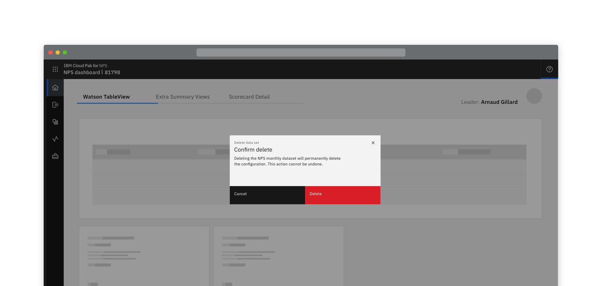
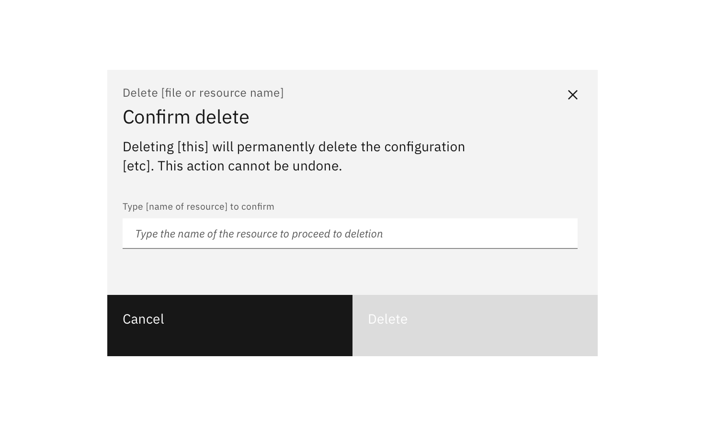
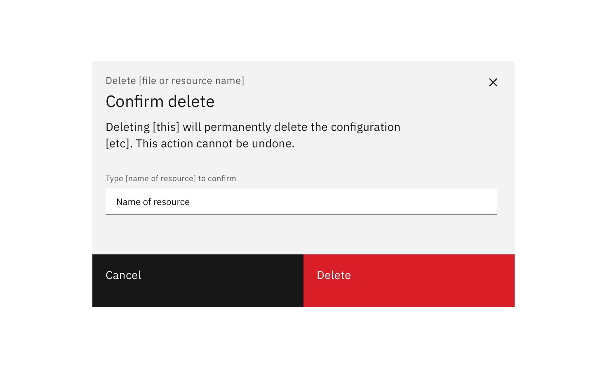
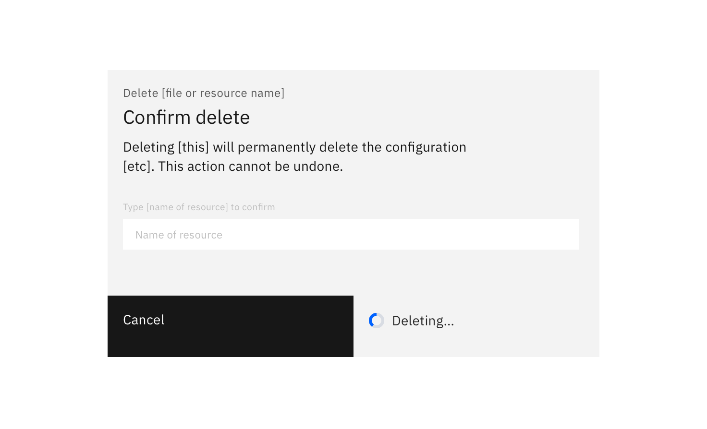
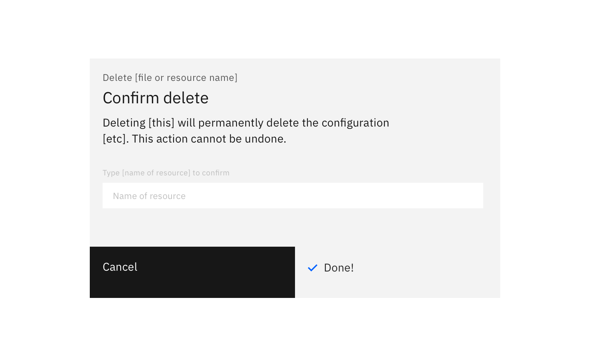
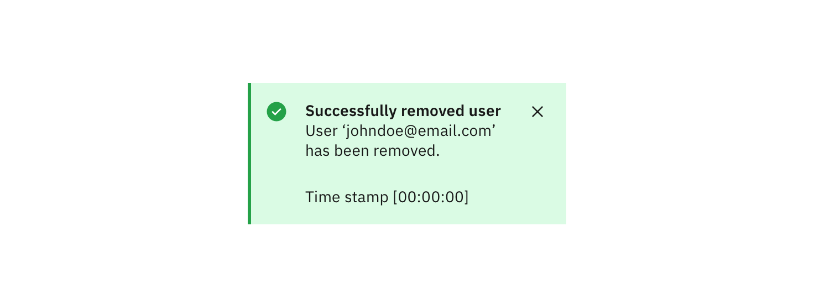
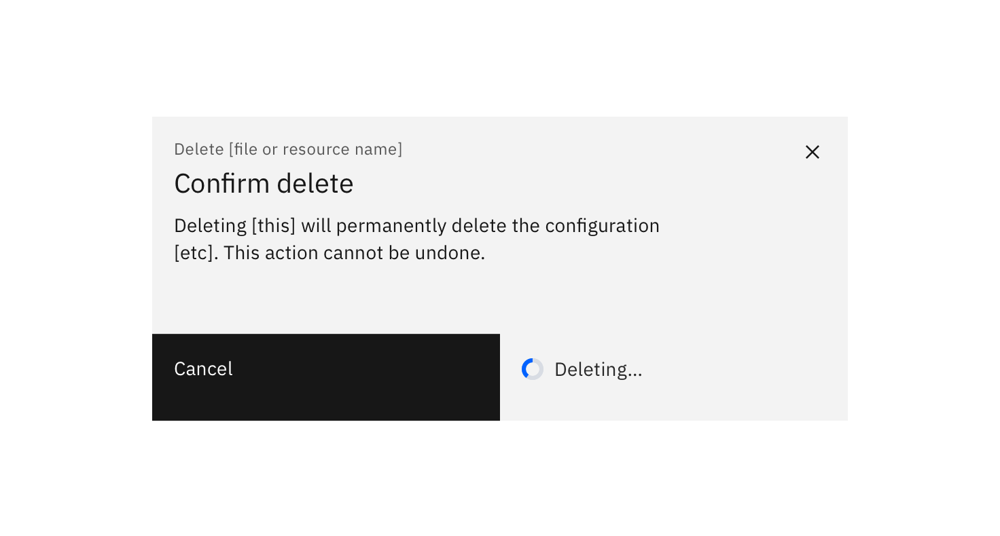

### Deleting is a destructive action. To protect user resources, your product should support ‘undo’ where possible. If ‘undo’ support is impossible, request user confirmation before deleting a resource or asset.

#### Status: 

Experimental

#### Maintainers:

[Vikki Paterson](https://github.ibm.com/VICTORIA), [Arnaud Gillard](https://github.ibm.com/Arnaud-Gillard)

<AnchorLinks>

<AnchorLink>High impact</AnchorLink>
<AnchorLink>Medium impact</AnchorLink>
<AnchorLink>Low impact</AnchorLink>

</AnchorLinks>

## High impact

A high-impact deletion cannot be reversed. The action would result in a significant loss for a user if done accidentally. 

For high-impact scenarios, a user should confirm the action by manually entering the name of the resource. The 'Delete' button is enabled when the text entered perfectly matches the resource name. 

The text should tell the user the consequences of the deletion and that the action cannot be undone. Optionally, when the delete button is selected it changes to `Deleting…`.

You can choose to show a notification confirming deletion is completed. This is useful when the deletion of the resource takes more than a few moments.

## Medium impact

A medium-impact deletion is one that cannot be reversed, but would not be catastrophic if done accidentally. When deleting is medium-impact, a confirmation dialog should be presented to the user which displays:

* The name of the resource
* Consequences of the deletion
* The action cannot be undone

Optionally, when the delete button is selected it changes to `Deleting…`.

You can choose to show a notification confirming deletion is completed. This is useful when the deletion of the resource takes more than a few moments.

## Low impact

Requiring the user to confirm deletion is generally recommended. However, in very low impact situations, such as when an ‘undo’ option is available, user confirmation may not be required.

