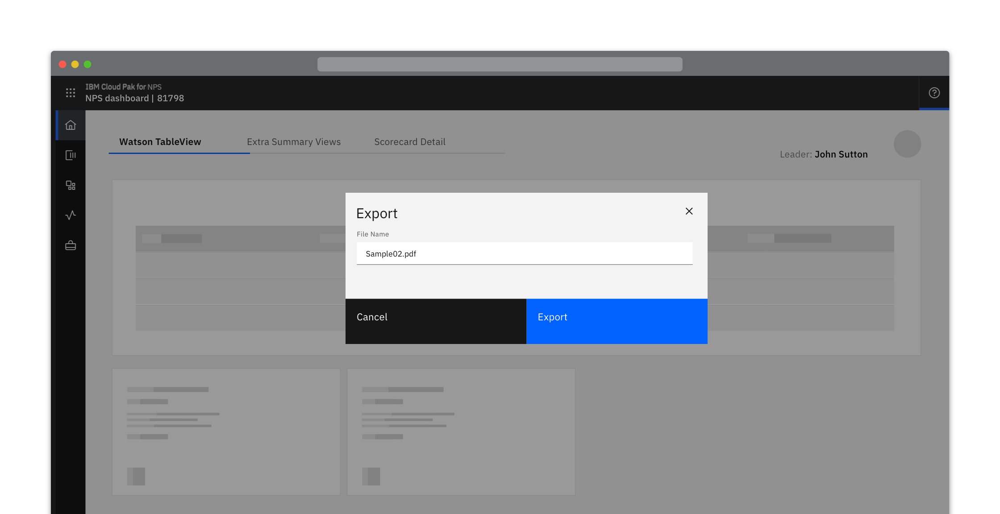
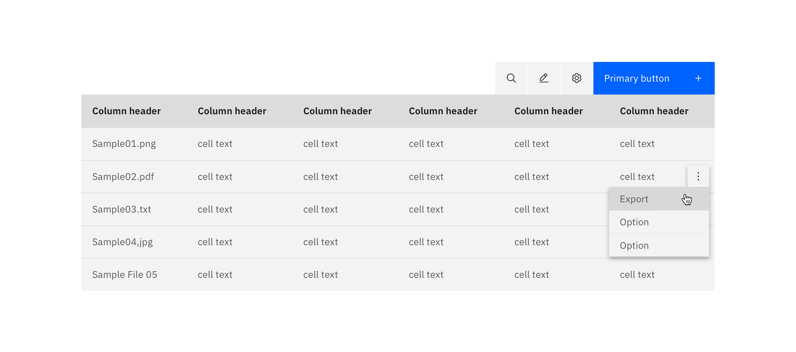
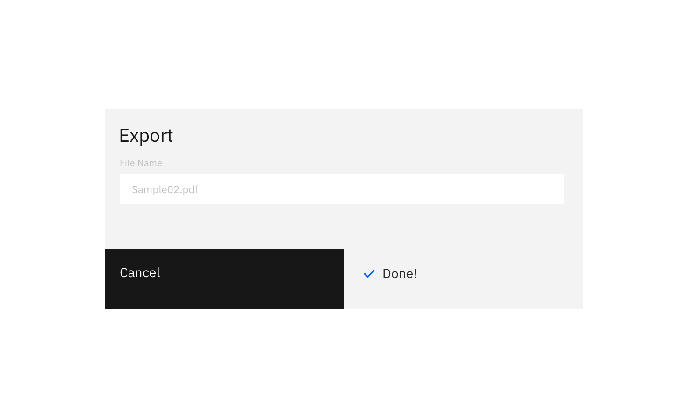
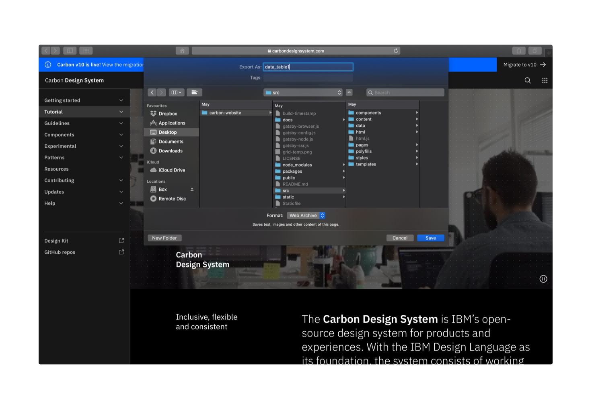

### Exporting a resource saves data in a different format, external to the system.

#### Status: 

Experimental

#### Maintainers:

[Vikki Paterson](https://github.ibm.com/VICTORIA), [Arnaud Gillard](https://github.ibm.com/Arnaud-Gillard)

<AnchorLinks>

<AnchorLink>Intuitive default name</AnchorLink>
<AnchorLink>Editable name</AnchorLink>
<AnchorLink>Specify export location</AnchorLink>

</AnchorLinks>

## Intuitive default name

When the resource is given an intuitive name by default and there is no choice of export location, the export occurs on the click of the Export button and nothing additional is displayed.

## Editable name
When exporting with an editable name, a dialog should be presented to the user displaying an editable textbox that is pre-populated with the default name for the file.

## Specify export location

When specifying the download location of a resource, clicking the primary “download” button activates the browser's default location panel. The file is downloaded once a location is selected and the user clicks Save.

