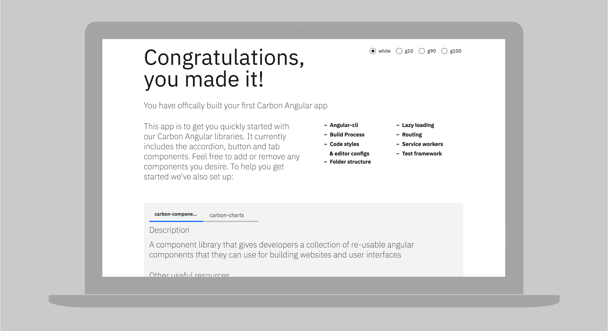

<AnchorLinks>

<AnchorLink>Carbon Angular library</AnchorLink>
<AnchorLink>Install</AnchorLink>
<AnchorLink>Development</AnchorLink>

</AnchorLinks>

## Resources

<Row>
<Column offsetLg="4" colLg="4" noGutterSm>
  <ResourceCard
    title="Try Angular components with CodeSandbox."
    href="https://codesandbox.io/s/0129r494ql"
    type="resource">


  </ResourceCard>
</Column>
</Row>

## Carbon Angular library

The [library](http://angular.carbondesignsystem.com/) provides front-end developers & engineers a collection of reusable Angular components to build websites and user interfaces. Adopting the library enables developers to use consistent markup, styles, and behavior in prototype and production work.

## Install

Assuming we're starting with a new @angular/cli project:

```sh
$ npx @angular/cli new my-project --style=scss
$ cd my-project
$ npm i --save carbon-components-angular carbon-components
```

Then we need to include carbon-components in `src/styles.scss`:

```scss
@import '~carbon-components/scss/globals/scss/styles.scss';
```

That's it! Now start the server and start building.

```sh
$ npm start
```

_Note: This isn't the only way to bootstrap a_ `carbon-components-angular` _application, but the combination of_ `@angular/cli` _and the_ `carbon-components` _scss is our recommended setup._

### Using our starter app





We recommend using the [carbon-angular-starter](https://github.com/carbon-design-system/carbon-angular-starter) for bootstrapping applications with Carbon components. Within five minutes your app will be running with the following already configured:

- Angular-cli
- Build process
- Code styles and editor configs
- Folder structure
- Lazy loading
- Routing
- Service workers
- Test framework

Check out the [readme](https://github.com/carbon-design-system/carbon-angular-starter) for installation instructions.

## Development

Please refer to the [contributing guidelines](https://github.com/IBM/carbon-components-angular/blob/master/README.md#contributing) before starting any work.
