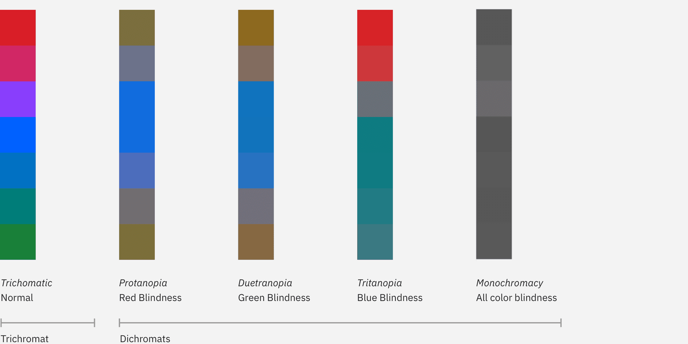

<AnchorLinks>

<AnchorLink>Introduction</AnchorLink>
<AnchorLink>Color contrast</AnchorLink>
<AnchorLink>Low vision</AnchorLink>
<AnchorLink>Tools</AnchorLink>

</AnchorLinks>

## Resources

<Row className="tile--group">
<Column offsetLg="4" colMd="4" colLg="4" noGutterSm>
<ResourceCard
    title="Carbon color contrast tool"
    href="https://marijohannessen.github.io/color-contrast-checker/"
    type="resource"
     >

</ResourceCard>
</Column>
</Row>

## Introduction

Visual impairments can include low vision, color blindness, and complete blindness. Carbon components have been designed to accommodate the entire spectrum of visual impairment, though designers still need to exercise diligence to ensure that the components are used correctly.

## Color contrast

Carbon meets [WCAG AA standards](https://www.w3.org/TR/UNDERSTANDING-WCAG20/visual-audio-contrast-contrast.html) across all standard themes in the system, including color contrast ratios.

#### Standard text

Standard text and images of text must have a contrast ratio of at least **4.5:1**.

#### Large text

Large text (at least 24 px regular and light / 19 px semi-bold) must have a contrast ratio of **3:1.**

#### Text against non-static backgrounds

When text is rendered on a gradient background or image, make sure the text color meets contrast standards in all places it appears. This is especially important for parallax applications or animations where text and backgrounds are moving independently of each other.

#### UI components

Visual information used to indicate states and boundaries of UI components must have a contrast ratio of **3:1** against adjacent colors. A UI component is defined as "a part of the content that is perceived by users as a single control for a distinct function." This includes form elements.

[IBM Checkpoint 1.4.3 Contrast (Minimum)](https://www.ibm.com/able/guidelines/ci162/contrast.html)

Please refer to our [usage section on the Colors page](/guidelines/color/usage) to learn more about color contrast ratios. You can also use this [color contrast](https://marijohannessen.github.io/color-contrast-checker/) tool to ensure your ratios pass WCAG AA standards.

<!-- To view best practices for using color in data visualization, view the [Data Vis color](/data-visualization/overview/colors) page. -->

## Color blindness

Color blindness involves difficulty in perceiving or distinguishing between colors, as well as sensitivity to color brightness. It affects approximately one in twelve men and one in two hundred women worldwide.

| Type           | Color deficiency |
| -------------- | ---------------- |
| _Protanopia_   | Red/green        |
| _Tritanopia_   | Blue             |
| _Deuteranopia_ | Green            |
| _Monochromacy_ | All colors       |

### Designing for color blindness

Don't rely on color alone to convey meaning. This includes conveying information, indicating an action, prompting the user for a response, or distinguishing one visual element from another. When designing with color, it might help to use a color-blind simulator to review visibility of content. If you're working in Sketch, we recommend the [Stark](http://www.getstark.co/) plugin.

## Low vision

Low vision can include partial sight in one or both eyes and can range from mild to severe. It affects about 4% of the world’s population.

| Type                       | Visual deficiency                                                                        |
| -------------------------- | ---------------------------------------------------------------------------------------- |
| _Low acuity_               | Also known as "blurred vision." Can make text difficult to read, since it appears fuzzy. |
| _Low-contrast sensitivity_ | Decreased ability to determine fine detail and distinguish one object from another       |
| _Obstructed visual field_  | The user's view is partially obstructed. Can include central vision and spotty vision.   |
| _Retinitis Pigmentosa_     | Also known as "tunnel vision." The user is only able to see central elements.            |

### Low-vision disabilities

### Designing for low vision

To get an understanding of the various low-vision disabilities, we recommend using the [NoCoffee](https://chrome.google.com/webstore/detail/nocoffee/jjeeggmbnhckmgdhmgdckeigabjfbddl) Chrome plugin to preview websites. Low-vision users may be using a screen reader to preview your website or experience, so be sure to follow [keyboard guidelines](/guidelines/accessibility/keyboard) to ensure the page is read to the user in a logical order.

## Resources

- [IBM Accessibility quick guidance](https://w3.ibm.com/able/devtest/quick/)(Internal only)
- [IBM Web Accessibility Checklist](https://www.ibm.com/able/guidelines/ci162/accessibility_checklist.html)
- [WCAG 2.1 guidelines](https://www.w3.org/TR/WCAG21/)
- [W3C low vision requirements](https://www.w3.org/TR/low-vision-needs/)

## Tools

- [High Contrast Chrome plugin](https://chrome.google.com/webstore/detail/high-contrast/djcfdncoelnlbldjfhinnjlhdjlikmph/related?hl=en)
- [Stark Sketch plugin](http://www.getstark.co/)
- [NoCoffee vision simulator](https://chrome.google.com/webstore/detail/nocoffee/jjeeggmbnhckmgdhmgdckeigabjfbddl)
